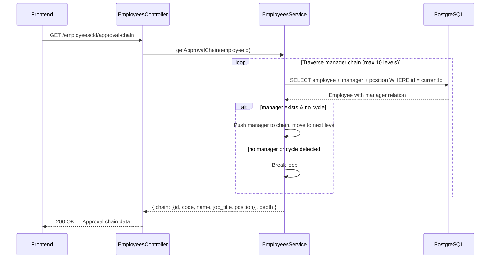
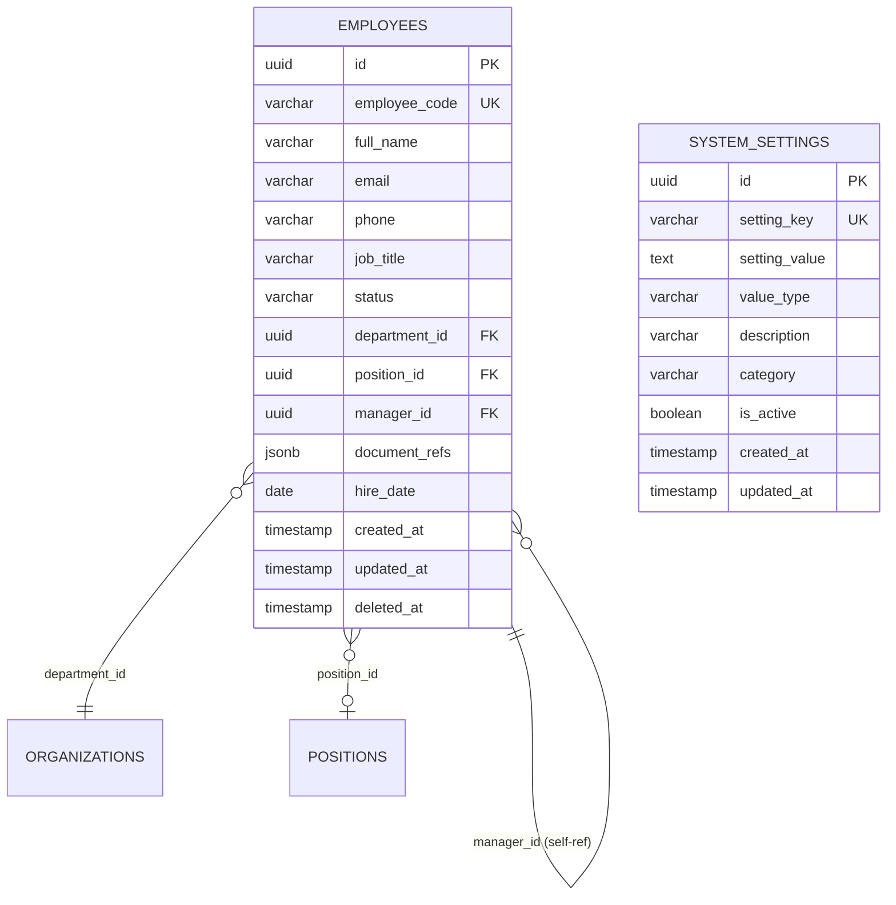

# Approval Chain — Sequence Diagram



## Example Flow

```
Employee: Nguyen Van A (SITE_QS @ CT Vincom Q7)
  |
  v Manager Level 1
Tran Van B (SITE_DIRECTOR / CHT)
  |
  v Manager Level 2
Le Van C (PROJECT_DIRECTOR / GDDA)
  |
  v Manager Level 3 (Top — no manager)
NULL → Stop
```

## Entity Relationship


