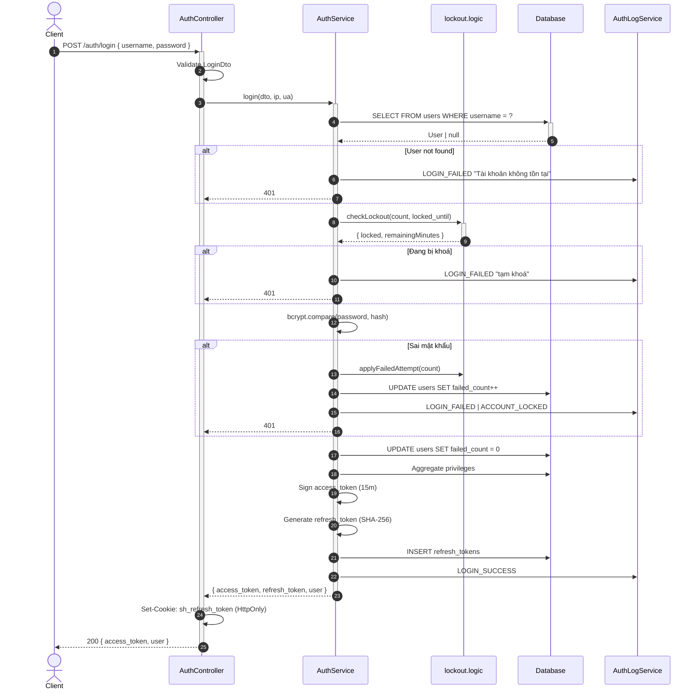
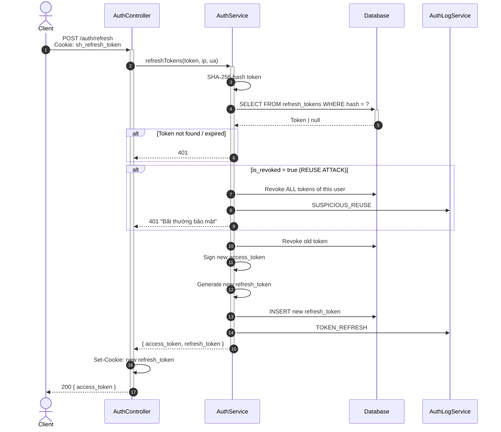
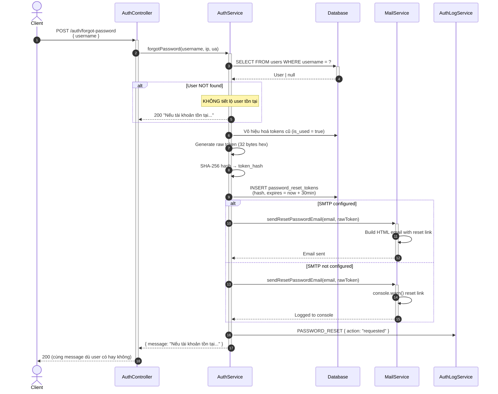
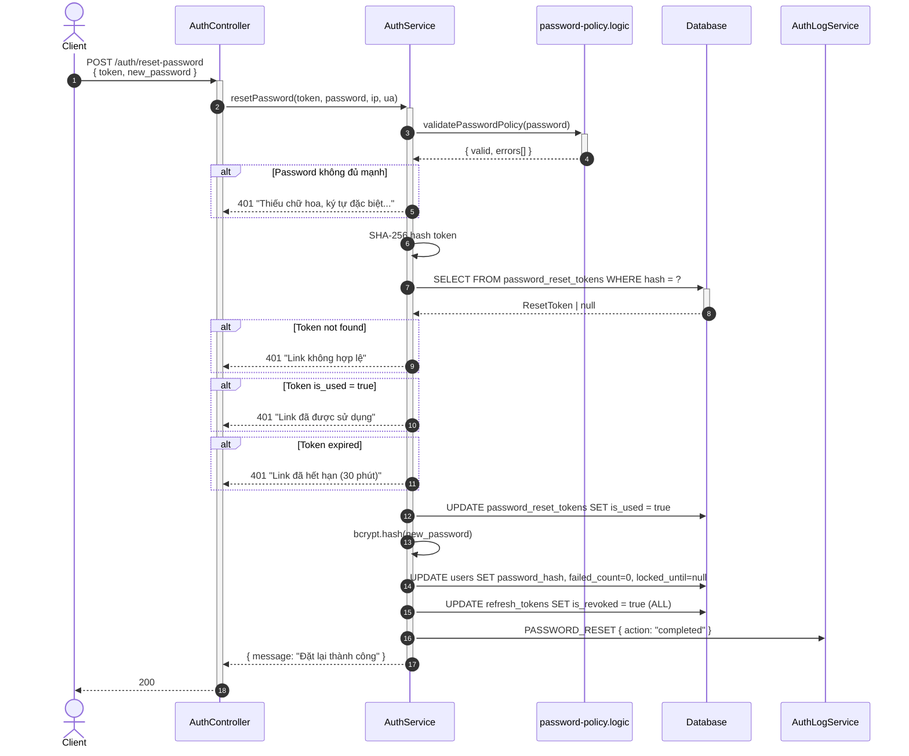

# Sequence Diagrams: Auth Module — Complete Flows

> **Module:** Auth | **Skill:** Architectural Visualizer
> **Ngày cập nhật:** 2026-03-26
> **Bao gồm:** Login + Refresh + Forgot Password + Reset Password

---

## 1. Login Flow (Lockout + Audit + Refresh Token)

## 2. Token Refresh Flow (Rotation + Reuse Detection)

## 3. Forgot Password Flow (Anti-Enumeration)

## 4. Reset Password Flow (Token Validation)

