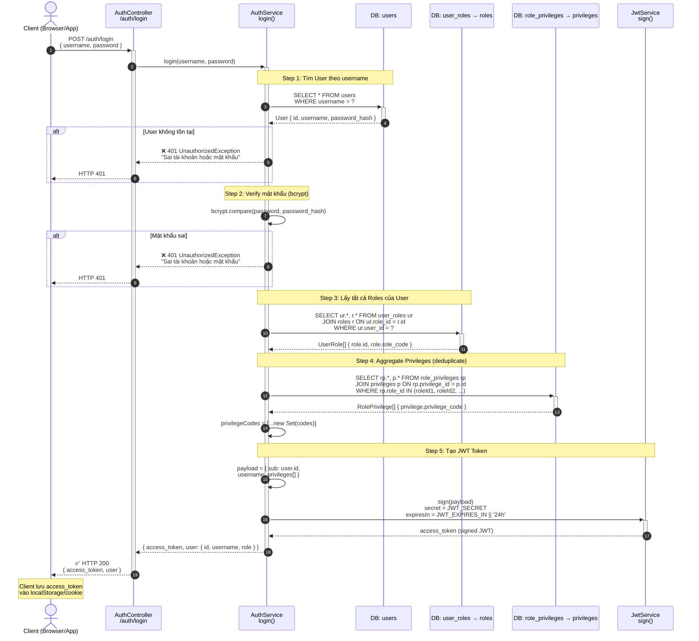
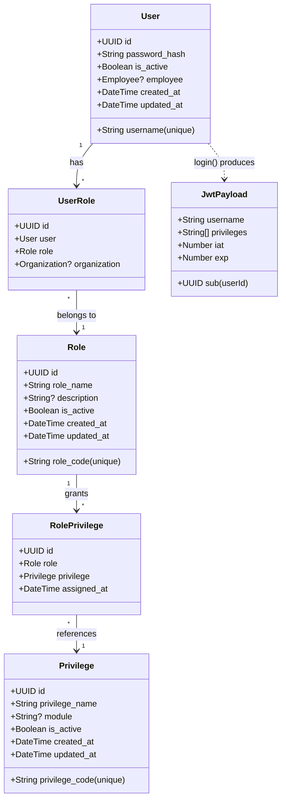

# Sequence Diagram: Luồng Đăng nhập (Authentication Flow)

> **Module:** Auth | **Skill:** Architectural Visualizer
> **Source:** `wms-backend/src/auth/`
> **Ngày tạo:** 2026-03-26

## 1. Luồng Đăng nhập (Login Flow)



## 2. Luồng Xác thực Request (Protected Route Flow)

```mermaid
sequenceDiagram
    autonumber
    actor User as Client (Browser/App)
    participant Guard1 as JwtAuthGuard
    participant Strat as JwtStrategy<br/>validate()
    participant Guard2 as PrivilegeGuard
    participant Ctrl as Controller<br/>@RequirePrivilege('X')
    participant Svc as Service

    User->>+Guard1: GET /api/protected-route<br/>Authorization: Bearer <token>

    Note over Guard1,Strat: Step 1: Verify JWT Token
    Guard1->>+Strat: Extract token từ header<br/>Verify signature (JWT_SECRET)<br/>Check expiration

    alt Token invalid / expired / missing
        Strat-->>User: ❌ 401 UnauthorizedException
    end

    Strat->>Strat: Decode payload
    Strat-->>-Guard1: req.user = {<br/>  userId: payload.sub,<br/>  username: payload.username,<br/>  privileges: payload.privileges[]<br/>}

    Note over Guard2: Step 2: Check Privileges
    Guard1->>+Guard2: Pass → next guard

    Guard2->>Guard2: Read @RequirePrivilege('CREATE_PO')<br/>from route metadata

    alt Không có @RequirePrivilege decorator
        Guard2->>Ctrl: ✅ Cho phép (no privilege check needed)
    end

    Guard2->>Guard2: requiredPrivileges.some(<br/>  p => user.privileges.includes(p)<br/>)

    alt User KHÔNG có privilege cần thiết
        Guard2-->>User: ❌ 403 ForbiddenException<br/>"Bạn không có quyền thực hiện thao tác này.<br/>Yêu cầu: [CREATE_PO]"
    end

    Guard2-->>-Ctrl: ✅ Authorized
    Ctrl->>+Svc: Execute business logic
    Svc-->>-Ctrl: Result
    Ctrl-->>-User: ✅ HTTP 200 { status, message, data }
```

## 3. Class Diagram: RBAC (Role-Based Access Control)



## 4. Tóm tắt kỹ thuật

| Thành phần | File | Chi tiết |
|-----------|------|----------|
| Login endpoint | `auth.controller.ts:15-18` | POST /auth/login, nhận { username, password } |
| Login logic | `auth.service.ts:20-64` | Verify → Aggregate privileges → Sign JWT |
| JWT Strategy | `jwt.strategy.ts:8-24` | Extract Bearer token, verify, map to req.user |
| Auth Guard | `jwt-auth.guard.ts:9` | Extends AuthGuard('jwt'), chặn 401 |
| Privilege Guard | `privilege.guard.ts:11-33` | Đọc @RequirePrivilege metadata, check `.some()`, chặn 403 |
| JWT Config | `auth.module.ts:24-27` | Secret: JWT_SECRET, Expiry: JWT_EXPIRES_IN \|\| '24h' |

### DB Query Chain khi Login:
```
users (1 query) → user_roles + roles (1 query) → role_privileges + privileges (1 query)
= Tổng cộng 3 queries cho mỗi lần đăng nhập
```

### Stateless Authorization:
- Privileges được nhúng vào JWT payload → không cần query DB khi check quyền
- Trade-off: Nếu admin thay đổi quyền, user phải login lại để nhận JWT mới
