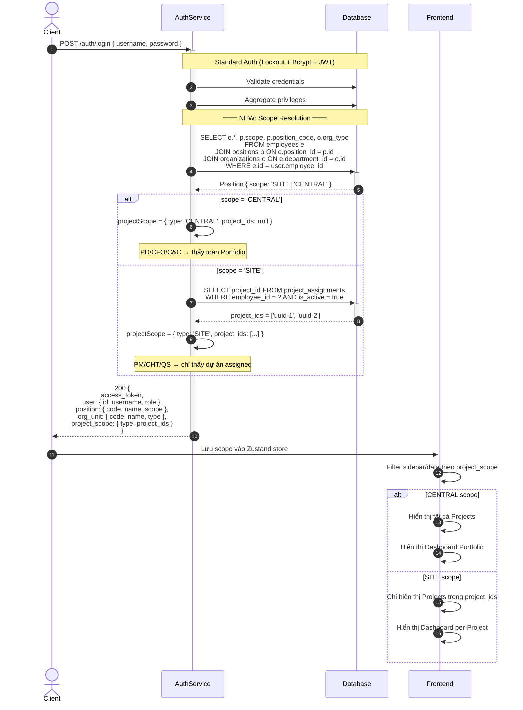
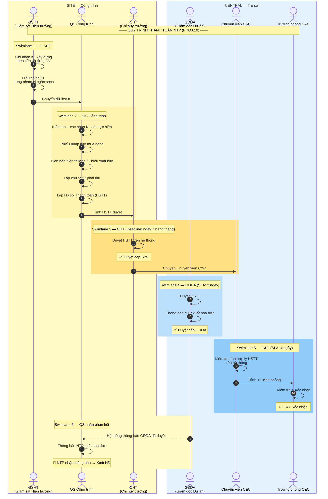
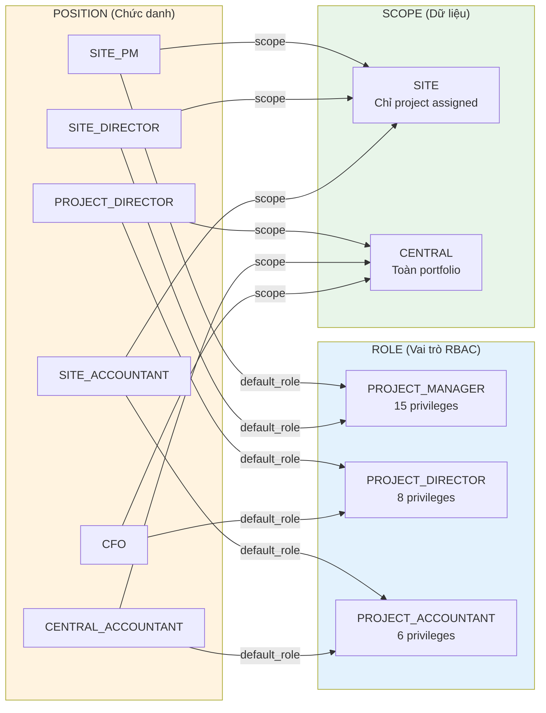

# Org Chart & Login Scope — IMPC Construction

> **Skill 1: Architectural Visualizer**
> **Ngày tạo:** 2026-03-26

---

## 1. Org Chart — SH-GROUP (IMPC Focus)

> Nguồn: `docs/reference/docs/Org Chart.png` (cập nhật 2026-04-18).
> IMPC DIVISION chia 3 lớp: **Company Layer** (phòng ban trụ sở) → **Service Layer** (2 Director line: Estate Management & General Contractor) → **Project Layer** (công trường thực thi).

```mermaid
graph TD
    SHG["🏢 SH-GROUP<br/><i>Root Corporation</i>"]
    SHG --> SC["Star Computer<br/><i>DIVISION</i>"]
    SHG --> SG["Star Gaming<br/><i>DIVISION</i>"]
    SHG --> IMPC["🏗️ IMPC<br/><i>DIVISION — Board of Management</i>"]

    %% ═══════ COMPANY LAYER ═══════
    subgraph Company["🏢 Company Layer — Trụ sở IMPC"]
        IMPC --> BOM["BOM Office"]
        IMPC --> BD["Business Development"]
        IMPC --> SMK["Sale / Marketing"]
        IMPC --> HRA["Human Resource /<br/>Admin Department"]
        IMPC --> FAD["Finance /<br/>Accounting Department"]
        IMPC --> LG["Legal"]
        IMPC --> ITD["IT"]
        IMPC --> AUD["Audit"]

        BOM --> BOM1["Executive Assistant"]
        BOM --> BOM2["Personal Assistant"]
        BOM --> BOM3["Secretary"]

        BD --> BD1["BD Manager"]
        BD --> BD2["BD Analyst"]

        SMK --> SMK1["Account Manager"]
        SMK --> SMK2["Sale Executive"]

        HRA --> HRA1["HR Manager"]
        HRA --> HRA2["Recruiter"]
        HRA --> HRA3["Admin"]

        FAD --> FAD1["CFO"]
        FAD --> FAD2["General Accountant"]
        FAD --> FAD3["Accounting Executive"]

        LG --> LG1["Legal Executive"]

        ITD --> ITD1["IT Manager"]
        ITD --> ITD2["Developer"]
        ITD --> ITD3["IT Helpdesk"]

        AUD --> AUD1["Audit Manager"]
        AUD --> AUD2["Internal Audit"]
    end

    %% ═══════ SERVICE LAYER ═══════
    subgraph Service["🛠️ Service Layer — 2 Director line"]
        IMPC --> EMD["Estate Management Director<br/>(Asst. GM Director)"]
        IMPC --> GCD["General Contractor Director<br/>(Asst. GM Director)"]

        EMD --> EMD_HR["Human Resource / Admin"]
        EMD --> EMD_FA["Finance / Accounting"]
        EMD --> EMD_LG["Legal"]
        EMD --> EMD_EN["Engineer"]
        EMD --> EMD_OP["Operation"]
        EMD --> EMD_PJ["Project"]

        EMD_HR --> EMD_HR1["Finance Manager"]
        EMD_FA --> EMD_FA1["Legal Executive"]
        EMD_EN --> EMD_EN1["Senior Chief Engineer"]
        EMD_OP --> EMD_OP1["Head of Operation"]
        EMD_OP --> EMD_OP2["Site QS"]
        EMD_PJ --> EMD_PJ1["Project Coordinator"]
        EMD_PJ --> EMD_PJ2["Official Secretary"]
        EMD_PJ --> EMD_PJ3["G-Officer"]

        GCD --> GCD_PL["Project Legal"]
        GCD --> GCD_QC["QA / QC"]
        GCD --> GCD_HSE["HSE"]
        GCD --> GCD_AR["Arc Design"]
        GCD --> GCD_PQ["Planning / QS"]
        GCD --> GCD_MR["MR"]
        GCD --> GCD_FA["Finance / Accounting"]
        GCD --> GCD_PS["Project Support"]

        GCD_PL --> GCD_PL1["Project Legal Executive"]
        GCD_QC --> GCD_QC1["QA/QC Manager"]
        GCD_QC --> GCD_QC2["QA/QC Officer"]
        GCD_HSE --> GCD_HSE1["HSE Manager"]
        GCD_HSE --> GCD_HSE2["HSE Supervisor"]
        GCD_AR --> GCD_AR1["Design Manager"]
        GCD_AR --> GCD_AR2["Senior Architect"]
        GCD_PQ --> GCD_PQ1["Planning/QS Manager"]
        GCD_FA --> GCD_FA1["Finance Manager"]
        GCD_PS --> GCD_PS1["HQ Admin"]
        GCD_PS --> GCD_PS2["Project Assistant"]
    end

    %% ═══════ PROJECT LAYER ═══════
    subgraph Project["🔨 Project Layer — Công trường"]
        EMD --> IEM["Industrial Estate Manager"]
        IEM --> EMP_PM["Project Manager"]
        EMP_PM --> EMP_HR["HR/Admin cum Accounting<br/>(Admin 1)"]
        EMP_PM --> EMP_TC["Technician"]
        EMP_PM --> EMP_CL["Cleaning Staff"]
        EMP_PM --> EMP_SEC["Security Staff"]
        EMP_TC --> EMP_TC1["Technician 1"]
        EMP_TC --> EMP_TC2["Technician 2"]
        EMP_CL --> EMP_CL1["Cleaning Staff 1"]
        EMP_CL --> EMP_CL2["Cleaning Staff 2"]
        EMP_SEC --> EMP_SEC1["Security Staff 1"]
        EMP_SEC --> EMP_SEC2["Security Staff 2"]

        GCD --> STM["Site Manager"]
        STM --> GCP_HR["HR/Admin cum Accounting<br/>(Admin 1)"]
        STM --> GCP_TECH["Technical"]
        STM --> GCP_CS["Civil & Structural"]
        STM --> GCP_MEP["MEP"]
        STM --> GCP_MS["Material / Store"]
        GCP_TECH --> GCP_TECH1["QA/QC Engineer"]
        GCP_TECH --> GCP_TECH2["Planning/QS Supervisor"]
        GCP_TECH --> GCP_TECH3["Quality Resource"]
        GCP_CS --> GCP_CS1["C&S Supervisor"]
        GCP_MEP --> GCP_MEP1["MEP Supervisor"]
        GCP_MS --> GCP_MS1["Purchaser"]
    end

    %% Styling
    style SHG fill:#1a56db,color:#fff,stroke:#1a56db
    style IMPC fill:#f59e0b,color:#fff,stroke:#f59e0b
    style SC fill:#e0e0e0,stroke:#757575
    style SG fill:#e0e0e0,stroke:#757575
    style EMD fill:#fce4ec,color:#000,stroke:#c62828
    style GCD fill:#e1f5fe,color:#000,stroke:#0277bd
    style IEM fill:#fff9c4,stroke:#f57f17
    style STM fill:#fff9c4,stroke:#f57f17
    style Company fill:#e3f2fd,stroke:#1565c0
    style Service fill:#e8f5e9,stroke:#2e7d32
    style Project fill:#fff3e0,stroke:#e65100
```

**Legend (theo Org Chart.png):**
- Đường liền nét → quan hệ báo cáo trực tiếp (reporting line)
- Đường nét đứt → quan hệ báo cáo chuyên môn (dotted / functional line)

---

## 2. Login → Scope Resolution Sequence

---

## 3. Luồng Thanh toán NTP — Theo tài liệu PROJ.10 Central Cons

---

## 4. Position → Role → Privilege Chain

