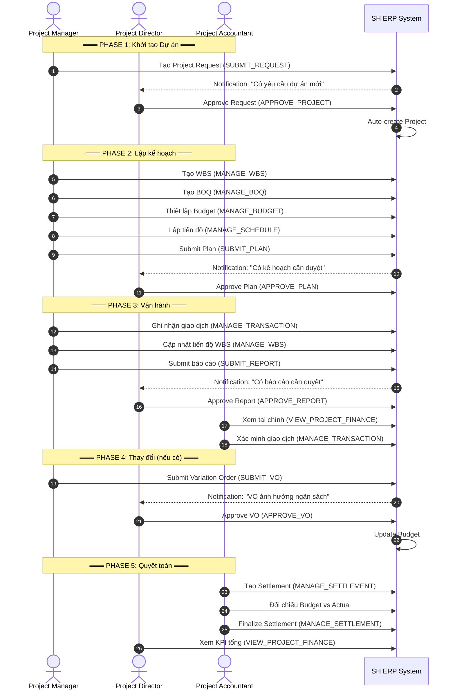
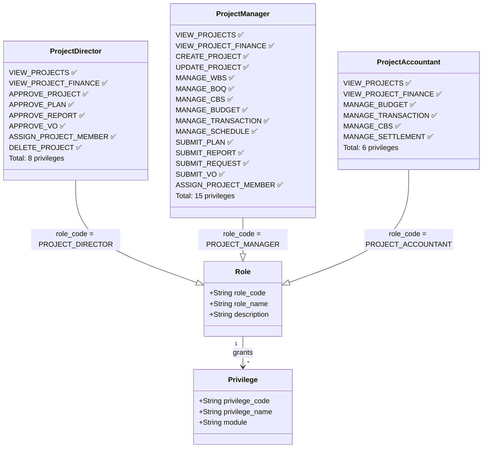
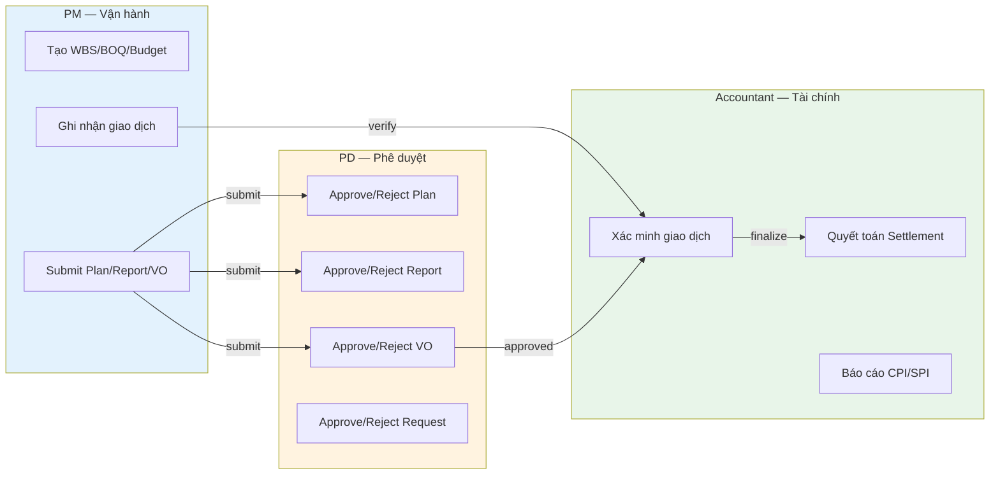

# RBAC — Sơ đồ phân quyền 3 Vai trò Dự án

> **Skill 1: Architectural Visualizer**
> **Ngày tạo:** 2026-03-26

## 1. Luồng tương tác PD ↔ PM ↔ Accountant

## 2. Class Diagram — RBAC Model

## 3. Separation of Duties (SoD) Flow

