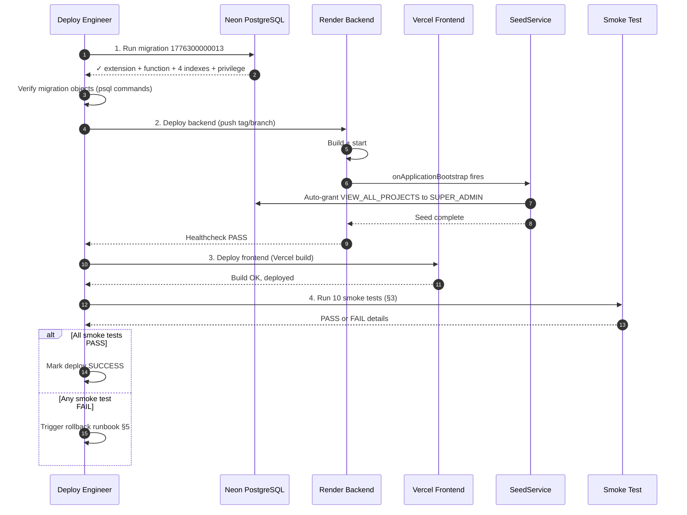
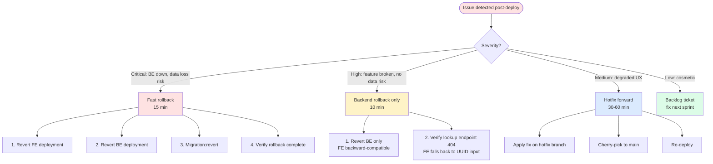

# Gate 6 — Deploy Runbook
**Feature:** `master-plan-project-lookup` · **Gate:** 6 (Deploy) · **Status:** Ready (chờ QA pass + code review approve)
**Branch:** `feature/master-plan-project-lookup` @ `3059488` (27 commits)
**Target environment:** Render (BE) + Vercel (FE) + Neon (PostgreSQL)
**Tech Advisor:** SH · **Deploy executor:** TBD (assign trước deploy day)

---

## 0. Pre-conditions (PHẢI tick xong mới deploy)

- [ ] PR #2 code review approve (≥1 reviewer)
- [ ] QA_RUN_REPORT submitted với ≥51/56 PASS
- [ ] PR #1 docs (tech-advisor-notes) đã merge (independent, không block)
- [ ] Maintenance window được announce (nếu chọn maintenance approach)
- [ ] DB backup tươi (≤24h tuổi)
- [ ] Rollback rehearsal đã chạy trên dev clone (xem §5)
- [ ] On-call engineer assigned trong 4h sau deploy
- [ ] Slack channel `#sherp-deploy` ready cho live update

---

## 1. Pre-deploy verification (1 day trước deploy)

### 1.1 Database privilege check (CRITICAL)

Migration `1776300000013-AddViewAllProjectsPrivilege.ts` tạo PostgreSQL extension `unaccent`. Yêu cầu DB role có `CREATE EXTENSION` privilege.

**Verify trên Neon production:**
```sql
-- Check current role privileges
SELECT
  r.rolname,
  r.rolsuper,
  r.rolcreatedb,
  has_database_privilege(r.rolname, current_database(), 'CREATE') AS can_create
FROM pg_roles r
WHERE r.rolname = current_user;

-- Check if user can create extensions
SELECT has_function_privilege(current_user, 'pg_catalog.pg_extension_config_dump(regclass, text)', 'EXECUTE');

-- Try create extension (sẽ fail nếu không quyền — CHỈ chạy trên dev clone)
CREATE EXTENSION IF NOT EXISTS unaccent;
```

**Outcome:**
- ✅ Nếu PASS → tiếp Bước 1.2
- ❌ Nếu FAIL → **STOP**. Liên hệ Neon support hoặc DBA grant `CREATE EXTENSION` cho deploy role. KHÔNG deploy cho đến khi resolved.

### 1.2 Migration dry-run trên staging

```bash
# Clone production schema sang staging-clone (Neon branch)
# Hoặc dùng existing staging DB

cd wms-backend

# Set staging DATABASE_URL
export DATABASE_URL=postgresql://<staging-creds>

# Run migration với verbose
npm run migration:run -- --logging

# Verify objects created
psql $DATABASE_URL <<EOF
\df public.f_unaccent
\di+ idx_projects_*
SELECT code FROM privileges WHERE code='VIEW_ALL_PROJECTS';
EOF
```

**Expected:**
- 1 function `f_unaccent` IMMUTABLE
- 4 indexes: `idx_projects_code_lower`, `idx_projects_status_active`, `idx_projects_org_status`, `idx_projects_name_unaccent_trgm`
- Row `VIEW_ALL_PROJECTS` trong privileges table

### 1.3 Backup verification

```bash
# Neon: tạo manual backup branch trước deploy
# UI: Neon Console → Branches → "Create branch from production"
# Name: pre-deploy-master-plan-lookup-<YYYY-MM-DD>

# Verify backup branch tồn tại + queryable
psql <backup-branch-url> -c "SELECT count(*) FROM projects;"
```

### 1.4 Rollback rehearsal trên dev clone

Xem §5 — phải chạy successfully trên dev clone trước khi deploy production.

---

## 2. Deploy sequence

### 2.1 Strategy decision

```mermaid
flowchart TD
    Start([Deploy MasterPlan Project Lookup]) --> Q1{Có user đang dùng MasterPlan dialog?}
    Q1 -->|Có > 5 user/h| MW[Maintenance Window<br/>30-60 min off-peak]
    Q1 -->|Không/ít| Rolling[Rolling deploy<br/>không downtime]

    MW --> Announce[Announce maintenance<br/>24h trước]
    Rolling --> Direct[Deploy không announce]

    Announce --> Deploy
    Direct --> Deploy[Deploy sequence §2.2]

    style Start fill:#dbeafe
    style MW fill:#fef3c7
    style Rolling fill:#dcfce7
    style Deploy fill:#a7f3d0
```



**Recommendation:** Vì feature thay text input thành picker (UI breaking-ish but graceful), **rolling deploy OK** — old session sẽ vẫn hoạt động (UUID input vẫn POST được, chỉ là sau refresh thấy picker mới).

### 2.2 Deploy sequence (Mermaid)



### 2.3 Concrete commands

```bash
# Step 1 — Migration (BE not yet deployed; migration is forward-compatible)
cd wms-backend
export DATABASE_URL=<production-url>
npm run migration:run -- --logging
# Verify
psql $DATABASE_URL -c "SELECT migration_name FROM typeorm_migrations ORDER BY id DESC LIMIT 5;"
# Expect: 1776300000013-AddViewAllProjectsPrivilege ở top

# Step 2 — Backend deploy (Render)
# Option A: Render auto-deploy from main branch (sau merge PR #2)
# Option B: Manual trigger Render dashboard

# Verify backend up
curl https://<render-url>/api/health
# Expect: { status: 'ok' }

# Verify SeedService ran (privilege seed)
psql $DATABASE_URL -c "
SELECT p.code, COUNT(rp.role_id) as role_count
FROM privileges p
LEFT JOIN role_privileges rp ON rp.privilege_id = p.id
WHERE p.code = 'VIEW_ALL_PROJECTS'
GROUP BY p.code;
"
# Expect: VIEW_ALL_PROJECTS | <≥1>

# Step 3 — Frontend deploy (Vercel)
# Vercel auto-deploys on main push usually
# Or manual: vercel --prod

# Verify frontend up
curl -I https://<vercel-url>/
# Expect: HTTP 200

# Step 4 — Run smoke tests §3
```

---

## 3. Post-deploy smoke tests (10 cases)

Chạy ngay sau deploy. Pass criteria: **9/10 PASS** mới mark deploy SUCCESS.

| # | Test | Steps | Expected | Pass/Fail |
|---|------|-------|----------|-----------|
| **S-1** | Backend health | `curl https://<be>/api/health` | `{ status: 'ok' }` | ☐ |
| **S-2** | Lookup endpoint reachable | `curl -H "Authorization: Bearer <token>" https://<be>/api/projects/lookup?q=test` | HTTP 200, JSON envelope | ☐ |
| **S-3** | Lookup returns items | Same as S-2 với valid query | `data.items` array, `data.total` ≥0 | ☐ |
| **S-4** | Vietnamese unaccent search | Search `q=truong` | Returns projects with "Trường" name (nếu có) | ☐ |
| **S-5** | RBAC enforcement | Call lookup với token thiếu VIEW_PROJECTS | HTTP 403 | ☐ |
| **S-6** | Cross-org via VIEW_ALL_PROJECTS | Call lookup với SUPER_ADMIN token | Items span multiple `organization_id` | ☐ |
| **S-7** | Frontend MasterPlan dialog opens | Browser → /master-plan → Click "Tạo" | Dialog mở, ProjectPicker hiện | ☐ |
| **S-8** | Picker search end-to-end | Click picker → gõ "test" → chọn item | Item selected, code+name hiện ở trigger | ☐ |
| **S-9** | Create MasterPlan với project picked | Submit form | HTTP 201, plan saved | ☐ |
| **S-10** | Audit log cross-org (nếu pickup cross-org) | SUPER_ADMIN tạo MP với project khác org | `audit_logs` có row `reason='CREATE_MASTER_PLAN_CROSS_ORG'` | ☐ |

**Verify cross-org audit log (S-10):**
```sql
SELECT created_at, actor_user_id, reason, target_entity_type, target_entity_id
FROM audit_logs
WHERE reason = 'CREATE_MASTER_PLAN_CROSS_ORG'
ORDER BY created_at DESC
LIMIT 5;
```

---

## 4. Monitoring + alerts

### 4.1 Metrics theo dõi (4h post-deploy)

| Metric | Source | Alert threshold |
|--------|--------|----------------|
| API error rate `/projects/lookup` | Render logs / APM | > 5% trong 5 min |
| Response time p95 `/projects/lookup` | APM | > 1000ms trong 5 min |
| BE crash/restart count | Render dashboard | ≥ 1 crash trong 1h |
| FE bundle load failures | Sentry / FE error tracker | > 10/min |
| DB query slow log | Neon dashboard | Queries > 500ms trên `projects` table |
| Postgres connection pool | Neon dashboard | > 80% utilized |

### 4.2 Index usage verification (sau 24h)

```sql
-- Confirm 4 new indexes đang được dùng
SELECT
  schemaname, indexname, idx_scan, idx_tup_read
FROM pg_stat_user_indexes
WHERE indexname IN (
  'idx_projects_code_lower',
  'idx_projects_status_active',
  'idx_projects_org_status',
  'idx_projects_name_unaccent_trgm'
)
ORDER BY idx_scan DESC;
```

Expect `idx_scan > 0` cho ≥3 trong 4 indexes (depending on query patterns). Nếu `idx_scan = 0` cho 1 index → backlog `PERF-PROJECT-LOOKUP-TRGM` để tune.

---

## 5. Rollback runbook

### 5.1 Decision tree



### 5.2 Fast rollback commands

```bash
# Step 1 — Revert frontend (Vercel)
# Vercel dashboard → Deployments → previous deployment → "Promote to Production"
# OR CLI: vercel rollback <previous-deployment-url>

# Step 2 — Revert backend (Render)
# Render dashboard → Service → "Rollback" to previous deploy
# OR push revert commit to main:
git checkout main
git revert <merge-commit-hash> --no-edit
git push origin main
# Render auto-deploys revert

# Step 3 — Migration revert
cd wms-backend
export DATABASE_URL=<production-url>
npm run migration:revert
# Verify objects removed
psql $DATABASE_URL -c "
\df public.f_unaccent
SELECT code FROM privileges WHERE code='VIEW_ALL_PROJECTS';
\di+ idx_projects_*
"
# Expect: function gone, privilege gone, 4 new indexes gone (existing indexes preserved)

# Step 4 — Verify rollback
curl https://<be>/api/health   # OK
curl https://<be>/api/projects/lookup   # Expect 404 (route removed)
# Open browser → /master-plan → "Tạo" → expect old UUID input field
```

### 5.3 Backend-only rollback (FE backward-compat)

Frontend code có degradation logic? **NO** — FE strictly expects `/projects/lookup` endpoint. Nếu BE rollback mà FE không rollback → picker trigger sẽ fail với 404 error (đã có error state rendering).

→ Rolling rollback BE-only **NOT recommended**. Use full rollback (FE + BE + migration).

### 5.4 Rollback rehearsal (PHẢI chạy trước deploy)

```bash
# Trên dev clone (KHÔNG production)
cd wms-backend
export DATABASE_URL=<dev-clone-url>

# 1. Apply migration
npm run migration:run

# 2. Verify objects exist
# (xem §1.2)

# 3. Revert
npm run migration:revert

# 4. Verify clean rollback
psql $DATABASE_URL -c "
\df public.f_unaccent
SELECT code FROM privileges WHERE code='VIEW_ALL_PROJECTS';
"
# Expect: function gone, privilege gone

# 5. Re-apply (idempotency check)
npm run migration:run

# 6. Re-verify
# Should be identical to step 2
```

Pass criteria: rehearsal phải succeed cleanly cả 2 chiều (apply + revert + re-apply).

---

## 6. Deploy day checklist (printable)

### Trước deploy (T-1 day)
- [ ] Pre-conditions §0 all checked
- [ ] DB privilege verified (§1.1)
- [ ] Migration dry-run trên staging passed (§1.2)
- [ ] Neon backup branch created (§1.3)
- [ ] Rollback rehearsal passed (§5.4)

### Deploy day (T-day)
- [ ] Maintenance window announced (nếu chọn MW approach)
- [ ] Deploy team assembled (deploy engineer + on-call BE + on-call FE + DBA standby)
- [ ] Slack `#sherp-deploy` open
- [ ] Tail logs ready (Render + Vercel + Neon)

### Deploy execution (T-zero)
- [ ] **Step 1** Migration applied successfully
- [ ] **Step 2** Backend deployed, healthcheck green
- [ ] **Step 2b** SeedService ran, VIEW_ALL_PROJECTS granted
- [ ] **Step 3** Frontend deployed
- [ ] **Step 4** 10 smoke tests run, ≥9/10 PASS

### Post-deploy (T+1h)
- [ ] No spike in error rate
- [ ] Response time p95 normal
- [ ] No crash/restart
- [ ] Cross-org audit log verified (≥1 entry nếu test active)

### Post-deploy (T+24h)
- [ ] Index usage verified (§4.2)
- [ ] No customer complaint tickets
- [ ] All 9 backlog tickets file đúng (no scope creep từ post-deploy fixes)

### Sign-off
- [ ] Deploy engineer: __________________ Date: ______
- [ ] Tech Advisor (SH): __________________ Date: ______
- [ ] On-call BE: __________________ Date: ______
- [ ] On-call FE: __________________ Date: ______

---

## 7. Reference

- **Migration file:** `wms-backend/src/migrations/1776300000013-AddViewAllProjectsPrivilege.ts`
- **Related backlog:** `docs/backlog/hardening-backlog.md`
- **QA matrix:** `docs/features/master-plan-project-lookup/QA_TEST_MATRIX.md`
- **PR description:** `docs/features/master-plan-project-lookup/PR_DESCRIPTION.md`
- **Tech advisor notes:** `docs/tech-advisor-notes/`

---

**Document owner:** Tech Advisor (feature `master-plan-project-lookup`)
**Last updated:** 2026-04-26
**Next review:** Sau deploy thực tế — capture lessons learned + update runbook cho feature tương lai
