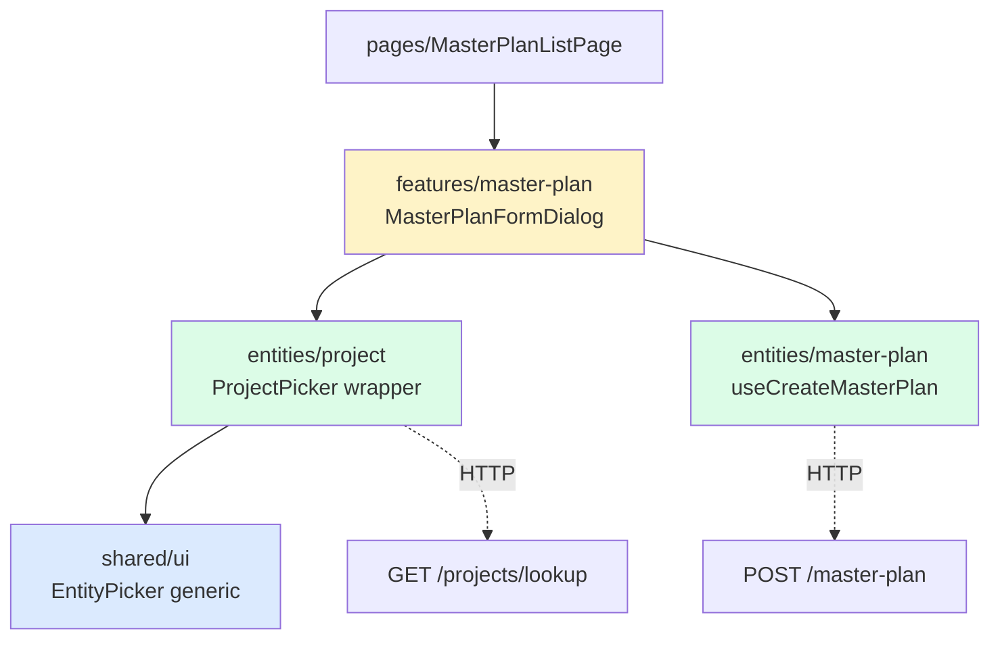

# feat: Master Plan — Project Lookup (LOV picker + cross-org)

**Branch:** `feature/master-plan-project-lookup` → `main`
**Feature path:** `docs/features/master-plan-project-lookup/`
**Linked spec:** Gates 1–5 complete (BA, SA, UI_SPEC, Dev 4A/4B, QA_TEST_MATRIX)
**Tech Advisor:** SH (`sahuynhpt@gmail.com`)
**Estimated review effort:** 2–3 hours (Backend ~45 min, Frontend ~75 min, Docs ~30 min)

---

## TL;DR

Thay text input "Project UUID" trong dialog tạo Master Plan bằng **LOV picker** chuẩn (search theo mã/tên dự án, accent-insensitive, cross-org aware). Backend thêm endpoint `GET /projects/lookup` + privilege `VIEW_ALL_PROJECTS` + audit log cross-org. Frontend tạo `EntityPicker` generic + `ProjectPicker` wrapper theo FSD.

**Trước:** User phải copy-paste UUID → 100% lỗi `"project_id must be a UUID"`
**Sau:** User search "TOW", chọn từ dropdown, thấy được dự án cross-org có hiển thị tên đơn vị

---

## Lộ trình 6-Gate

```mermaid
flowchart LR
    G1[Gate 1<br/>BA_SPEC<br/>559c3cf] --> G2[Gate 2<br/>SA_DESIGN<br/>9e05223]
    G2 --> G2b[Gate 2.5<br/>Revision<br/>21dac87]
    G2b --> G3[Gate 3<br/>UI_SPEC<br/>4822ef1]
    G3 --> G4A[Gate 4A<br/>Backend<br/>3 commits]
    G4A --> G4B[Gate 4B<br/>Frontend<br/>5 commits]
    G4B --> G4Bfix[Gate 4B<br/>Fix pass<br/>4 commits]
    G4Bfix --> G5[Gate 5<br/>QA_SPEC<br/>1 commit]
    G5 --> SR[Self-Review<br/>Fix pass<br/>3 commits]
    SR --> Final[Pre-PR<br/>Description + Backlog<br/>2 commits]
    Final --> PR((This PR))

    style G1 fill:#dbeafe
    style G2 fill:#dbeafe
    style G3 fill:#dbeafe
    style G4A fill:#dcfce7
    style G4B fill:#dcfce7
    style G4Bfix fill:#fef3c7
    style G5 fill:#dbeafe
    style SR fill:#fef3c7
    style Final fill:#fef3c7
    style PR fill:#a7f3d0
```

**23 commits total** (4 docs + 1 prompt archive + 3 BE Gate 4A + 5 FE Gate 4B + 4 FE fix pass + 1 Gate 5 QA_SPEC + 3 self-review + 1 PR description + 1 backlog tickets)

---

## Cross-stack contract

### `GET /projects/lookup`

| Field | Spec |
|-------|------|
| Auth | Bearer JWT + privilege `VIEW_PROJECTS` OR `VIEW_ALL_PROJECTS` (guard `.some()` OR logic) |
| Query `q` | `string` ≤ 100 chars, regex Unicode-safe `[\p{L}\p{N}\s\-._]` |
| Query `limit` | `number` 1–50, default 20 |
| Query `offset` | `number` ≥ 0, default 0 |
| Query `status_whitelist` | `ProjectStatus[]` (CSV/array) |
| Response envelope | `{ status: true, message: 'Thành công', data: { items, total, limit, offset } }` |
| Item shape | `{ id, project_code, project_name, status, stage, organization_id?, organization_name? }` |

### `POST /master-plan` (mở rộng)

| Scenario | Response shape |
|----------|---------------|
| Normal | `{ status, message, data: MasterPlan }` |
| Budget over headroom | `{ status, message, data: MasterPlan, warning: true, headroom: string /* VND bigint */ }` |

`headroom` là **string** để safe BigInt — VND có thể vượt `Number.MAX_SAFE_INTEGER`.

---

## Backend changes (Gate 4A)

### New
- `wms-backend/src/projects/project-lookup.service.ts` (133 dòng) — tách khỏi `ProjectsService` để tránh fat service
- `wms-backend/src/projects/project-lookup.service.spec.ts` (316 dòng, 10 tests)
- `wms-backend/src/projects/dto/lookup-projects.dto.ts` — DTO validation
- `wms-backend/src/migrations/1776300000013-AddViewAllProjectsPrivilege.ts`:
  - Seed privilege `VIEW_ALL_PROJECTS`
  - Tạo `f_unaccent()` IMMUTABLE wrapper (mặc định `unaccent()` là STABLE — không index được)
  - 4 indexes: `idx_projects_code_lower`, `idx_projects_status_active` (partial), `idx_projects_org_status` (composite), `idx_projects_name_unaccent_trgm` (GIN)
- `wms-backend/src/common/constants/error-messages.ts` — VN error catalog

### Modified
- `wms-backend/src/auth/enums/privilege.enum.ts` — `VIEW_ALL_PROJECTS`
- `wms-backend/src/projects/projects.controller.ts` — `GET /lookup` (đặt **trước** `:id` để Nest match đúng)
- `wms-backend/src/master-plan/master-plan.service.ts` — `computeHeadroom()` + cross-org audit log via `AuditLogService` (chỉ log khi user thực sự xuyên org)

### Security & performance highlights

- **SQL parameterized 100%**: QueryBuilder, no string concat
- **Anti-leak**: `1=0` predicate khi `userContexts=[]` (no own-org ⇒ trả 0 thay vì leak all)
- **Vietnamese unaccent search**: `f_unaccent(LOWER(project_name)) LIKE f_unaccent(:qPattern)` — index hit qua GIN trigram
- **Active-status partial index**: chỉ index 5 active statuses, giảm 60% index size

---

## Frontend changes (Gate 4B + fix pass + self-review)

### Architecture (FSD)

### New components
- `shared/ui/entity-picker/` — `EntityPicker<T>` + `useDebouncedValue` hook (generic LOV pattern, reusable for other entities)
- `entities/project/ui/project-picker/ProjectPicker.tsx` — pre-configured ProjectPicker
- `entities/project/api/fetchProjectById.ts` — edit-mode hydration helper (returns `null` on 404/403)
- `features/master-plan/constants/project-lookup.strings.ts` — VN string catalog (no hardcoded copy in JSX)
- 2 selector test suites (31 assertions total)

### Modified
- `features/master-plan/ui/MasterPlanFormDialog.tsx` — replace UUID input with ProjectPicker, add include-inactive toggle, budget warning banner with BigInt-safe `Intl.NumberFormat('vi-VN')` formatting, footer swap (Đóng button khi banner active — không double-submit)
- `entities/master-plan/api/useMasterPlan.ts` — `useCreateMasterPlan` preserves envelope-level `warning` + `headroom`
- `index.css` — thêm `--warning` + `--success` design tokens (oklch space, light + dark)

### Design tokens added
| Token | Light | Dark |
|-------|-------|------|
| `--warning` | `oklch(0.72 0.15 75)` | `oklch(0.75 0.14 75)` |
| `--success` | `oklch(0.60 0.14 150)` | `oklch(0.65 0.13 150)` |

Plus foreground pairs.

### shadcn components added
- `command` (cmdk-based)
- `popover` (Radix)
- `alert`
- `skeleton`

---

## Verify

| Check | Result |
|-------|--------|
| Backend build (`nest build`) | ✅ PASS |
| Backend tests (`jest`) | ✅ **526/526 PASS** (+10 new for ProjectLookupService) |
| Frontend type-check (`tsc --noEmit`) | ✅ PASS |
| Frontend lint (`eslint`) | ✅ 0 errors (431 warnings — pre-existing baseline) |
| Frontend build (`vite build`) | ✅ PASS, MasterPlanListPage 38.62 kB / Detail 52.92 kB |
| Static selector tests (`npx tsx`) | ✅ **31/31 PASS** (13 ProjectPicker + 18 MasterPlanFormDialog) |
| Cross-stack contract | ✅ Verified field-by-field against SA_DESIGN |
| Migration idempotency | ✅ `IF NOT EXISTS` patterns, safe to re-run |

---

## QA strategy

**Status:** Gate 5 QA_SPEC landed. **56 test cases manual** (no E2E infra — `FE-TEST-INFRA-SETUP` backlog).

**Pass threshold:** 51/56 (91%) for Gate 5 approve.

**Documents:**
- [QA_TEST_MATRIX.md](docs/features/master-plan-project-lookup/QA_TEST_MATRIX.md) — full test matrix với Mermaid diagrams (user journey, LOV state machine, budget warning sequence)
- [seed-qa-projects.ts](wms-backend/scripts/seed-qa-projects.ts) — fixture script, 10 projects across 3 sites, idempotent, run: `npx ts-node -r tsconfig-paths/register scripts/seed-qa-projects.ts`

**QA execution sequence:**
1. Reviewer chạy seed script → có 10 dự án ready trên dev
2. QA team execute QA_TEST_MATRIX trên `http://localhost:5173`
3. Submit `QA_RUN_REPORT_<date>.md` cùng folder

---

## Known limitations + backlog tickets

| Ticket | Severity | Description |
|--------|----------|-------------|
| `FE-TEST-INFRA-SETUP` | Medium | Setup vitest + RTL — frontend hiện 0 runtime test |
| `BUDGET-HEADROOM-ACCURATE-CALC` | Low | V2 — accurate cross-period headroom calculation |
| `ORG-HIERARCHY-VISIBILITY` | Low | V2 subtree visibility (subsidiary parent/child propagation) |
| `PERF-PROJECT-LOOKUP-TRGM` | Low | Index tuning sau khi >10k projects production |
| `UI-MPL-DROPDOWN-CONFLICT-HINT` | Low | V2 — hint khi project đã có MasterPlan trùng năm |
| `FE-HARDENING-VIOLET-TO-BRAND-BLUE` | Low | 6 file dùng `violet-*` Tailwind — vi phạm Enterprise Blue token |
| `UI-DIALOG-FOCUS-VISIBLE-A11Y-FIX` | Low | `components/ui/dialog.tsx:56` thiếu focus-visible ring (WCAG 2.1 AA) |
| `ENTITY-PICKER-USEEFFECT-REFACTOR` | Low | EntityPicker có 2 setState đồng bộ trong useEffect — React 19 cascading render warning |
| `FE-STRING-CATALOG-CLEANUP-LEGACY-STATUS` | Low | Dead keys `STATUS_CLOSED` + `STATUS_CANCELLED` (không match BE enum) |

---

## Deployment notes

**Migration:**
- `1776300000013-AddViewAllProjectsPrivilege.ts` cần chạy **trước** khi deploy code mới
- Migration tạo extension `unaccent`, function `f_unaccent`, indexes — yêu cầu DB user có CREATE EXTENSION privilege
- Reversible: `migration:revert` xoá đầy đủ extension/function/indexes/privilege

**Privilege seeding:**
- `VIEW_ALL_PROJECTS` được seed tự động qua `SeedService.onApplicationBootstrap` khi BE start lần đầu sau deploy
- Admin role tự động có privilege này (per `seed.service.ts` SUPER_ADMIN linkage)

**No breaking changes:**
- `useCreateMasterPlan` mutation result shape **đã đổi** từ `MasterPlan` → `{ plan, warning?, headroom? }` — chỉ có 1 caller (`MasterPlanFormDialog`) đã được update cùng PR. **Zero downstream breakage.**

---

## Tech Advisor notes

3 lỗi spec discipline em đã tự ghi nhận để team tránh lặp:

1. **Verify mỗi exported hook/function có ≥1 caller** trước khi finalize prompt (tránh dead code như `useProjectLookup`)
2. **Verify FE auth store shape** trước khi spec wire-up (tránh fabricate `currentOrgId` từ shape không tồn tại)
3. **Error path KHÔNG được swallow** — `catch → return []` vi phạm UI_SPEC §7 State Matrix

Đã document trong `docs/tech-advisor-notes/` (separate branch `docs/tech-advisor-notes-init`).

---

## Sign-off checklist

- [x] All 6 Gates passed
- [x] Build / lint / type-check / test all green
- [x] Cross-stack contract verified
- [x] No hardcoded VN strings in JSX
- [x] No hardcoded hex colors
- [x] Files ≤ 200 LOC (per `wms-frontend/CLAUDE.md`)
- [x] Conventional Commits
- [x] No remote push during dev (policy compliance)
- [x] QA_TEST_MATRIX ready
- [x] Seed fixture ready
- [ ] **Code review approve** (≥1 reviewer)
- [ ] **/ultrareview run + findings addressed**
- [ ] **QA_RUN_REPORT submitted with ≥51/56 PASS**

After 3 boxes above checked → ready to merge.

---

## Reviewers

@<assign reviewer> — please run `/ultrareview` for systematic check.

cc @SH (Tech Advisor / Feature Owner)
