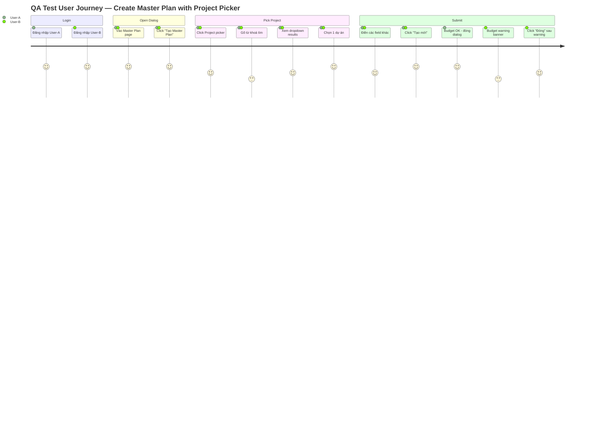
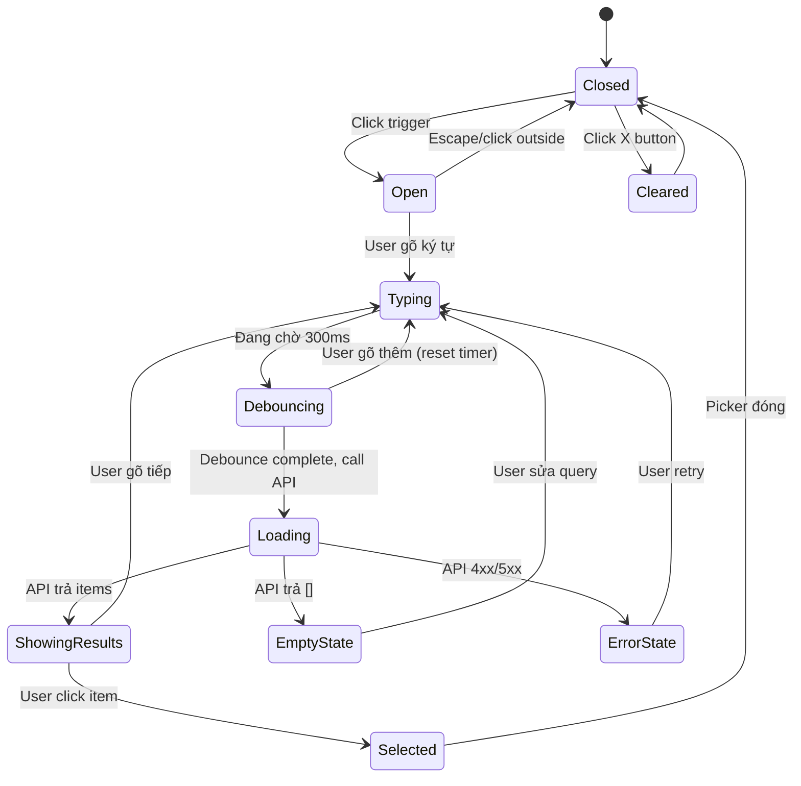
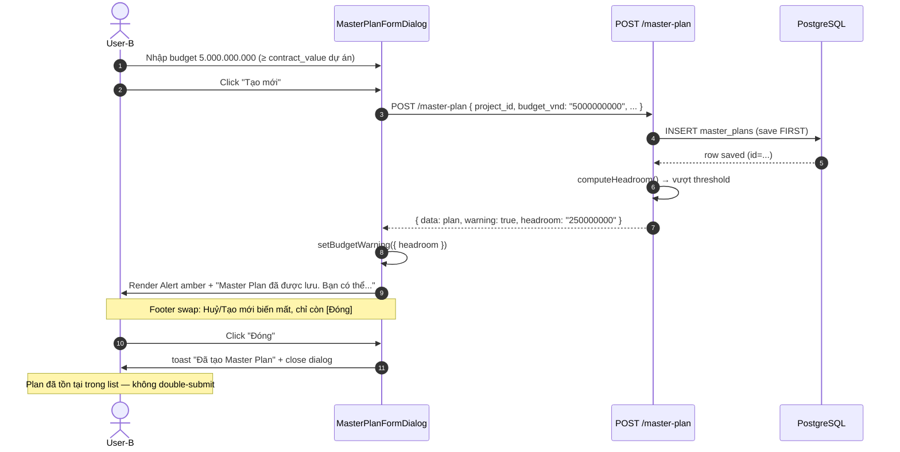

# Gate 5 — QA Test Matrix
**Feature:** `master-plan-project-lookup` · **Gate:** 5 (QA) · **Format:** Manual checklist (no E2E infra)
**Feature branch:** `feature/master-plan-project-lookup @ 8cebca4` (17 commits, Gate 4B DONE)
**QA owner:** SH + QA team · **Tech Advisor:** reviewed 2026-04-24

---

## 0. Scope + approach

Gate 5 verify feature `master-plan-project-lookup` sẵn sàng merge vào `main`. Frontend chưa có test infra (vitest/Playwright/Storybook = 0) → toàn bộ thực thi **thủ công qua UI**.

Cover:
- Happy path: chọn dự án, tạo Master Plan cross-org, budget warning
- Edge cases: Vietnamese unaccent search, inactive toggle, cross-org display
- Accessibility WCAG 2.1 AA: keyboard nav, focus ring, screen reader labels
- Regression: Master Plan list + dashboard không hỏng

**Ngoài scope Gate 5** (→ backlog tickets riêng):
- Load/performance test (cần > 10k projects)
- Visual regression (cần Storybook)
- Mobile/responsive (chưa spec)

---

## 1. Test environment setup

### 1.1 Khởi chạy servers

```bash
# Terminal 1 — Backend
cd D:\SHERP\SHERP\wms-backend
npm run start:dev
# → http://localhost:3000

# Terminal 2 — Frontend
cd D:\SHERP\SHERP\wms-frontend
npm run dev
# → http://localhost:5173
```

**Warning:** Node.js cần ≥ 22.12 (Vite 7 requirement). Hiện tại 22.4.0 — không block nhưng upgrade trước khi ship.

### 1.2 Seed data yêu cầu

| Entity | Trạng thái hiện tại | Action cần thiết |
|--------|---------------------|------------------|
| Organizations | ✅ 26 units đã seed (SH-GROUP root, 3 subsidiaries, 6 IMPC departments, 3 sites: SITE-VCQ7/TDC/SGA) | None |
| Projects | ❌ 0 projects | **Tạo manual** qua POST /projects với user có privilege MANAGE_PROJECT |

**Minimum test dataset** (tạo trước khi chạy QA):

| # | project_code | project_name | status | organization | Dùng cho TC |
|---|--------------|--------------|--------|--------------|-------------|
| 1 | `TOW-VCQ7-001` | Tháp nước VCQ7 | ACTIVE | SITE-VCQ7 | A, D, E, G |
| 2 | `TOW-VCQ7-002` | Tháp nước mở rộng VCQ7 | WON_BID | SITE-VCQ7 | A, C |
| 3 | `WH-TDC-001` | Nhà kho Tân Đô Cảng | ACTIVE | SITE-TDC | A, B, D |
| 4 | `WH-TDC-002` | Nhà kho phụ | ON_HOLD | SITE-TDC | C |
| 5 | `PUMP-SGA-001` | Trạm bơm Sài Gòn A | SETTLING | SITE-SGA | A, D |
| 6 | `PUMP-SGA-002` | Trạm bơm cũ | CLOSED | SITE-SGA | C (inactive toggle) |
| 7 | `DAI-HOC-001` | Công trình Đại Học Quốc Gia | ACTIVE | SITE-VCQ7 | B (unaccent) |
| 8 | `EDGE-001` | Dự án có tên rất dài vượt 50 ký tự để test truncation | ACTIVE | SITE-TDC | A (edge) |
| 9 | `CXL-TEST-01` | Công trình xây lắp | CANCELLED | SITE-SGA | C (inactive) |
| 10 | `SPEC-!@#-001` | Ký tự đặc biệt test | ACTIVE | SITE-VCQ7 | H (validation) |

**Script tạo nhanh** (optional): file `wms-backend/scripts/seed-qa-projects.ts` — nếu chưa có thì tạo.

### 1.3 Test accounts

| User | Username | Privileges | Org context | Expected behavior |
|------|----------|------------|-------------|-------------------|
| User-A | `qa_regular` | VIEW_PROJECTS, CREATE_MASTER_PLAN | SITE-VCQ7 | Thấy projects VCQ7 only |
| User-B | `qa_crossorg` | VIEW_ALL_PROJECTS, CREATE_MASTER_PLAN | CENTRAL | Thấy all projects |
| User-C | `qa_noaccess` | (none) | SITE-VCQ7 | 403 on lookup |

---

## 2. User journey diagram



---

## 3. LOV dropdown state machine



---

## 4. Test cases

### Section A — Basic LOV search (happy path)

| TC | Precondition | Steps | Expected | Pass/Fail |
|----|--------------|-------|----------|-----------|
| A-1 | Login User-A, open dialog | Observe picker trigger | Shows placeholder "Chọn dự án..." (text muted) | ☐ |
| A-2 | A-1 | Click trigger | Dropdown opens with search input focused; empty state "Nhập để tìm kiếm dự án" hoặc initial top-20 (per UI-Q3 decision) | ☐ |
| A-3 | A-2 | Type "TOW" | Debounce ~300ms then 2 items render (TOW-VCQ7-001, TOW-VCQ7-002) | ☐ |
| A-4 | A-3 | Inspect item visual | Code mono (TOW-VCQ7-001) + em-dash + name + green "Đang thi công" badge; org name sub-label | ☐ |
| A-5 | A-3 | Click TOW-VCQ7-001 | Dropdown closes, trigger shows `TOW-VCQ7-001 — Tháp nước VCQ7` | ☐ |
| A-6 | A-5 | Click X button trên trigger | Selection cleared, placeholder hiện lại | ☐ |
| A-7 | A-2 | Gõ "XXXXYYY" (không match) | Empty state "Không tìm thấy dự án phù hợp" | ☐ |

### Section B — Vietnamese accent-insensitive search

Verify backend `f_unaccent()` IMMUTABLE wrapper + GIN trigram index hoạt động.

| TC | Query | Expected match |
|----|-------|----------------|
| B-1 | `truong` | "Công trình Đại Học Quốc Gia" (via unaccent) | ☐ |
| B-2 | `TRUONG` (uppercase) | Same as B-1 (case-insensitive) | ☐ |
| B-3 | `dai hoc` | "Đại Học Quốc Gia..." | ☐ |
| B-4 | `đại học` (có dấu) | Same as B-3 | ☐ |
| B-5 | `tháp` | "Tháp nước VCQ7..." both projects | ☐ |

### Section C — Status filter toggle

| TC | State | Expected |
|----|-------|----------|
| C-1 | Checkbox UNCHECKED (default) | Chỉ thấy 5 statuses: WON_BID, ACTIVE, ON_HOLD, SETTLING, WARRANTY. KHÔNG thấy PUMP-SGA-002 (CLOSED) và CXL-TEST-01 (CANCELLED) | ☐ |
| C-2 | Checkbox CHECKED | Thêm PUMP-SGA-002 (CLOSED badge), CXL-TEST-01 (CANCELLED badge destructive variant) | ☐ |
| C-3 | Badge colors | ACTIVE=default, WON_BID=secondary, ON_HOLD=outline, SETTLING=outline, WARRANTY=secondary, CLOSED=outline, CANCELLED=destructive | ☐ |

### Section D — Cross-organization

| TC | User | Action | Expected |
|----|------|--------|----------|
| D-1 | User-A | Search broad "a" | Chỉ projects SITE-VCQ7 (own org) | ☐ |
| D-2 | User-B | Search broad "a" | Projects across SITE-VCQ7 + SITE-TDC + SITE-SGA | ☐ |
| D-3 | User-B | Observe item sub-label | Mỗi item hiện "Đơn vị: SITE-XXX" dưới tên dự án | ☐ |
| D-4 | User-B | Select cross-org project, create MasterPlan | MasterPlan saved, audit_log có entry với reason `CREATE_MASTER_PLAN_CROSS_ORG` | ☐ |
| D-5 | User-C | Click picker | Trigger disabled hoặc 403 error toast "Bạn không có quyền tra cứu dự án" | ☐ |

**Verify audit log D-4:**
```bash
# In another terminal
psql -h localhost -U sherp_user -d sherp_dev -c \
  "SELECT reason, actor_user_id, target_entity_id, created_at FROM audit_logs WHERE reason='CREATE_MASTER_PLAN_CROSS_ORG' ORDER BY created_at DESC LIMIT 3;"
```

### Section E — Edit mode hydration

| TC | Setup | Steps | Expected |
|----|-------|-------|----------|
| E-1 | Có ≥1 MasterPlan đã tạo | Click "Sửa" trên row | Dialog mở, picker trigger hiện project đã lưu (fetchProjectById) | ☐ |
| E-2 | E-1 | Observe picker trigger ngay khi dialog mở (chưa click) | Code + name hiển thị đúng, không cần user click | ☐ |
| E-3 | E-1 | Click picker → chọn project khác → Save | MasterPlan cập nhật project_id mới | ☐ |
| E-4 | Edit MasterPlan có project cross-org | Open dialog | Picker hydrate đúng, sub-label "Đơn vị:" hiện | ☐ |

### Section F — Budget warning flow



| TC | Steps | Expected |
|----|-------|----------|
| F-1 | Login User-B, tạo MasterPlan với budget lớn (> 80% contract_value) | Plan save OK, banner amber hiện | ☐ |
| F-2 | Observe banner | Title "Ngân sách vượt mức" + body "Hạn mức còn lại: 250.000.000 VND" (format vi-VN dấu chấm) | ☐ |
| F-3 | Observe banner body line 2 | "Master Plan đã được lưu. Bạn có thể xem lại trong danh sách." | ☐ |
| F-4 | Observe footer buttons | Chỉ có 1 button "Đóng". KHÔNG còn "Huỷ" + "Tạo mới" | ☐ |
| F-5 | Click Đóng | Dialog close + toast "Đã tạo Master Plan" | ☐ |
| F-6 | Verify list sau đóng | Plan vừa tạo xuất hiện trong list | ☐ |
| F-7 | Budget nhỏ (OK) | Banner KHÔNG hiện, flow thường (auto-close + toast) | ☐ |

**Edge:** Test với `budget_vnd: "9999999999999999"` (BigInt size) — verify format không corrupt (VND support tới lakh+crore scale).

### Section G — Accessibility (WCAG 2.1 AA)

| TC | Technique | Expected |
|----|-----------|----------|
| G-1 | Tab từ form field trước picker | Focus ring hiện rõ trên trigger (uses `--ring` token) | ☐ |
| G-2 | Enter/Space khi focus trigger | Dropdown mở | ☐ |
| G-3 | Arrow Down/Up khi dropdown mở | Di chuyển highlight giữa items | ☐ |
| G-4 | Enter | Select highlighted item, close dropdown | ☐ |
| G-5 | Escape | Close dropdown, focus về trigger | ☐ |
| G-6 | Screen reader (NVDA/JAWS) đọc trigger | "Combobox, collapsed, Chọn dự án..." (role=combobox, aria-expanded, aria-label) | ☐ |
| G-7 | Color contrast badge CANCELLED (destructive) vs bg | ≥ 4.5:1 (WCAG AA) — kiểm qua Chrome DevTools Contrast | ☐ |
| G-8 | Focus visible khi tab qua X button | Ring hoặc indicator rõ ràng | ☐ |

**Known gap:** `components/ui/dialog.tsx:56` missing `focus-visible:ring-*` → backlog `UI-DIALOG-FOCUS-VISIBLE-A11Y-FIX`. Nếu G-1 fail vì dialog, flag và pass individual trigger test.

### Section H — Error handling

| TC | Setup | Expected |
|----|-------|----------|
| H-1 | Disconnect network, search | Empty state (no crash), error toast "Không kết nối được máy chủ" hoặc silent fail | ☐ |
| H-2 | User-C (no VIEW_PROJECTS) | 403 error hiển thị qua toast VN | ☐ |
| H-3 | Gõ query 101 ký tự | Validation reject client-side OR server 400 + VN message | ☐ |
| H-4 | Gõ ký tự cấm (emoji, control chars) | Validation reject OR server sanitize | ☐ |
| H-5 | BE 500 (stop BE, search) | Error toast "Có lỗi xảy ra khi tra cứu dự án" | ☐ |

### Section I — Performance (light smoke, không load test)

| TC | Condition | Metric | Threshold |
|----|-----------|--------|-----------|
| I-1 | Search "a" (broad) | Response time | < 500ms | ☐ |
| I-2 | Gõ liên tục 10 ký tự trong 1s | Network tab API calls | ≤ 2 calls (debounce working) | ☐ |
| I-3 | Scroll dropdown 20 items | UI frame rate | Không giật | ☐ |
| I-4 | Open → close picker 10 lần | Memory leak check | DevTools Memory profile ổn định | ☐ |

### Section J — Regression

| TC | Area | Expected |
|----|------|----------|
| J-1 | `/master-plan` list page load | Works, hiện Master Plans đã tạo | ☐ |
| J-2 | MasterPlan dashboard `/master-plan/:id` | Works, không error | ☐ |
| J-3 | Projects list page `/projects` | Works, không đụng chung | ☐ |
| J-4 | Project detail page | Works | ☐ |
| J-5 | WBS tree, task templates | Works | ☐ |
| J-6 | Reports page | Works | ☐ |
| J-7 | Other pages (users, roles, employees) | Works, no regression từ tokens change | ☐ |
| J-8 | Dark mode toggle (nếu có) | --warning/--success tokens render đúng trong dark | ☐ |

---

## 5. Pass criteria

| Section | Tổng TC | Pass tối thiểu |
|---------|---------|----------------|
| A (Basic) | 7 | **7/7** (all must pass) |
| B (Unaccent) | 5 | **5/5** (core feature) |
| C (Status filter) | 3 | **3/3** |
| D (Cross-org) | 5 | **5/5** (audit log critical) |
| E (Edit hydration) | 4 | **4/4** |
| F (Budget warning) | 7 | **7/7** (UX critical) |
| G (A11y) | 8 | **6/8** (G-1/G-8 có thể fail do dialog backlog) |
| H (Error handling) | 5 | **4/5** |
| I (Performance) | 4 | **4/4** |
| J (Regression) | 8 | **8/8** (no regression tolerance) |
| **Total** | **56** | **51/56 (91%)** min để APPROVE Gate 5 |

Nếu pass < 51/56 → **FAIL Gate 5**, quay lại Gate 4 fix cycle.

---

## 6. Reporting template

QA tạo file `docs/features/master-plan-project-lookup/QA_RUN_REPORT_<YYYY-MM-DD>.md`:

```markdown
# QA Run Report — master-plan-project-lookup
Executed by: <name> | Date: <date> | Env: dev (BE:3000, FE:5173)

## Summary
- Total TC: 56
- PASS: X
- FAIL: Y
- BLOCKED: Z
- Verdict: APPROVE / REJECT

## Section results
<paste checklist với ☑/☒ + notes>

## Bugs filed
- <link ticket> BUG-XXX: <title>

## Screenshots
- <link>
```

---

## 7. Known limitations & backlog

| Issue | Severity | Backlog ticket |
|-------|----------|----------------|
| FE không có test infra — toàn manual | Medium | `FE-TEST-INFRA-SETUP` |
| Dialog focus-visible ring WCAG fail | Low (không thuộc feature này nhưng ảnh hưởng G-1/G-8) | `UI-DIALOG-FOCUS-VISIBLE-A11Y-FIX` |
| Violet colors ở OrgChartTab và 5 file khác | Low (không thuộc feature) | `FE-HARDENING-VIOLET-TO-BRAND-BLUE` |
| Budget headroom accurate calc (V2) | Low | `BUDGET-HEADROOM-ACCURATE-CALC` |
| Org hierarchy visibility subtree (V2) | Low | `ORG-HIERARCHY-VISIBILITY` |
| Trgm search performance tuning | Low | `PERF-PROJECT-LOOKUP-TRGM` |
| LOV dropdown conflict hint (UI-Q1) | Low | `UI-MPL-DROPDOWN-CONFLICT-HINT` |

---

## 8. Sign-off

- [ ] QA Lead: ___________
- [ ] Tech Advisor: ___________
- [ ] Feature Owner (SH): ___________

**Date approved:** __________

Sau khi approve → chuyển **Gate 6 (Deploy)**.

---

**Last updated:** 2026-04-24
**Document owner:** Tech Advisor (feature `master-plan-project-lookup`)
