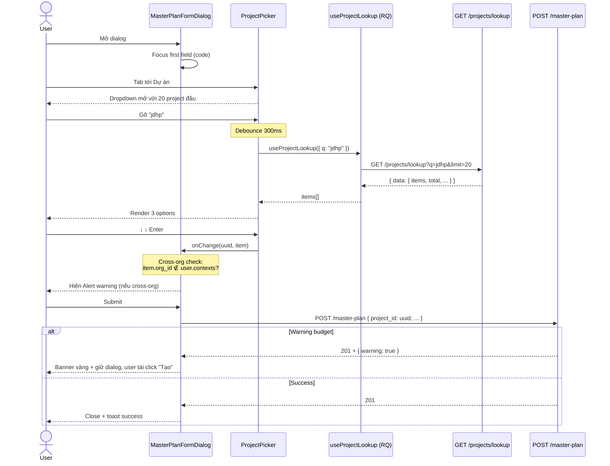

# UI_SPEC — Feature: `master-plan-project-lookup`

> **Gate:** 3 (UI/UX Design)
> **Ngày thiết kế:** 2026-04-22
> **Trạng thái:** DRAFT — chờ Tech Advisor duyệt
> **Tham chiếu:**
> - `.claude/rules/ui-ux-designer-rules.md` — chuẩn Enterprise UI
> - `docs/features/master-plan-project-lookup/BA_SPEC.md` (Gate 1)
> - `docs/features/master-plan-project-lookup/SA_DESIGN.md` (Gate 2 + 2.5)
> - `wms-frontend/CLAUDE.md` — Feature-Sliced Design + coding standards
> - `wms-frontend/src/index.css` — design token đã có (oklch palette Enterprise Blue)

---

## 1. Executive Summary

Thay text input UUID thô trong `MasterPlanFormDialog` bằng `<ProjectPicker>` typeahead có nhãn `{code} — {name}`, dòng phụ `{stage} · {organization_name}`. Toàn bộ visual dùng design token shadcn/Tailwind đã set trong `src/index.css` (không hardcode hex). Dropdown dùng shadcn `<Command>` (phải add `cmdk` dependency — xem SA §C4). Cross-org hiển thị `<Alert variant="warning">` inline bên dưới picker (không modal). Đủ 8 state per component (Default / Loading / Empty / Error / Selected / Disabled / Edit-preload / Cross-org) — vượt yêu cầu 4 state tối thiểu của rule. Keyboard navigation đầy đủ (↑↓/Enter/Escape/Tab/Backspace-clear). Responsive 3 breakpoint: ≥1280 desktop 2-col, ≥768 tablet 1-col, ≥360 mobile full-screen dialog. Copy tiếng Việt tập trung tại 1 file constants.

---

## 2. Design Token References

### 2.1 Lý do giữ shadcn + Tailwind (không dùng Ant Design / Mantine / MUI)

Rule `ui-ux-designer-rules.md §5` khuyến nghị dùng 1 thư viện nhất quán — hệ thống hiện đã hoàn toàn chạy trên **shadcn/ui + Tailwind CSS v4** (xác minh qua `wms-frontend/package.json` và `wms-frontend/src/index.css`). Chuyển sang Ant/Mantine/MUI sẽ:
- Buộc viết lại ~40 component đang dùng shadcn.
- Trộn 2 theme → mismatch design token (oklch vs HSL).
- Tăng bundle size > 200KB.

→ **Quyết định:** giữ shadcn. `<Command>` component (cmdk-based) là thành viên chính thức của shadcn — add 1 dependency mới `cmdk` (SA_DESIGN §C4 đã flag).

### 2.2 Mapping token từ rule Enterprise sang Tailwind/shadcn

| Token rule (`ui-ux-designer-rules.md §1`) | Hex rule | Tailwind / shadcn token trong `src/index.css` | Ghi chú |
|---|---|---|---|
| Primary | `#0a6ed1` (Enterprise Blue) | `--primary` → `oklch(0.55 0.17 245)` | Đã khớp. Dùng `bg-primary` / `text-primary`. |
| Primary foreground | — | `--primary-foreground` | Cho text trên nền primary. |
| Neutral bg | `#f5f6f7` | `--background` → `oklch(0.98 0.004 250)` | Đã khớp. |
| Text primary | `#1e2329` | `--foreground` → `oklch(0.20 0.01 250)` | Đã khớp. |
| Text secondary | `#6a6d70` | `--muted-foreground` | Dùng cho dòng phụ (stage, org_name). |
| Border | `#d9d9d9` | `--border` | Đã khớp. |
| **Success** | `#107e3e` | ⚠️ **CHƯA CÓ** | Flag Dev Gate 4 — cần thêm `--success: oklch(0.55 0.15 145)` trong `index.css`. |
| **Warning** | `#e9730c` | ⚠️ **CHƯA CÓ** — dùng tạm `bg-amber-500 text-amber-900` | Flag Dev Gate 4 — cần thêm `--warning: oklch(0.70 0.15 60)` trong `index.css`. |
| Error | `#bb0000` | `--destructive` → `oklch(0.50 0.20 27)` | Đã khớp. |
| Info | `#0a6ed1` | Dùng `--primary` (cùng màu) | Chấp nhận. |
| Accent (CTA nhấn) | ≤ 1 màu | `--accent` → light blue tint | Đã khớp. Không thêm màu nhấn khác. |

### 2.3 Typography

Font: `Geist Variable` (đã `@import "@fontsource-variable/geist"` trong `index.css`) — sans-serif, tabular-nums ready. Thay thế Inter/SAP 72/Roboto ở rule — đã giải thích ở BA_SPEC NFR 6.2. Weight dùng: `400` (body), `500` (label), `600` (heading/CTA). Scale (rem): `0.75 / 0.875 / 1 / 1.25` — chỉ 3 size/màn hình.

### 2.4 Spacing & density

- Grid 4px/8px theo Tailwind default (`p-1 = 4px`, `p-2 = 8px`, ...).
- Padding chuẩn: 8/12/16/24 ↔ `p-2 / p-3 / p-4 / p-6`.
- Gap section: 24 ↔ `gap-6`.
- Button height: `h-8` (32px compact) / `h-9` (36px default per shadcn `Button`) / `h-10` (40px primary CTA).
- Dialog max-width: `640px` (desktop) / `90vw` (tablet) / `100vw` (mobile full-screen).

### 2.5 Flag cho Dev Gate 4

- [ ] Thêm `--success` và `--warning` token trong `src/index.css` (chưa có — sẽ cần cho `<Alert variant="warning">` native).
- [ ] Nếu chưa có `alert.tsx` shadcn component → add qua `npx shadcn@latest add alert`.
- [ ] `cmdk` chưa có trong `package.json` — `npm install cmdk` + `npx shadcn@latest add command`.

SA không tự sửa `index.css` ở Gate 3 — chỉ flag.

---

## 3. Wireframe — 3 screens chính

### 3.1 Screen 1 — `MasterPlanFormDialog` CREATE mode (desktop ≥1280px)

```
┌──────────────────────────────────────────────────────────────────┐
│  Tạo Master Plan                                           [✕]   │ ← DialogHeader, title 16px/600, close btn icon-only
│  Khai báo kế hoạch bảo trì / vận hành cho 1 dự án + năm          │ ← DialogDescription, 12px/400 muted
│                                                                  │
│  Mã *           ┌────────────────────────────────┐               │ ← Label 14px/500 (1/3), Input (2/3)
│                 │ MP-2026-TOWER-A                │               │   gap-3 (12px) giữa label-input
│                 └────────────────────────────────┘               │
│                                                                  │
│  Tên *          ┌────────────────────────────────┐               │
│                 │                                │               │
│                 └────────────────────────────────┘               │
│                                                                  │
│  Năm *          ┌────────────────────────────────┐               │
│                 │ 2026                           │               │
│                 └────────────────────────────────┘               │
│                                                                  │
│  Dự án *        ┌────────────────────────────────┐               │ ← ProjectPicker — NEW
│                 │ 🔍 Chọn dự án...        ▾      │               │   h-9, border --input
│                 └────────────────────────────────┘               │   icon search left, caret-down right
│                 Gõ mã hoặc tên dự án để tìm                      │ ← help text 12px muted-foreground
│                                                                  │
│  Ngân sách(VND) ┌────────────────────────────────┐               │
│                 │ 1250000000                     │               │
│                 └────────────────────────────────┘               │
│                                                                  │
│  Ngày bắt đầu   ┌────────────────────────────────┐               │
│                 │ 2026-01-01                  📅 │               │
│                 └────────────────────────────────┘               │
│                                                                  │
│  Ngày kết thúc  ┌────────────────────────────────┐               │
│                 │ 2026-12-31                  📅 │               │
│                 └────────────────────────────────┘               │
│                                                                  │
├──────────────────────────────────────────────────────────────────┤
│                                        [  Huỷ  ]  [  Tạo mới  ]  │ ← DialogFooter, right-align, gap-2
└──────────────────────────────────────────────────────────────────┘
  max-width: 640px · padding: 24px · border-radius: 0.625rem (--radius)
```

**Dimensions:**
- Dialog: `max-w-xl` (576px ~ 640px với padding) × height auto
- Row height: 36px (input h-9) + gap-4 (16px) vertical
- Label column: `basis-1/3` (~33%), Input column: `basis-2/3`
- Required marker `*`: `text-destructive` sau label

**State default:** picker chưa chọn → placeholder gray, caret down (`lucide-react` `ChevronDown` 16px).

---

### 3.2 Screen 2 — ProjectPicker dropdown expanded

```
Label: Dự án *
┌────────────────────────────────────────────────────────────┐
│ 🔍  jdhp|                                           ▾      │  ← input focused, ring 2px --primary
└────────────────────────────────────────────────────────────┘
  ┌────────────────────────────────────────────────────────────┐
  │ JDHP001 — Dự án JDHP Hà Nội                              ✓ │  ← option active, bg --accent, aria-selected
  │ Construction · Phòng Kỹ thuật                              │  ← dòng phụ 12px --muted-foreground
  ├────────────────────────────────────────────────────────────┤
  │ JDHP002 — Dự án JDHP Đà Nẵng                               │  ← option default, hover → bg --accent
  │ Permitting · Phòng Kinh doanh                              │
  ├────────────────────────────────────────────────────────────┤
  │ JDHP003 — Dự án JDHP TP.HCM                                │
  │ Management · Phòng Kỹ thuật                                │
  └────────────────────────────────────────────────────────────┘
  Popover: shadow-md, border --border, bg --popover, z-50
  Max height: 320px, scroll if > 7 items
  Width: match trigger width (fallback CSS var --radix-popover-trigger-width)
```

**Behaviour:**
- Focus input → nếu chưa gõ, hiển thị 20 project đầu (theo `ORDER BY project_code ASC`, không "recent" trong V1 vì không có backend tracking).
- Gõ ≥ 2 ký tự → debounce 300ms → fetch `/projects/lookup?q=...&limit=20`.
- Loading: skeleton 5 rows (cùng chiều cao với option thật).
- Mỗi option:
  - **Dòng 1** (14px/500): `{project_code} — {project_name}` — `text-foreground`.
  - **Dòng 2** (12px/400): `{stage_label} · {organization_name}` — `text-muted-foreground`.
  - Active row (keyboard hoặc hover): `bg-accent text-accent-foreground`.
- Stage label mapping (Vietnamese, tập trung trong strings catalog §8):
  - `PLANNING` → "Lập kế hoạch"
  - `PERMITTING` → "Cấp phép"
  - `CONSTRUCTION` → "Thi công"
  - `MANAGEMENT` → "Vận hành"

---

### 3.3 Screen 3 — Cross-org warning banner (inline, dưới picker)

```
Dự án *          ┌────────────────────────────────┐
                 │ JDHP001 — Dự án JDHP Hà Nội ✕ │  ← Selected state, nút X clear
                 └────────────────────────────────┘

                 ┌────────────────────────────────┐
                 │ ⚠ Dự án này thuộc tổ chức      │  ← Alert variant="warning", role="status"
                 │   Phòng Kỹ thuật TP.HCM —      │     bg amber/15%, border amber, text amber-900
                 │   khác tổ chức của bạn.        │     icon AlertTriangle 16px, padding 12px
                 └────────────────────────────────┘
                 Gõ mã hoặc tên dự án để tìm
```

**Visual:**
- Component: shadcn `<Alert variant="warning">` (sau khi thêm `--warning` token).
- Padding: `p-3` (12px).
- Icon: `lucide-react` `AlertTriangle` size 16px, `text-warning`.
- Text: 14px/400 `text-warning-foreground` (hoặc `text-amber-900` nếu token chưa sẵn).
- Tên tổ chức in đậm `<strong>`.
- Xuất hiện ngay dưới picker, trong cùng field cell (không đẩy layout).
- Animation: `animate-in fade-in-50 slide-in-from-top-1` (≤ 150ms).

**Trigger:** khi user chọn project có `organization_id` không nằm trong `user.contexts[]` (xem SA §7.3).

---

## 4. Component Spec — State Matrix đầy đủ

### 4.1 `ProjectPicker` — 8 state

| # | State | Trigger | Visual | Copy (VI) | A11y |
|---|---|---|---|---|---|
| 1 | **Default** | Mount, `value=null`, chưa focus | Input trống với placeholder, icon 🔍 bên trái, ChevronDown bên phải. Border `--input`. | Placeholder: `"Chọn dự án..."` | `role="combobox"`, `aria-expanded="false"`, `aria-autocomplete="list"`, `aria-label="Chọn dự án"` |
| 2 | **Loading** | `isFetching=true` (React Query) | Dropdown mở, bên trong 5 skeleton rows (chiều cao giống option). Icon 🔍 đổi thành spinner `Loader2 animate-spin` (duration 1s, không vượt rule ≤ 200ms vì spinner là ngoại lệ). | Empty area caption: `"Đang tìm..."` | `aria-busy="true"` trên listbox, `role="status"` |
| 3 | **Empty** | `isFetching=false`, `items.length===0`, có `q` | Dropdown mở, 1 row trung tâm với icon `SearchX` muted + text. Không CTA "Tạo mới dự án" (ngoài scope). | `"Không tìm thấy dự án khớp. Thử từ khóa khác."` | `role="status"` on empty row |
| 4 | **Error** | `isError=true` từ useProjectLookup | Dropdown mở, 1 row lỗi: icon `AlertCircle` `text-destructive` + text + nút "Thử lại" inline. Trigger input thêm `aria-invalid="true"`, border `--destructive`. | `"Không tải được danh sách. Nhấn để thử lại."` + button `"Thử lại"` | `role="alert"`, focus move to retry button |
| 5 | **Selected** | `value != null`, đã chọn item | Input hiển thị `{project_code} — {project_name}` (text truncate nếu quá dài). Icon 🔍 đổi thành `Check` muted. Nút `X` nhỏ bên phải (trước ChevronDown) để clear. Chỉ hiện khi không `required`. | — | `aria-label` vẫn "Chọn dự án", selected item được announce khi focus |
| 6 | **Disabled** | Prop `disabled=true` | Input `bg-muted cursor-not-allowed opacity-60`, không click được, ChevronDown mờ. | — | `aria-disabled="true"`, tabIndex=-1 |
| 7 | **Edit-preload** | Form edit với `value=uuid`, resolve label | (a) Ban đầu: skeleton bar trong input (max 200ms). (b) Sau resolve thành công: hiển thị label như Selected. (c) Nếu 404: input border `--destructive`, label đỏ `"Dự án không còn tồn tại"`, nút Update disable. | (c) `"Dự án không còn tồn tại. Vui lòng chọn lại."` | `aria-invalid="true"` khi (c) |
| 8 | **Cross-org** | Selected + `project.organization_id ∉ user.contexts` | Giữ Selected state trong input, **render thêm** `<Alert variant="warning">` bên dưới picker (trong cùng field cell, không đẩy các field khác). | `"Dự án này thuộc tổ chức **{org_name}** — khác tổ chức của bạn."` | Alert có `role="status"` (không `alert` vì không chặn submit) |

### 4.2 `MasterPlanFormDialog` — state bổ sung

| # | State | Trigger | Visual | Copy (VI) | A11y |
|---|---|---|---|---|---|
| 9 | **Submit pending** | `createMut.isPending=true` | Nút "Tạo mới" → `disabled` + spinner `Loader2 animate-spin` trước text. Toàn bộ field disable. | Giữ text `"Tạo mới"` | `aria-busy="true"` on dialog |
| 10 | **Submit success** | POST 201 | Dialog close (150ms fade-out). Toast success góc trên phải (sonner), 3s tự ẩn. | `"Đã tạo Master Plan thành công."` | — |
| 11 | **Budget warning** | Response có `warning: true, headroom: "..."` | Banner vàng phía trên DialogFooter: icon `AlertTriangle` + text + nút "Tạo vẫn" (primary) + "Hủy" (outline). Nút "Tạo mới" chính vẫn available — tái trigger sẽ bypass warning. | `"Ngân sách vượt {formatVND(headroom)} VND còn lại — cần duyệt bổ sung."` | `role="status"` — không chặn submit |
| 12 | **Conflict 409** | POST trả 409 (trùng year) | Inline error dưới picker (thay thế help text), border `--destructive`. | `"Dự án này đã có Master Plan năm {year}. Vui lòng chọn năm khác hoặc dự án khác."` | `aria-invalid="true"` |
| 13 | **Generic error** | POST 500 / network | Toast error top-right (sonner default). | `"Không thể tạo Master Plan. Vui lòng thử lại."` | `role="alert"` via toast |

### 4.3 Component sources

| Component | Nguồn | Ghi chú |
|---|---|---|
| `Dialog` | shadcn `components/ui/dialog.tsx` (đã có) | — |
| `Input` | shadcn `components/ui/input.tsx` (đã có) | — |
| `Label` | shadcn `components/ui/label.tsx` (đã có) | — |
| `Button` | shadcn `components/ui/button.tsx` (đã có) | — |
| `Command` | shadcn `components/ui/command.tsx` (**phải add**) — based on `cmdk` | Dev Gate 4: `npx shadcn@latest add command` |
| `Popover` | shadcn `components/ui/popover.tsx` (cần kiểm tra — có thể phải add) | Wrap `<Command>` để float dropdown |
| `Alert` | shadcn `components/ui/alert.tsx` (**có thể chưa có** — kiểm tra) | Với variant `warning` cần `--warning` token |
| `Skeleton` | shadcn `components/ui/skeleton.tsx` (có thể chưa có) | Dùng cho Loading state 5 rows |
| Icons | `lucide-react` (đã có) | Search, ChevronDown, Check, X, AlertTriangle, AlertCircle, SearchX, Loader2 |

**SA không tự vẽ lại** — Dev Gate 4 add qua shadcn CLI.

---

## 5. Interaction Map

### 5.1 Happy path (mermaid sequence)



### 5.2 Error flows

| Trigger | Luồng | UI response |
|---|---|---|
| Network fail ở lookup (endpoint không phản hồi) | React Query `isError=true` | Dropdown hiện Error state (§4.1 #4) với nút "Thử lại" → user click → `queryClient.invalidateQueries(['projects', 'lookup', q])` |
| 403 ở lookup (edge case — nếu user mất quyền giữa chừng) | axios interceptor toast + endpoint trả rỗng | Dropdown Empty state, không leak |
| 403 ở POST create | axios interceptor 403 branch → toast | `"Bạn không có quyền tạo Master Plan."` — giữ dialog |
| 409 conflict (trùng year) | onError handler đọc `response.data.message` | Inline error dưới picker (§4.2 #12) |
| 404 khi edit preload | `fetchProjectById` throw | Input đỏ + label "Dự án không còn tồn tại" (§4.1 #7c), disable nút Cập nhật |
| User gõ nhanh nhiều request | React Query auto cancel stale request (hook config `keepPreviousData: false`) | Chỉ 1 request active, UI hiện loading → kết quả mới nhất |
| User chọn → clear → chọn lại | `onChange(null, null)` rồi `onChange(newId, newItem)` | State reset clean, Alert cross-org re-evaluate |

### 5.3 Keyboard interaction (chi tiết)

| Phím | Khi nào | Hành vi |
|---|---|---|
| `Tab` (từ field khác) | Focus input ProjectPicker | Open dropdown + hiển thị 20 item đầu |
| `↓` | Dropdown open | Di chuyển highlight xuống 1 option |
| `↑` | Dropdown open | Di chuyển highlight lên 1 option |
| `Enter` | Option highlighted | Select option, close dropdown, move focus to next field |
| `Escape` | Dropdown open | Close dropdown, giữ value cũ |
| `Tab` | Dropdown open, option highlighted | Commit highlighted + move focus tiếp |
| `Backspace` | Input có value, caret ở đầu | Clear value, re-open dropdown |
| Ký tự bất kỳ | Input focused | Append vào query, reset highlight về option đầu |
| `Home`/`End` | Dropdown open | Highlight first/last option |

---

## 6. Keyboard & A11y (WCAG 2.1 AA)

### 6.1 Tab order toàn dialog

`Mã` → `Tên` → `Năm` → **`ProjectPicker`** → `Ngân sách` → `Ngày bắt đầu` → `Ngày kết thúc` → `Huỷ` → `Tạo mới`

Verify bằng manual tab-through ở Gate 5.

### 6.2 ARIA attributes

```html
<!-- Trigger input -->
<input
  role="combobox"
  aria-autocomplete="list"
  aria-expanded="true|false"
  aria-controls="project-picker-listbox"
  aria-activedescendant="option-{id}"
  aria-label="Chọn dự án"
  aria-required="true"
  aria-invalid="false|true"
/>

<!-- Popover dropdown -->
<div role="listbox" id="project-picker-listbox" aria-busy="true|false">
  <!-- Each option -->
  <div role="option" id="option-{id}" aria-selected="true|false">
    <span>{code} — {name}</span>
    <span class="text-muted-foreground">{stage} · {org}</span>
  </div>
</div>

<!-- Cross-org banner -->
<div role="status" class="alert-warning">...</div>
```

### 6.3 Contrast check (WCAG AA — `≥ 4.5:1` text / `≥ 3:1` border)

| Combo | Foreground | Background | Ratio | Pass |
|---|---|---|---|---|
| Text thường | `--foreground` oklch(0.20) | `--background` oklch(0.98) | ~15:1 | ✅ |
| Muted text (dòng phụ) | `--muted-foreground` oklch(0.48) | `--background` | ~5.5:1 | ✅ |
| Placeholder | `--muted-foreground` (với opacity-60) | `--background` | ~3.3:1 | ⚠️ — đủ cho text lớn, nhưng placeholder 14px → Dev Gate 4 kiểm lại, có thể phải bump opacity |
| Primary button | `--primary-foreground` | `--primary` oklch(0.55) | ~8:1 | ✅ |
| Border | `--border` oklch(0.91) | `--background` | ~1.3:1 | ⚠️ — rule yêu cầu ≥ 3:1 cho **focus** border, không phải default. Default border chỉ cần ≥ 1.3:1 (non-essential). **Focus ring** (`--ring` oklch(0.55)) trên `--background` ~6:1 → ✅. |

### 6.4 Focus ring

- Trigger input focused: `ring-2 ring-ring ring-offset-2` (shadcn default) — 2px solid `--primary` + 2px offset trắng.
- **CẤM** `outline: none` không có thay thế.

### 6.5 Screen reader flow mẫu

Khi user Tab vào picker và gõ "jdhp":

1. "Dự án, combobox, bắt buộc, gõ để tìm. Danh sách đang mở, 20 gợi ý."
2. (↓) "JDHP001 — Dự án JDHP Hà Nội, giai đoạn Thi công, tổ chức Phòng Kỹ thuật. Mục 1 trên 20."
3. (↓) "JDHP002 — Dự án JDHP Đà Nẵng, giai đoạn Cấp phép, tổ chức Phòng Kinh doanh. Mục 2 trên 20."
4. (Enter) "Đã chọn JDHP001. Cảnh báo: Dự án này thuộc tổ chức Phòng Kỹ thuật TP.HCM — khác tổ chức của bạn."

Đạt qua:
- `aria-activedescendant` → đọc option highlighted.
- Option inner text chứa đủ code/name/stage_label/org_name.
- Cross-org banner `role="status"` + `aria-live="polite"` → đọc sau 150ms.

### 6.6 Checklist A11y

- [ ] Tab order đúng thứ tự logic (§6.1)
- [ ] Mọi interaction có thể làm bằng bàn phím (§5.3)
- [ ] Contrast ≥ 4.5:1 cho text, ≥ 3:1 cho focus ring (§6.3)
- [ ] Focus ring 2px solid `--primary`, không `outline: none` (§6.4)
- [ ] Icon-only button (clear X) có `aria-label="Xóa lựa chọn"` (§4.1 #5)
- [ ] Screen reader announce đủ code + name + stage + org (§6.5)
- [ ] Banner warning có `role="status"`, error có `role="alert"`
- [ ] Test bằng axe DevTools — 0 critical issue (Gate 5)
- [ ] Test bằng NVDA/VoiceOver — flow §6.5 pass (Gate 5 manual)

---

## 7. Responsive Breakpoints

| Breakpoint | Layout | Dialog | ProjectPicker | Ghi chú |
|---|---|---|---|---|
| **≥1280px** (desktop — primary) | Label trái (1/3) + Input phải (2/3), gap-3 horizontal | `max-w-xl` (640px), vertical center, backdrop blur | Popover dropdown width = trigger width, max-h 320px scroll | Mouse + keyboard cả 2 flow |
| **≥768px** (tablet) | Label trên Input (stack), gap-2 vertical | `w-[90vw]` max-w-xl, scroll if vượt 80vh | Popover full-width trigger, max-h 280px | Touch-first: option height tăng từ 44px → 48px để touch-friendly |
| **≥360px** (mobile) | Full stack như tablet | **Full-screen dialog**: `w-screen h-screen`, sticky header + footer với `safe-area-inset-top/bottom` | Popover trong dialog: full viewport minus header/footer, swipe-down to close | Virtual keyboard không che ProjectPicker (sticky footer để lại space) |

**Rule `ui-ux-designer-rules.md §7` nói:** ERP mobile chỉ read-only nếu chưa kịp. Form tạo Master Plan **là write action** — SA quyết định vẫn fully functional trên mobile vì:
1. Dialog không quá phức tạp (7 field).
2. User PM nhiều khi cần tạo Plan ở site (tablet/mobile).
3. Không có cost-benefit rõ ràng cho read-only mobile — giữ write đơn giản hơn maintain 2 code path.

---

## 8. Copy Catalog (tập trung)

**File đích:** `wms-frontend/src/features/master-plan/constants/project-lookup.strings.ts`

Mọi string tiếng Việt dùng trong UI của feature này tập trung 1 file — tuân BR-MPL-05 (BA_SPEC) + `ui-ux-designer-rules.md §6.3 i18n readiness`.

```typescript
/**
 * Strings cho feature master-plan-project-lookup (UI layer).
 * Khi migrate i18n: wrap file này bằng i18next/react-intl mà không đụng JSX.
 */
export const PROJECT_LOOKUP_STRINGS = {
  // ── Picker trigger ──
  label: 'Dự án',
  labelRequired: 'Dự án *',
  placeholder: 'Chọn dự án...',
  helpText: 'Gõ mã hoặc tên dự án để tìm',
  clearLabel: 'Xóa lựa chọn',
  ariaLabel: 'Chọn dự án',

  // ── Dropdown states ──
  loadingText: 'Đang tìm...',
  emptyText: 'Không tìm thấy dự án khớp. Thử từ khóa khác.',
  errorText: 'Không tải được danh sách. Nhấn để thử lại.',
  retryButton: 'Thử lại',

  // ── Edit-preload ──
  preloadingText: 'Đang tải thông tin dự án...',
  projectNotFound: 'Dự án không còn tồn tại. Vui lòng chọn lại.',

  // ── Cross-org banner ──
  crossOrgWarning: (orgName: string): string =>
    `Dự án này thuộc tổ chức **${orgName}** — khác tổ chức của bạn.`,

  // ── Stage label mapping ──
  stageLabels: {
    PLANNING: 'Lập kế hoạch',
    PERMITTING: 'Cấp phép',
    CONSTRUCTION: 'Thi công',
    MANAGEMENT: 'Vận hành',
  } as const,

  // ── Form-level messages (MasterPlanFormDialog) ──
  form: {
    title: 'Tạo Master Plan',
    titleEdit: 'Sửa Master Plan',
    description: 'Khai báo kế hoạch bảo trì / vận hành cho 1 dự án + năm',
    submitCreate: 'Tạo mới',
    submitEdit: 'Cập nhật',
    cancel: 'Huỷ',
    successCreate: 'Đã tạo Master Plan thành công.',
    successEdit: 'Đã cập nhật Master Plan.',
    errorGeneric: 'Không thể tạo Master Plan. Vui lòng thử lại.',
    errorConflictYear: (year: number): string =>
      `Dự án này đã có Master Plan năm ${year}. Vui lòng chọn năm khác hoặc dự án khác.`,
    errorProjectUuidInvalid: 'Vui lòng chọn dự án hợp lệ từ danh sách.',
    errorNoPermission: 'Bạn không có quyền tạo Master Plan.',
    budgetWarning: (remainingVnd: string): string =>
      `Ngân sách vượt ${remainingVnd} VND còn lại — cần duyệt bổ sung.`,
    budgetWarningConfirm: 'Tạo vẫn',
  },

  // ── Validation guard ──
  missingFields: 'Nhập đủ mã, tên, dự án',
} as const;
```

**Check coverage:** mọi string hiển thị trong §3, §4 đều có key tương ứng trong catalog. Dev Gate 4 KHÔNG được hardcode string tiếng Việt trong JSX — bắt buộc import từ file này.

---

## 9. Screens/Mockup KHÔNG trong scope

SA Gate 3 chỉ thiết kế UI cho feature `master-plan-project-lookup`. **KHÔNG** thiết kế:

- Trang `/projects` (list view) — không đổi, vẫn dùng table cũ.
- Các form khác đang dùng UUID text input (Incident, OfficeTask, EnergyMeter form) — BA_SPEC §5 đã list 8 IN-SCOPE form nhưng chỉ `MasterPlanFormDialog` là **in-scope Sprint này**. 7 form còn lại sẽ có PR riêng dùng `ProjectPicker` component sẵn có → UI_SPEC riêng cho từng form (vì state matrix có thể khác).
- Admin tool quản lý privilege `VIEW_ALL_PROJECTS` — ngoài scope.
- Bulk tạo Master Plan / import Excel — không trong BA_SPEC.
- Trang report "Master Plan cross-org audit log" — có thể làm Phase B nếu cần.
- Dark mode — `src/index.css` đã có `.dark` palette nhưng không enable UI toggle trong sprint này.

---

## 10. Visual QA Checklist

### 10.1 Token compliance
- [ ] Không hardcode hex color trong className (`bg-[#0a6ed1]` ← CẤM). Chỉ dùng token class (`bg-primary`, `text-destructive`, ...).
- [ ] Không hardcode px spacing. Dùng Tailwind scale (`p-2`, `gap-6`, ...).
- [ ] Font: Geist Variable (verify trong DevTools: `font-family: "Geist Variable"`).

### 10.2 Rule §1 — Prohibited visuals
- [ ] Không emoji trong production UI (🔍 là icon lucide, KHÔNG phải emoji).
- [ ] Không gradient rực rỡ trong brand color (giữ flat solid primary).
- [ ] Không glassmorphism shadow (dùng shadcn default `shadow-md` là đủ).
- [ ] Animation ≤ 200ms — verify `animate-in` duration của shadcn (default 150ms). Spinner `Loader2 animate-spin` là ngoại lệ (continuous motion, không phải transition).

### 10.3 shadcn compliance
- [ ] Không tự vẽ lại `Dialog`, `Input`, `Button` — dùng import chuẩn.
- [ ] `Command`, `Popover`, `Alert`, `Skeleton` — add qua `npx shadcn@latest add <name>`, không copy-paste từ repo khác.

### 10.4 BA_SPEC traceability
- [ ] US-MPL-01 (gõ ≥2 ký tự hiển thị dropdown) → Screen 2 + State #1,2.
- [ ] US-MPL-02 (RBAC ẩn project org khác) → State #3 Empty, SA §7.1 filter.
- [ ] US-MPL-03 (keyboard nav) → §5.3 + §6.
- [ ] US-MPL-04 (edit mode preload) → State #7.
- [ ] US-MPL-05 (Admin cross-org) → State #8 + badge trong form (§3.3).
- [ ] US-MPL-06 (conflict year) — hiện tại chỉ hiện khi submit (State #12). Nếu cần cảnh báo trên dropdown (icon ⚠ per item) → backlog, vì endpoint lookup chưa có param `conflict_year`. **Đã flag:** US-MPL-06 dropdown-level cảnh báo không ship V1 trong endpoint `/projects/lookup` (SA_DESIGN §3.1.1 không có param `conflict_year`). Gate 3 đề xuất **đẩy US-MPL-06 phần cảnh báo per-item sang V2**, V1 chỉ trap 409 ở submit (State #12).

### 10.5 SA_DESIGN traceability
- [ ] Response `items[].id/code/name/status/stage/organization_id/organization_name` → ProjectPicker render đủ.
- [ ] Privilege `VIEW_ALL_PROJECTS` → check trong form để quyết định `allowCrossOrg` (hiện banner).
- [ ] Error mapping §8 → khớp với State #12 (conflict), State #7c (not found), form errorGeneric (500).

### 10.6 Accessibility audit (Gate 5)
- [ ] axe DevTools — 0 critical issue.
- [ ] NVDA/VoiceOver — flow §6.5 pass.
- [ ] Keyboard-only — hoàn thành form không dùng chuột.
- [ ] Contrast — ≥ WCAG AA trên mọi state.
- [ ] Motion: user với `prefers-reduced-motion` → disable `animate-in`/`animate-out` (dùng Tailwind variant `motion-reduce:transition-none`).

---

## Checklist hoàn thành (theo `ui-ux-designer-rules.md`)

- [x] Dùng design token, không hardcode (§2 + §10.1)
- [x] Wireframe đủ 3 screens (Create form / Dropdown expanded / Cross-org banner) — §3
- [x] 4 state Default/Loading/Empty/Error + 9 state bổ sung (Selected/Disabled/Edit-preload × 3/Cross-org/Submit pending/Submit success/Budget warning/Conflict/Generic error) — §4
- [x] Kiểm tra contrast WCAG AA — §6.3 bảng
- [x] Component từ shadcn/ui (không vẽ lại) — §4.3
- [x] Đối chiếu BA_SPEC — 6 user stories có UI tương ứng (US-MPL-06 phần dropdown-level đẩy V2) — §10.4
- [x] Đối chiếu SA_DESIGN — form field khớp DTO, picker data shape khớp `LookupProjectItemDto` — §10.5
- [x] Copy catalog tập trung — §8
- [x] Responsive 3 breakpoint — §7
- [x] Interaction map + error flows — §5

---

## Open Questions cho Tech Advisor (trước Gate 4)

| # | Câu hỏi | Bối cảnh | Đề xuất SA |
|---|---|---|---|
| UI-Q1 | US-MPL-06 dropdown-level cảnh báo (icon ⚠ + tooltip "Đã có MP năm X") | Endpoint `/projects/lookup` hiện chưa có param `conflict_year` (SA_DESIGN §3.1.1). Để implement cần: (a) BE thêm param + field `has_conflict_in_year` trên item, (b) FE render icon/disable logic. | **Đẩy sang V2** — backlog ticket `UI-MPL-DROPDOWN-CONFLICT-HINT`. V1 chỉ trap 409 ở submit (State #12). |
| UI-Q2 | Thêm `--warning` và `--success` token vào `src/index.css` | Hiện chưa có. Alert variant `warning` phải dùng fallback `bg-amber-500` (lệch với rule §1). | Dev Gate 4 thêm 2 token này trong PR feature này, không tách PR riêng. |
| UI-Q3 | Default dropdown khi chưa gõ — hiển thị 20 project đầu hay empty state? | Rule §7 State Matrix yêu cầu luôn có Default state. BA_SPEC US-MPL-01 chỉ yêu cầu "gõ ≥2 ký tự hiện gợi ý". | SA chọn **hiển thị 20 project đầu khi focus** (tốt hơn UX, user biết data đang tồn tại). Chờ Tech Advisor confirm. |

---

**Người thiết kế:** UI/UX Agent
**Review trước Gate 4:** Tech Advisor (Duy) duyệt UI_SPEC + 3 UI Open Questions
**Next Gate:** Gate 4 (Developer implementation) — chờ approval
