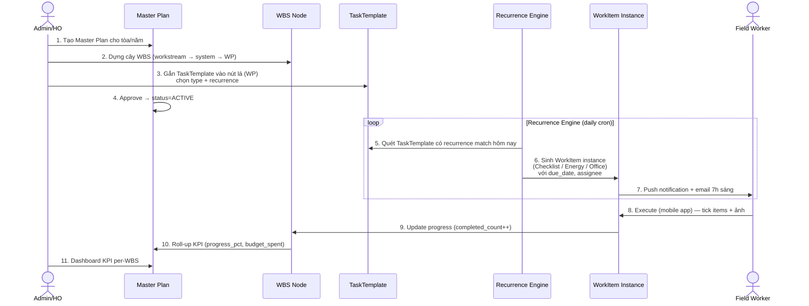

# BA_SPEC: Master Plan + 4 module con (Checklist / Office Task / Energy Inspection / Incident)

> **Nguồn tham chiếu:**
> - `docs/reference/docs/HDSD checklist/HDSD.docx` + `HDSD (1).docx` — user type Nhân viên bảo vệ (mobile app workflow.impc.one)
> - `docs/reference/docs/HDSD checklist/Hướng dẫn sử dụng - User Type Quản Lý Dự Án.pptx` — user type QLDA/HO (web app, 78 slides)
> **Chuẩn tham chiếu:** PMI PMBOK — Work Breakdown Structure (WBS); ISO 41001 Facility Management
> **Ngày phân tích:** 2026-04-18
> **Trạng thái:** Gate 1 — BA ANALYSIS (APPROVED scope, ready for Gate 2 SA_DESIGN)

---

## 0. TÓM TẮT

**Master Plan** = cây WBS lập kế hoạch bảo trì / vận hành / quản lý tòa nhà của IMPC, mỗi nút lá (work package) sinh ra **N task instance** thuộc 1 trong 4 loại con: Checklist · Office Task · Energy Inspection · Incident. Master Plan cung cấp **schedule (định kỳ) + budget + resource assignment**; 4 module con cung cấp **form thực thi + evidence (ảnh, giá trị đo) + workflow phê duyệt**.

4 module con **tái sử dụng chung 1 "Work Item engine"** (cùng lifecycle, notification, photo attach) nhưng có **form fields riêng** theo loại.

---

## 1. PHẦN A — PHÂN TÍCH NGƯỢC 4 MODULE CON (từ HDSD `workflow.impc.one`)

### 1.1 Actors & Use Context

| Actor | Mô tả | Kênh chính |
|---|---|---|
| **Admin / Supervisor (SS)** | Tạo checklist template, assign task, xem báo cáo | Web |
| **Nhân viên bảo vệ / Kỹ thuật viên** | Execute checklist, tạo sự cố, upload ảnh | Mobile (iOS/Android) |
| **Head Office (HO)** | Xem toàn portfolio, audit, KPI tòa nhà | Web |
| **Approver** | Duyệt mở lại sự cố, duyệt checklist ngoại lệ | Web + Mobile noti |

**Dẫn xuất quan trọng từ HDSD:**
- App hiện tại là **mobile-first** cho field worker, web cho quản lý.
- Có chức năng **offline** cho Checklist (B1: "Vào công việc hằng ngày (Nơi này có thể checklist offline)")
- Notification 2 kênh: **push app** + **email** — nhắc nhở 7h sáng mỗi ngày
- Ảnh chụp **trực tiếp (không cho upload từ thư viện)** cho evidence critical (Checklist result, Incident)
- Ảnh có **phân loại "trước khắc phục / sau khắc phục"** (before/after fix)

---

### 1.2 Module 1 — CHECKLIST

**Nghiệp vụ cốt lõi:**
Checklist = form đa hạng mục (multi-item) được giao cho field worker thực thi định kỳ (ca, ngày, tuần).

**Entity đề xuất:**

| Entity | Thuộc tính chính |
|---|---|
| **ChecklistTemplate** | `id`, `name`, `description`, `frequency` (DAILY/WEEKLY/MONTHLY/SHIFT), `asset_type` (điện/PCCC/HVAC/vệ sinh...), `items: ChecklistItemTemplate[]` |
| **ChecklistItemTemplate** | `id`, `order`, `content` (câu hỏi/hạng mục), `result_type` (PASS_FAIL / VALUE / PHOTO_ONLY / MIXED), `require_photo: boolean`, `value_unit` (kWh, °C...) |
| **ChecklistInstance** | `id`, `template_id`, `master_plan_task_id` (FK từ WBS), `assignee_id`, `due_date`, `status` (NEW / IN_PROGRESS / COMPLETED), `created_at`, `completed_at` |
| **ChecklistItemResult** | `id`, `instance_id`, `item_template_id`, `result` (PASS/FAIL/NA), `value`, `photos[]`, `photo_category` (BEFORE_FIX / AFTER_FIX / EVIDENCE), `notes`, `checked_at` |

**State machine Instance:**
```
NEW  ──(lưu kết quả item đầu tiên)──▶  IN_PROGRESS
IN_PROGRESS  ──(tất cả item đã COMPLETED)──▶  COMPLETED  (auto-transition + notify)
```

**State per-item:** `incomplete → completed` (sau khi nhấn "Lưu lại")

**Business Rules (trích từ HDSD):**
- BR-CHK-01: Item result "Đạt" → BẮT BUỘC tick giá trị (nếu template có `value_unit`)
- BR-CHK-02: Item require_photo=true → BẮT BUỘC có ít nhất 1 ảnh **chụp trực tiếp** (không upload từ thư viện)
- BR-CHK-03: Instance auto-transition COMPLETED khi 100% item đã completed — gửi notification cho người tạo + supervisor
- BR-CHK-04: Hỗ trợ offline — lưu local trên mobile, sync khi có mạng (conflict resolution: last-write-wins per item)
- BR-CHK-05: Không cho phép sửa result sau khi instance = COMPLETED (immutable evidence)

---

### 1.3 Module 2 — SỰ CỐ / HƯ HỎNG (INCIDENT)

**Nghiệp vụ cốt lõi (từ HDSD + pptx slide 26-42):**
Field worker (Nhân viên bảo vệ/Kỹ thuật) phát hiện bất thường → tạo sự cố với ảnh → QLDA tiếp nhận (qua email/notification) → kiểm tra & đánh giá → giao việc (đổi trạng thái + hạn + người xử lý) → NVKT fix xong báo → QLDA kiểm tra ảnh after + đóng.

**Entity đề xuất:**

| Entity | Thuộc tính chính |
|---|---|
| **Incident** | `id`, `incident_code` (IC-YYMMDD-XXX), `title`, `description`, `project_id` (FK), `severity` (LOW/MEDIUM/HIGH/CRITICAL), `category` (ELECTRICAL/PLUMBING/HVAC/SECURITY/OTHER), `location_text`, `related_asset`, `reported_by`, `assigned_to`, `status` (NEW / IN_PROGRESS / RESOLVED / COMPLETED), `due_date`, `reported_at`, `assigned_at`, `resolved_at`, `closed_at` |
| **IncidentPhoto** | `id`, `incident_id`, `url`, `category` (BEFORE_FIX / AFTER_FIX / EVIDENCE), `uploaded_by`, `uploaded_at` |
| **IncidentReopenRequest** | `id`, `incident_id`, `requested_by`, `reason` (bắt buộc), `status` (PENDING / APPROVED / REJECTED), `approved_by`, `created_at` |
| **IncidentAssigneeChangeRequest** | `id`, `incident_id`, `requested_by` (NVKT), `current_assignee_id`, `proposed_assignee_id`, `reason`, `status` (PENDING / APPROVED / REJECTED), `approved_by` (QLDA) |
| **IncidentComment** | `id`, `incident_id`, `actor_id`, `comment`, `created_at` (audit trail) |

**State machine (xác nhận từ pptx slide 30-34):**
```
NEW          ──(QLDA nhận + giao việc: đổi trạng thái + hạn + assignee)──▶  IN_PROGRESS
IN_PROGRESS  ──(NVKT fix xong + upload ảnh AFTER_FIX)──▶                    RESOLVED
RESOLVED     ──(QLDA kiểm tra ảnh after + xác nhận)──▶                      COMPLETED
COMPLETED    ──(user request reopen + reason → QLDA duyệt)──▶               NEW (re-open flow)
```

**2 sub-flow approval (pptx slide 37, 38-42):**
- **Re-open flow**: user (HDSD) tạo yêu cầu reopen trên status COMPLETED → QLDA nhận thông báo → duyệt/từ chối → incident quay về NEW nếu duyệt
- **Assignee change flow**: NVKT yêu cầu chuyển người xử lý → QLDA xem request → "Đồng ý" (update assignee) hoặc "Từ chối"

**Business Rules:**
- BR-INC-01: Tạo incident BẮT BUỘC có tối thiểu 1 ảnh chụp trực tiếp + description ≥ 20 ký tự (từ HDSD)
- BR-INC-02: Severity = CRITICAL → notify ngay lập tức QLDA + HO (bypass giờ làm việc)
- BR-INC-03: Chỉ incident status = COMPLETED mới có thể request reopen (HDSD: "sự cố trạng thái đóng mới được yêu cầu mở lại")
- BR-INC-04: Reopen request + assignee change request BẮT BUỘC nhập lý do (>= 10 ký tự)
- BR-INC-05: Transition RESOLVED → COMPLETED chỉ **QLDA** có quyền (không để NVKT tự đóng) — kiểm tra ảnh AFTER_FIX trước khi xác nhận
- BR-INC-06: **Export .docx report** per-incident (pptx slide 36) — gồm thông tin + ảnh before/after + timeline
- BR-INC-07: Notification 2 kênh bắt buộc: **email + web notification** khi: (a) incident mới, (b) giao việc, (c) NVKT báo resolved, (d) reopen request pending QLDA duyệt

---

### 1.4 Module 3 — KIỂM TRA NĂNG LƯỢNG (ENERGY INSPECTION) — MODULE RIÊNG

**Xác nhận từ pptx slide 60-71:** Đây là **module riêng**, KHÔNG phải sub-type của Checklist. Có entity **Thiết bị/Đồng hồ** + **Reading (Chỉ số đầu, Chỉ số cuối, Ảnh, Khách hàng)**. Tạo công việc qua mục **"Việc Lặp"** (recurring) với flow tương tự Checklist nhưng form fields khác.

**Entity đề xuất:**

| Entity | Thuộc tính chính |
|---|---|
| **EnergyMeter** | `id`, `meter_code`, `meter_type` (ELECTRIC/WATER/GAS), `unit` (kWh/m³/...), `project_id` (FK), `customer_id` (FK — khách hàng, slide 68), `location_text`, `baseline_value`, `created_at`, `is_active` |
| **EnergyInspection** | `id`, `inspection_code`, `project_id`, `task_template_id` (FK từ Master Plan recurrence), `description`, `assignee_id`, `due_date`, `status` (NEW / IN_PROGRESS / COMPLETED), `created_at`, `completed_at` |
| **EnergyReading** | `id`, `inspection_id`, `meter_id` (FK), `previous_reading`, `current_reading`, `delta`, `reading_photo_url`, `reading_timestamp`, `notes`, `alert_threshold_exceeded: boolean` |

**Luồng nghiệp vụ (pptx slide 62-68):**
1. QLDA vào mục "Việc Lặp" → nhấn "Thêm"
2. Điền: Dự án, mô tả, người xử lý, hạn hoàn thành
3. Nhấn "+" để thêm **danh sách thiết bị/đồng hồ** cần kiểm tra (multi-select)
4. Confirm → instance được sinh theo recurrence pattern
5. Field worker mở inspection trên app → nhập chỉ số đầu + cuối + chụp ảnh đồng hồ cho từng meter
6. QLDA xem kết quả + export report

**Business Rules:**
- BR-ENR-01: Mỗi reading BẮT BUỘC `current_reading >= previous_reading` (nếu < → báo lỗi, có thể do reset meter — cần flag `is_meter_reset: true` để bypass)
- BR-ENR-02: Delta > threshold × baseline (mặc định 20%) → auto tạo Incident severity = MEDIUM, link tới inspection
- BR-ENR-03: Phải chụp **ảnh đồng hồ trực tiếp** (anti-fake) — reuse logic ChupHinh từ HDSD
- BR-ENR-04: Export .docx báo cáo năng lượng (pptx slide 71) — filter: từ-ngày → đến-ngày, dự án, khách hàng, loại năng lượng
- BR-ENR-05: Meter gắn với `project_id + customer_id` — 1 tòa có thể có nhiều khách thuê, mỗi khách có đồng hồ riêng

---

### 1.5 Module 4 — CÔNG VIỆC VĂN PHÒNG (OFFICE TASK)

> **Không có trong HDSD** — suy luận là **task thuần (no checklist, no evidence đo lường)**. Ví dụ: "Chuẩn bị báo cáo tháng", "Gửi email cho NCC X".

**Entity đề xuất:**

| Entity | Thuộc tính |
|---|---|
| **OfficeTask** | `id`, `title`, `description`, `priority` (LOW/MEDIUM/HIGH), `assignee_id`, `due_date`, `status` (TODO / DOING / DONE / CANCELED), `attachments[]`, `completion_note` |

**Business Rules:**
- BR-OFC-01: Task DONE yêu cầu `completion_note` ≥ 10 ký tự
- BR-OFC-02: Overdue task → notify assignee + manager mỗi 24h cho tới khi close

---

### 1.6 Lớp chung: "Công việc của tôi" / "Công việc hằng ngày" (Daily Work Feed)

Pptx slide 18-24 + HDSD mô tả view gộp filter theo:
- **Loại công việc** (Checklist / Sự cố / Công việc văn phòng / Kiểm tra năng lượng)
- **Trạng thái** (Tất cả / Chờ xử lý / Đang xử lý / Đóng / **Trễ hạn**)
- **Khoảng ngày**
- **Thứ tự** (mới nhất / cũ nhất / hạn hoàn thành / trạng thái)
- **Sub-tasks** (expand/collapse — task có thể có công việc con)
- **Progress %** per task, quá hạn đánh dấu màu đỏ
- **Nhóm phụ trách + người tham gia** multi-user

→ Thiết kế 1 **`WorkItem` abstraction** (entity cha polymorphic) cho cả 4 loại để render chung màn này và enforce notification/SLA thống nhất.

**Đề xuất:** **Table Inheritance** — 1 bảng `work_items` cha với polymorphic `work_item_type` + các bảng con (`checklist_instances`, `incidents`, `energy_inspections`, `office_tasks`) chỉ giữ data đặc thù. Bảng cha chứa: id, type, title, project_id, assignee_id, due_date, status, progress_pct, parent_id (sub-task), master_plan_task_id (link lên WBS).

---

### 1.7 Export & Reporting — xác nhận từ pptx

**Export per-module (bắt buộc):**
| Module | Format | Scope | Pptx ref |
|---|---|---|---|
| Incident | .docx | Per-incident (ảnh before/after + timeline) | slide 36 |
| Checklist | .xlsx | Per-instance + multi-record (filter date + type + project) | slide 52-57 |
| Energy Inspection | .docx | Multi-record (filter date + project + customer + energy type) | slide 69-71 |
| Office Task | .xlsx | Multi-record (chưa có HDSD cụ thể, dự kiến tương tự Checklist) | — |

**Module Báo cáo riêng (pptx slide 72-77):**
- Chart thống kê cross-module (incident count, checklist pass rate, energy trend...)
- Filter panel → re-fetch chart
- Click chart element → link nhanh tới detail (icon "watch")
- Print support (điều chỉnh vị trí/kích thước chart trước khi in)
- Export Excel danh sách chi tiết


---

## 2. PHẦN B — MASTER PLAN THEO HƯỚNG WBS

### 2.1 Khái niệm WBS áp dụng cho IMPC

**Định nghĩa (PMBOK):** WBS là phân rã có cấu trúc **deliverable-oriented** của toàn bộ công việc dự án thành các nút lá có thể giao, đo, và kiểm soát được.

**Áp dụng IMPC:** Mỗi **tòa nhà / khu công nghiệp** dưới sự quản lý của IMPC có 1 **Master Plan / năm** (hoặc theo hợp đồng quản lý). Master Plan là cây WBS với 5 cấp.

### 2.2 Cấu trúc WBS 5 cấp

```
Level 0 — MASTER PLAN (1 plan = 1 project quản lý 1 tòa/khu/năm)
  └─ Level 1 — WORKSTREAM  (bảo trì | vận hành | cải tạo | audit)
       └─ Level 2 — SYSTEM  (điện | HVAC | PCCC | vệ sinh | an ninh)
            └─ Level 3 — WORK PACKAGE  (cụm công việc cùng mục tiêu)
                 └─ Level 4 — TASK TEMPLATE  (= sinh instance định kỳ)
                      └─ Level 5 — WORK ITEM INSTANCE  (Checklist / Incident / Energy / Office)
```

**Ví dụ cụ thể — Master Plan 2026 cho "Tòa Vincom Q7":**

```
MP-VCQ7-2026 — Kế hoạch Quản lý Tòa Vincom Q7 — 2026
├── 1. BẢO TRÌ ĐỊNH KỲ (Workstream)
│   ├── 1.1 Hệ thống điện (System)
│   │   ├── 1.1.1 Kiểm tra tủ điện tổng (Work Package — weekly)
│   │   │   ├── 1.1.1.1 Checklist tủ điện tầng hầm [Template, recurrence=weekly]
│   │   │   │   └── 1.1.1.1.i [Instance] — CK-20260418-001, assignee=NV Bảo vệ A, status=NEW
│   │   │   └── 1.1.1.2 Đo chỉ số công tơ chính [Template, recurrence=monthly]
│   │   │       └── 1.1.1.2.i [Energy Instance] — EN-20260401-007, value=12340 kWh
│   │   └── 1.1.2 Bảo trì UPS phòng server (Work Package — quarterly)
│   ├── 1.2 Hệ thống HVAC
│   └── 1.3 PCCC
├── 2. XỬ LÝ SỰ CỐ (Workstream — on-demand, không định kỳ)
│   └── 2.1 Incident pool (aggregated — filter by asset/severity)
├── 3. VẬN HÀNH VĂN PHÒNG (Workstream)
│   ├── 3.1 Báo cáo & Audit
│   │   └── 3.1.1 Office task: báo cáo tháng [Template, recurrence=monthly day=5]
│   └── 3.2 Liên lạc khách thuê
└── 4. CẢI TẠO / DỰ ÁN NÂNG CẤP (Workstream — one-off, ad-hoc)
```

### 2.3 Entity đề xuất cho Master Plan

| Entity | Thuộc tính chính |
|---|---|
| **MasterPlan** | `id`, `code` (MP-VCQ7-2026), `name`, `building_id` / `project_id`, `year`, `start_date`, `end_date`, `status` (DRAFT/ACTIVE/CLOSED), `total_budget`, `created_by`, `approved_by` |
| **WbsNode** | `id`, `plan_id`, `parent_id` (self-ref), `wbs_code` (1.1.1.2), `name`, `level` (0-5), `node_type` (WORKSTREAM / SYSTEM / WORK_PACKAGE / TASK_TEMPLATE), `sort_order`, `planned_start`, `planned_end`, `budget`, `responsible_user_id` |
| **TaskTemplate** | `id`, `wbs_node_id` (level=4), `work_item_type` (CHECKLIST / INCIDENT_BUCKET / ENERGY / OFFICE), `recurrence_rule` (RRULE RFC 5545 format: FREQ=WEEKLY;BYDAY=MO), `template_ref_id` (ChecklistTemplate.id nếu type=CHECKLIST), `sla_hours`, `default_assignee_role` |
| **WorkItemInstance** | (Bảng gộp / view) Abstract layer trỏ tới row trong `checklist_instances` / `incidents` / `energy_readings` / `office_tasks`, cung cấp `wbs_code`, `type`, `status`, `due_date`, `assignee`, `asset_id` |
| **WbsProgress** | (View tính toán) `plan_id`, `wbs_code`, `planned_count`, `completed_count`, `overdue_count`, `progress_pct`, `budget_spent`, `budget_variance` |

### 2.4 Luồng nghiệp vụ chính của Master Plan



### 2.5 Business Rules — Master Plan

- BR-MP-01: 1 Master Plan gắn với đúng 1 building/project + 1 năm (unique constraint)
- BR-MP-02: Status ACTIVE chỉ khi đã có ≥ 1 TaskTemplate ở nút lá (prevent plan rỗng)
- BR-MP-03: Xóa WbsNode không cho phép nếu đã có instance được sinh (giữ audit trail) — cho phép **Archive** thay vì delete
- BR-MP-04: Budget node con ≤ budget node cha (hard limit, tái sử dụng `BudgetService.checkBudgetLimit()` từ rule SHERP)
- BR-MP-05: WbsNode `planned_end` không vượt `plan.end_date`
- BR-MP-06: Recurrence engine là **idempotent** — rerun trong ngày không sinh duplicate instance (unique key: `task_template_id + scheduled_date`)
- BR-MP-07: Khi Master Plan status = CLOSED → stop recurrence engine, đóng các instance chưa complete với note "Plan closed"

---

## 3. USER STORIES

### US-MP-01 — Admin tạo Master Plan mới
> **As an** Admin,
> **I want to** tạo Master Plan cho tòa nhà X năm Y với cây WBS đầy đủ,
> **So that** hệ thống tự động sinh công việc định kỳ cho field worker.

**AC:**
- Form tạo MP: code, name, building, year, start/end, budget
- Import WBS từ template (reuse năm trước) hoặc dựng mới
- Preview cây WBS trước khi ACTIVE
- Validate BR-MP-01 → BR-MP-05

### US-MP-02 — Admin gắn Task Template vào nút WBS
> **As an** Admin,
> **I want to** gắn ChecklistTemplate + recurrence pattern vào từng nút lá WBS,
> **So that** engine tự động sinh ChecklistInstance cho field worker.

### US-MP-03 — System auto-generate Work Item instance
> **As the** System,
> **I** (cron hàng ngày) scan TaskTemplate active, sinh instance với due_date = hôm nay + SLA, assignee từ role matrix,
> **So that** field worker thấy task mới trên "Công việc hằng ngày".

### US-MP-04 — Field Worker execute Checklist instance
> **As a** Nhân viên bảo vệ,
> **I want to** mở app, thấy checklist mới của ca hôm nay, tick từng item + chụp ảnh + nhập giá trị đo,
> **So that** ghi nhận công việc thực tế + evidence lên hệ thống.

(Reuse HDSD §"Xử lý Checklist" — B1-B11)

### US-MP-05 — Field Worker tạo Incident
> **As a** Nhân viên bảo vệ,
> **I want to** tạo sự cố với mô tả + ảnh trực tiếp khi phát hiện bất thường,
> **So that** sự cố được assign kỹ thuật viên xử lý.

(Reuse HDSD §"Tạo sự cố" — B1-B5)

### US-MP-06 — Admin xem Dashboard WBS roll-up
> **As an** Admin / HO,
> **I want to** xem progress % / budget spent / overdue count theo từng nút WBS (drill-down),
> **So that** nắm tình hình vận hành tòa nhà theo thời gian thực.

### US-MP-07 — Energy Inspection — auto-alert vượt ngưỡng
> **As a** Admin,
> **I want to** hệ thống tự so sánh reading vs baseline + previous period, auto tạo Incident nếu vượt ngưỡng 20%,
> **So that** kịp thời phát hiện rò rỉ / quá tải / bất thường.

### US-MP-08 — Office Task overdue reminder
> **As a** Task assignee,
> **I want to** nhận nhắc nhở mỗi 24h khi task quá hạn,
> **So that** không quên task văn phòng.

---

## 4. KPIs & REPORT FIELDS

### 4.1 KPI per-Master-Plan

| KPI | Công thức | Ngưỡng |
|---|---|---|
| **Progress %** | `completed_instances / planned_instances × 100` | Xanh ≥ 90%, Vàng 70-90%, Đỏ < 70% |
| **On-Time Rate** | `completed_on_time / completed × 100` | Xanh ≥ 95% |
| **Incident MTTR** | Avg (closed_at - reported_at) | Target < 48h cho MEDIUM |
| **Energy Anomaly** | Số reading vượt ngưỡng / tháng | Đỏ > 5 |
| **Budget Variance** | `(spent - planned_ITD) / planned_ITD` | Hard limit ±10% |
| **Checklist Pass Rate** | `items_pass / items_total × 100` | Xanh ≥ 98% |

### 4.2 Report fields bắt buộc (per-WBS drill-down)

- wbs_code, name, level
- planned_count / completed_count / in_progress_count / overdue_count
- progress_pct, on_time_rate
- budget_planned, budget_spent, variance
- last_incident_date, open_incident_count
- next_scheduled_instance (next 7 days)

---

## 5. ẢNH HƯỞNG TÀI CHÍNH & TUÂN THỦ

- **Budgetary Control:** Master Plan phải gọi `BudgetService.checkBudgetLimit()` khi approve → hard limit ngân sách năm
- **ISO 41001 Facility Management:** Audit trail per-instance (evidence ảnh, timestamp, actor) — đạt yêu cầu audit
- **ISO 9001 Document Control:** ChecklistTemplate phải có version control (tái sử dụng module `documents/` đã DONE)
- **Labor cost:** Completion time mỗi instance (log actual_minutes) → feed cost allocation per-WBS

---

## 6. OUT OF SCOPE (Phase A MVP)

| Tính năng | Lý do | Phase |
|---|---|---|
| AI detection ảnh (đèn cháy, rò rỉ) | ML model cần training data | Phase C |
| GPS geo-fencing checklist (chỉ check được khi tại chỗ) | Cần GPS accuracy test thực tế | Phase B |
| Offline sync conflict resolution nâng cao (3-way merge) | Last-write-wins đủ cho MVP | Phase B |
| IoT integration (auto read meter qua Modbus/MQTT) | Cần hardware gateway | Phase C |
| SLA Escalation matrix (timer → thăng cấp nếu chưa xử lý) | Logic phức tạp, chưa cần MVP | Phase B |
| Mobile app React Native (clone workflow.impc.one) | Web-first MVP, mobile app Phase B | Phase B |
| Voice note cho Incident | Cần xử lý audio | Phase C |

---

## 7. ASSUMPTION — ĐÃ RESOLVE (2026-04-18)

| # | Câu hỏi | Kết luận | Ảnh hưởng SA |
|---|---|---|---|
| Q1 | Asset model | ✅ **Gắn Project** (xác nhận pptx slide 46) — không tạo entity Building/Asset mới | Master Plan FK → `projects.id` |
| Q2 | Role field worker | ✅ Existing `Employee` + role matrix đủ (Nhân viên bảo vệ / Kỹ thuật viên / QLDA) | Không seed role mới; có thể cần thêm privilege `MANAGE_MASTER_PLAN`, `EXECUTE_CHECKLIST`, `REPORT_INCIDENT`, `APPROVE_REOPEN` |
| Q3 | Mobile app | ✅ **Web-only Phase A** — không làm mobile/PWA. Field worker IMPC tạm dùng app cũ `workflow.impc.one` cho tới khi SHERP có mobile (Phase B+) | Tất cả UI là web desktop/responsive; không cần Service Worker / camera API |
| Q4 | Offline checklist | ✅ **OUT of Phase A** — cần mạng. Offline dời Phase B khi làm mobile | Giảm ~40% độ phức tạp; không cần IndexedDB + sync engine |
| Q5 | Energy Inspection | ✅ **Module RIÊNG** (xác nhận pptx slide 60-71) — có entity Meter + Reading + Customer | Không share table với Checklist; folder riêng `energy-inspection/` |
| Q6 | Recurrence engine | ✅ **Bull Queue + Upstash Redis** (scale 20 tòa → in-process không đủ) | Thêm dependency `@nestjs/bull` + Render Background Worker service |
| Q7 | Volume forecast | ✅ **20 tòa × 100 task template** ≈ 2000 templates active | Xem §9 Scale & Volume bên dưới |

---

## 8. SCALE & VOLUME (từ Q7)

**Input:** 20 tòa × 100 task template avg = **2000 task template active**

**Forecast instances (1 năm):**
| Loại | Template | Recurrence avg | Instance/năm |
|---|---|---|---|
| Checklist | ~70% × 2000 = 1400 | Weekly (52) | ~73K |
| Energy | ~15% × 2000 = 300 | Monthly (12) | ~3.6K |
| Office Task | ~15% × 2000 = 300 | On-demand + weekly | ~15K |
| Incident | Ad-hoc — không theo template | ~30/tòa/tháng × 20 × 12 | ~7.2K |
| **Tổng** | | | **~99K instances/năm** |

**Checklist items detail:**
- Avg 10 items/checklist × 73K instances = **~730K checklist_item_results/năm**
- Energy readings: 300 template × 12 × avg 5 meters = **~18K readings/năm**

**Database sizing (NeonDB) — cumulative 3 năm:**
| Bảng | Rows/năm | 3 năm | Index cần |
|---|---|---|---|
| `work_items` (polymorphic cha) | 99K | ~300K | btree(project_id, due_date, status); BRIN(created_at) |
| `checklist_item_results` | 730K | ~2.2M | btree(instance_id); có thể partition theo year từ năm 3 |
| `incidents` | 7.2K | ~22K | btree(project_id, status); GIN(tags) |
| `energy_readings` | 18K | ~54K | btree(meter_id, reading_timestamp) |
| `incident_photos` + `checklist_result_photos` | ~1.5M | ~4.5M | BRIN(uploaded_at); file trên Cloudinary/R2 |

**Kết luận sizing:**
- Neon free/hobby tier (~3GB) đủ năm 1
- Năm 2+ cần Neon Scale plan (~$19/mo cho 10GB)
- **Không cần** sharding hay Elasticsearch — PostgreSQL + pg_trgm + BRIN đủ

**Recurrence engine load:**
- Cron daily 00:00 scan 2000 templates → sinh ~270 instances/ngày
- Peak 7:00 AM notification push — ~270 email + web notifications
- **Bull Queue** với worker concurrency=4 xử lý < 5 phút → OK

---

## 9. CHECKLIST HOÀN THÀNH GATE 1

- [x] User Stories liệt kê đầy đủ (8 stories, cross 4 sub-modules + Master Plan parent)
- [x] Business Rules rõ ràng (7 BR-MP + 5 BR-CHK + 5 BR-INC + 3 BR-ENR + 2 BR-OFC = 22 BRs)
- [x] KPI fields xác định (6 KPI dashboard + 10 report fields)
- [x] Ảnh hưởng Financials đánh giá (Budget hard limit + Labor cost allocation)
- [x] WBS 5-level structure với ví dụ cụ thể
- [x] Reverse-engineer từ HDSD 2 module (Checklist + Incident) — documented
- [x] Bổ sung insight từ pptx 78 slides (QLDA perspective): state machine, 2 sub-flow approval, Energy entity thật, Export Word/Excel, module Báo cáo với chart
- [x] 7 assumption § 7 ĐÃ RESOLVE (2026-04-18)
- [x] Volume forecast + DB sizing (§8)
- [x] Scope Phase A chốt: web-only, no offline, Bull Queue + Redis, 4 module con + Master Plan WBS

---

**Gate 1 STATUS:** ✅ **APPROVED — Ready for Gate 2 SA_DESIGN**

**Next:** Gate 2 SA_DESIGN gồm:
- ERD đầy đủ (Master Plan + WbsNode + TaskTemplate + WorkItem polymorphic + 4 module con + sub-flows)
- Clean Architecture folder map trong `wms-backend/src/master-plan/` + 4 sub-folder
- API endpoints với privilege matrix
- Bull Queue recurrence engine design (RRULE parser, idempotency key, job retry policy)
- Migration plan (mapping với NeonDB branching, zero-downtime)
- Dependency trên modules đã DONE: `projects/`, `approvals/`, `documents/`, `employees/`, `cloud-storage/`
