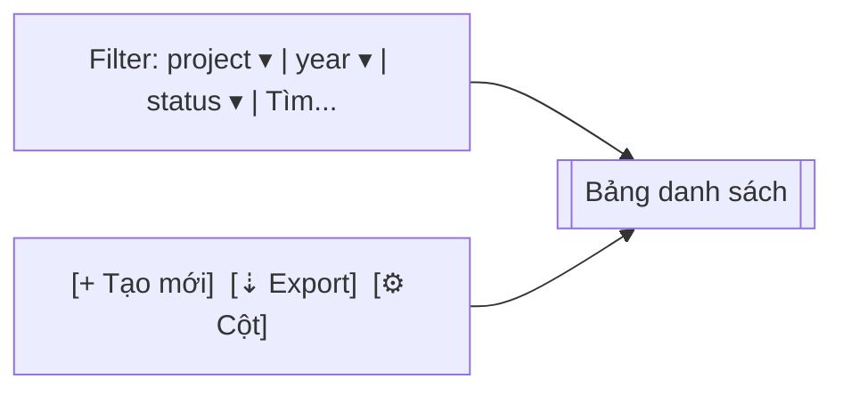

# UI_SPEC — Master Plan (Gate 3)

> **Tham chiếu:** `BA_SPEC.md` (Gate 1 ✅) · `SA_DESIGN.md` (Gate 2 ✅) · `.claude/rules/ui-ux-designer-rules.md`
> **Phong cách:** Enterprise (SAP Fiori / Oracle Redwood) — data-first, density-adjustable, không emoji.
> **Ngày:** 2026-04-18 · **Phase A:** web-only, desktop ưu tiên (≥1280px)

---

## 0. Design Tokens áp dụng (bắt buộc — no hardcode)

```ts
// wms-frontend/src/shared/theme/tokens.ts (đề xuất)
export const token = {
  color: {
    primary:   '#0a6ed1',
    primaryBg: 'rgba(10, 110, 209, 0.08)',
    success:   '#107e3e',
    warning:   '#e9730c',
    error:     '#bb0000',
    info:      '#0a6ed1',
    textMain:  '#1e2329',
    textMuted: '#6a6d70',
    border:    '#d9d9d9',
    surface:   '#ffffff',
    bg:        '#f5f6f7',
  },
  radius: { sm: 2, md: 4, lg: 8 },
  space:  [0, 4, 8, 12, 16, 24, 32, 48],
  font:   { family: "'Inter', system-ui, sans-serif", mono: "ui-monospace, SFMono-Regular" },
};
```

**Library:** **shadcn/ui + Tailwind CSS** (theo chuẩn codebase wms-frontend). KHÔNG mix với Ant Design / MUI. Icons dùng `lucide-react`. Charts dùng `recharts`.

---

## 1. Layout Shell (áp dụng mọi trang Master Plan)

```
┌──────────────────────────────────────────────────────────────────────┐
│ Masthead: [SHERP ▾]  [workspace ▾]      [search ⌕]   [🔔] [👤]       │
├──────┬───────────────────────────────────────────────────────────────┤
│ Nav  │ Breadcrumb: Quản lý dự án / Master Plan / MP-2026-TOWER-A     │
│ ─────│ ─────────────────────────────────────────────────────────── │
│ Dự án│ Page Title + Status Badge       [Primary CTA] [··· actions] │
│ ▾MP  │                                                              │
│  ∘ DS│ ┌────────── Filter / Toolbar ────────────┐                   │
│  ∘ Tk│ │ Filter bar: project ▾ year ▾ status ▾  │ [⚙ columns] [⇣] │
│ WBS  │ └────────────────────────────────────────┘                   │
│ Feed │                                                              │
│ Dash │        <Content area — bảng hoặc tree>                       │
└──────┴───────────────────────────────────────────────────────────────┘
```

- Side nav mục "Master Plan" chèn vào nhóm **Quản lý dự án**, có 4 sub: Danh sách · Công việc của tôi · WBS Editor · Dashboard.
- Breadcrumb tối đa 4 cấp.
- Primary CTA luôn ở góc phải page header (ví dụ "Tạo Master Plan").

---

## 2. Screen 1 — Master Plans List

**Route:** `/master-plan` · **Privilege:** `VIEW_MASTER_PLAN`

### Wireframe


### Column set
| Cột | Kiểu | Sort | Ghi chú |
|---|---|---|---|
| Mã MP | text | ✓ | click → detail |
| Tên | text | ✓ | wrap 2 dòng |
| Dự án/Toà | text | ✓ | hiển thị `project.code - project.name` |
| Năm | int | ✓ | tabular-nums |
| Trạng thái | badge | ✓ | DRAFT (gray) · ACTIVE (primary) · CLOSED (muted) |
| Progress | bar | – | 0–100%, màu primary; ≥ due → error |
| Ngân sách | currency | ✓ | VND, tabular-nums |
| Người duyệt | avatar+name | – |  |
| Actions | icon-menu | – | view / edit / approve / close / clone |

### State matrix
- **Loading:** Ant `Table` với `loading={true}` + skeleton 10 rows.
- **Empty:** illustration "Không có Master Plan nào" + nút "Tạo Master Plan đầu tiên" (primary).
- **Error:** banner đỏ + "Thử lại".
- **Default:** pagination server-side (pageSize 20, 50, 100), density toggle (Comfortable/Compact).

### Actions
- `[+ Tạo mới]` → dialog form (§3).
- Bulk action **không có** ở Phase A (tránh nhầm approve hàng loạt).

---

## 3. Screen 2 — Master Plan Detail (5 tabs)

**Route:** `/master-plan/:id` · **Privilege:** `VIEW_MASTER_PLAN`

### Header
```
┌─────────────────────────────────────────────────────────────────────┐
│ MP-2026-TOWER-A — Bảo trì TOWER A 2026       [ACTIVE]               │
│ Dự án: TWA · Năm 2026 · Ngân sách: 1.250.000.000 ₫                  │
│                        [Phê duyệt] [Đóng] [Clone năm sau] [·· more]│
└─────────────────────────────────────────────────────────────────────┘
│ Tabs:  Overview | WBS Tree | Task Templates | Dashboard | Instances │
```

### Tab 1: Overview
- 4 KPI card: Progress %, On-time %, MTTR (Incidents), Budget variance.
- Card: Thông tin chung (dự án, năm, người duyệt, timeline).
- Card: Audit trail (last 10 events, link "Xem tất cả").

### Tab 2: WBS Tree
- Component: Ant `Tree` kết hợp `Table` (tree-table pattern — expandable rows).
- Cột: Mã WBS · Tên node · Type badge · Budget · Progress · Assignee · Actions (+ child, edit, archive).
- Toolbar: `[+ Thêm node gốc]` · `[Expand all]` · `[Drag to reorder]` (disable ở Phase A).
- Validate đỏ nếu `sum(children.budget) > parent.budget` — hiển thị icon warning ở node cha.

### Tab 3: Task Templates
- List template gắn vào WBS node lá (WORK_PACKAGE).
- Cột: Tên · Loại (CHECKLIST/INCIDENT/ENERGY/OFFICE) · Recurrence (human-readable từ RRULE) · SLA · Active toggle.
- Click template → drawer edit (§5) có preview 10 ngày kế.

### Tab 4: Dashboard
- 2×2 grid:
  - Progress theo tháng (Ant `Line`)
  - Phân bố Work Item theo type (donut)
  - On-time vs Overdue (stacked bar theo tuần)
  - Top 5 node trễ hạn (bảng nhỏ)

### Tab 5: Instances
- Nhúng feed (giống Screen 5) đã filter sẵn `master_plan_id`.

### State matrix
| State | Hành vi |
|---|---|
| Loading | Skeleton header + tab skeleton |
| Empty WBS | CTA "Tạo node gốc" giữa tab |
| Plan = DRAFT | Nút Phê duyệt primary; Close disable |
| Plan = CLOSED | Mọi form edit disable + banner "Đã đóng, chỉ đọc" |

---

## 4. Screen 3 — WBS Node Editor (Dialog)

**Trigger:** `[+ Thêm node]` trong WBS tree · `[edit]` từ row action.

### Form fields
| Field | Type | Required | Ràng buộc |
|---|---|---|---|
| Mã WBS | text | ✓ | unique per plan, pattern `\d+(\.\d+)*` |
| Tên | text | ✓ | ≤ 200 ký tự |
| Loại | select | ✓ | WORKSTREAM / SYSTEM / WORK_PACKAGE (level tự suy từ parent) |
| Parent | read-only | – | từ context; root node = null |
| Ngân sách | money | – | VND, ≥ 0; validate ≤ remaining budget của parent |
| Ngày bắt đầu | date | – | ≥ plan.start_date |
| Ngày kết thúc | date | – | ≥ Ngày bắt đầu |
| Người phụ trách | user-picker | – | Employee, filter theo project |

### Layout
- Label trái 1/3 · Input 2/3 (desktop).
- Footer: `[Huỷ]` secondary · `[Lưu]` primary.

### State matrix
- Submitting: disable form, spinner trên nút Lưu.
- Validation fail: inline error dưới field + border error.
- Server error 4xx: toast error + giữ form.

---

## 5. Screen 4 — Task Template Form (Drawer, right-side 520px)

**Route:** N/A (drawer overlay trên Tab 3)

### Form fields
| Field | Type | Required | Ghi chú |
|---|---|---|---|
| Tên template | text | ✓ | hiển thị trong feed |
| Loại Work Item | select | ✓ | CHECKLIST · INCIDENT · ENERGY · OFFICE (cố định sau khi tạo) |
| Template reference | select | ✓ nếu CHECKLIST | link tới ChecklistTemplate; các loại khác lấy config default |
| Recurrence rule | RRULE builder | ✓ | UI có preset: Daily / Weekly / Monthly / Custom; hiện RRULE string dưới (read-only) |
| SLA (giờ) | int | ✓ | 1–720 |
| Assignee mặc định | role select | ✓ | Role name; runtime pick user cụ thể |
| Active | toggle | – | default ON |

### RRULE Preset UI
```
[● Daily]  [○ Weekly]  [○ Monthly]  [○ Custom RRULE]

Daily  → Lặp mỗi [1] ngày, vào lúc [07:00]
Weekly → Mỗi tuần: [M][T][W][T][F][S][S]
Monthly→ Ngày [1] hàng tháng, lúc [07:00]
Custom → Textarea FREQ=MONTHLY;BYMONTHDAY=1,15;BYHOUR=7
```

### Preview panel (dưới form)
> "10 ngày sinh job kế tiếp:"
> 2026-04-19 07:00 · 2026-04-20 07:00 · 2026-04-21 07:00 · ...

Gọi `POST /master-plan/task-templates/:id/preview` để lấy.

### State matrix
- Preview loading: skeleton 10 dòng.
- Preview error (RRULE invalid): banner đỏ "Biểu thức recurrence không hợp lệ".
- Save success: drawer close + toast "Đã lưu" + refresh list.

---

## 6. Screen 5 — My Work Items Feed

**Route:** `/work-items/feed` · **Privilege:** `VIEW_WORK_ITEM`

### Layout
```
┌─ Filter sidebar (240px) ────┐ ┌─ Feed (flex) ────────────────────┐
│ Loại:                        │ │ [Hôm nay] [Tuần] [Tháng] [Tuỳ]  │
│ ☑ Checklist                  │ │                                  │
│ ☑ Incident                   │ │ ── 18/04 ──                      │
│ ☐ Energy                     │ │ ┌────────────────────────────┐  │
│ ☐ Office task                │ │ │ CHK  Kiểm tra PCCC tầng 3  │  │
│                              │ │ │ ● IN_PROGRESS · 60%         │  │
│ Trạng thái:                  │ │ │ Hạn: 18/04 17:00 (2h nữa)  │  │
│ ☑ Mới                        │ │ │ Assignee: Nguyễn V.A        │  │
│ ☑ Đang làm                   │ │ └────────────────────────────┘  │
│ ☐ Hoàn thành                 │ │                                  │
│                              │ │ ── 17/04 ── (OVERDUE)            │
│ Assignee:                    │ │ ┌────────────────────────────┐  │
│ ◉ Tôi  ○ Tất cả              │ │ │ INC  Hỏng quạt thông gió   │  │
└──────────────────────────────┘ │ │ 🔴 OVERDUE · 3h            │  │
                                  │ └────────────────────────────┘  │
                                  └──────────────────────────────────┘
```

### Work Item Card
- 3-dòng compact: Type badge + Tên · Progress + Status · Due + Assignee.
- Overdue: viền trái đỏ 3px, badge "Quá hạn Xh".
- Click card → detail (§7).

### State matrix
| State | Hiển thị |
|---|---|
| Loading | 5 card skeleton |
| Empty | "Bạn chưa có công việc nào hôm nay" + link "Xem tuần này" |
| Error | Banner + Retry |
| Default | Grouped theo ngày (reverse-chrono), sticky date header |

### Performance
- Pagination cursor (load more, 20/page).
- Cache ở frontend TanStack Query staleTime 30s.
- Backend: endpoint dùng composite index `IDX_WI_ASSIGNEE_STATUS`.

---

## 7. Screen 6 — Work Item Detail (Polymorphic)

**Route:** `/work-items/:id` · **Privilege:** `VIEW_WORK_ITEM`

### Layout chung
```
┌──────────────────────────────────────────────────────────────────┐
│ CHK  Kiểm tra PCCC tầng 3                   [IN_PROGRESS · 60%] │
│ Master Plan: MP-2026-TOWER-A / WBS 2.1 / PCCC                   │
│ Assignee: Nguyễn V.A   Due: 18/04 17:00   [Reassign]            │
├──────────────────────────────────────────────────────────────────┤
│ <Polymorphic body theo work_item_type>                           │
└──────────────────────────────────────────────────────────────────┘
```

### Polymorphic body switch
- **CHECKLIST** → render list ChecklistItemResult, mỗi item 1 card (câu hỏi, result radio, upload ảnh trực tiếp, input value).
- **INCIDENT** → form: title, severity, category, description, ảnh before/after, timeline workflow (NEW → IN_PROGRESS → RESOLVED → COMPLETED).
- **ENERGY_INSPECTION** → bảng Meter → cột Reading input (kWh, m³, m³/h).
- **OFFICE_TASK** → mô tả + checklist item tick + ảnh optional.

### Actions bar
- Reassign (icon + dropdown user) — cần privilege `ASSIGN_INCIDENT` cho INCIDENT.
- Export PDF (phase B).
- In/Share (phase B).

### State matrix
- Loading: skeleton body.
- 404: trang "Không tìm thấy công việc" + link về feed.
- 403 (không quyền): "Bạn không có quyền xem công việc này".
- Plan/WorkItem CLOSED: body read-only + banner "Đã đóng".

---

## 8. Screen 7 — Master Plan Dashboard

**Route:** `/master-plan/:id/dashboard` (alias tab 4) · **Privilege:** `VIEW_MASTER_PLAN`

### 4 KPI Cards (row 1)
| Card | Metric | Source |
|---|---|---|
| Tiến độ chung | % hoàn thành | `GET /master-plan/:id/dashboard` |
| Tỷ lệ đúng hạn | on-time/total (%) | idem |
| MTTR Sự cố | giờ trung bình | idem |
| Sai lệch ngân sách | % over/under | idem |

### 4 Chart (row 2, 2×2)
- Line: Progress 12 tháng (x: tháng, y: %)
- Donut: WorkItem distribution theo type
- Stacked bar: On-time vs Overdue theo tuần
- Table top-5: Node trễ hạn (mã + tên + ngày trễ)

### Refresh
- Auto refresh 5 phút (TanStack `refetchInterval`).
- Manual `[⟳]` ở góc phải header.

### State matrix
- Loading: 4 KPI card shimmer + 4 chart skeleton.
- Empty: "Chưa có dữ liệu — cần phê duyệt & chờ 24h generate" + CTA phê duyệt (nếu DRAFT).
- Error individual chart: mini banner trong chart, các chart khác vẫn render.

---

## 9. Responsive Breakpoints

| Breakpoint | Hành vi |
|---|---|
| ≥1280 (Desktop) | Layout đầy đủ, sidebar luôn hiện |
| 768–1279 (Tablet) | Side nav collapse default; bảng enable horizontal scroll |
| <768 (Mobile) | Read-only view: chỉ feed (§6) + detail (§7). Dialog bật full-screen. Master Plan edit **disable** |

Phase A **không hỗ trợ mobile execute** (checklist/incident report).

---

## 10. Accessibility (WCAG 2.1 AA)

- Mọi Ant `Button` đã có `aria-label` khi chỉ có icon.
- `Tree` keyboard: Arrow up/down navigate, Enter expand, Space select.
- Focus ring: override Ant token `--ant-primary-color-outline`, độ rộng 2px.
- Badge trạng thái: kèm text, không chỉ dùng màu.
- Form error: `aria-describedby` link message.

---

## 11. Checklist trước khi hoàn thành Gate 3

- [x] Design token áp dụng (không hardcode màu/spacing)
- [x] 7 wireframe cho 7 screen
- [x] State matrix (Loading/Empty/Error/Default) từng screen
- [x] Đã đối chiếu BA_SPEC — các User Story đều có UI (Master Plan CRUD · WBS · Recurrence · Feed · Detail polymorphic · Dashboard)
- [x] Đã đối chiếu SA_DESIGN — form field khớp với DTO (`CreateMasterPlanDto`, `CreateWbsNodeDto`, `CreateTaskTemplateDto`)
- [x] Library: shadcn/ui + Tailwind (đã có trong wms-frontend)
- [ ] ⚠ Contrast check bằng axe DevTools — **chờ Gate 4 DEV implement** mới kiểm được
- [ ] ⚠ Keyboard navigation test — idem

Sau Gate 4 DEV: phải chạy lại 2 checklist cuối và update status ở đây.
