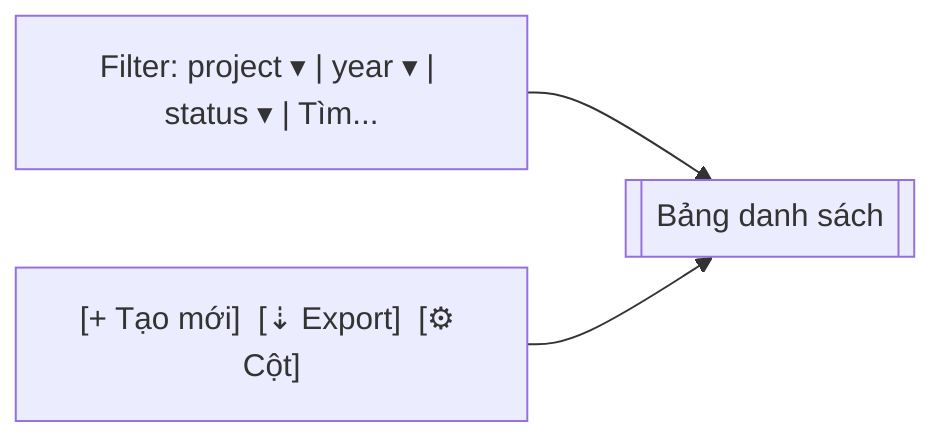

# UI_SPEC — Master Plan (Gate 3)

> **Tham chiếu:** `BA_SPEC.md` (Gate 1 ✅) · `SA_DESIGN.md` (Gate 2 ✅) · `.claude/rules/ui-ux-designer-rules.md`
> **Phong cách:** Enterprise (SAP Fiori / Oracle Redwood) — data-first, density-adjustable, không emoji.
> **Ngày:** 2026-04-18 · **Phase A:** web-only, desktop ưu tiên (≥1280px)

---

## 0. Design Tokens áp dụng (bắt buộc — no hardcode)

```ts
// wms-frontend/src/shared/theme/tokens.ts (đề xuất)
export const token = {
  color: {
    primary:   '#0a6ed1',
    primaryBg: 'rgba(10, 110, 209, 0.08)',
    success:   '#107e3e',
    warning:   '#e9730c',
    error:     '#bb0000',
    info:      '#0a6ed1',
    textMain:  '#1e2329',
    textMuted: '#6a6d70',
    border:    '#d9d9d9',
    surface:   '#ffffff',
    bg:        '#f5f6f7',
  },
  radius: { sm: 2, md: 4, lg: 8 },
  space:  [0, 4, 8, 12, 16, 24, 32, 48],
  font:   { family: "'Inter', system-ui, sans-serif", mono: "ui-monospace, SFMono-Regular" },
};
```

**Library:** **shadcn/ui + Tailwind CSS** (theo chuẩn codebase wms-frontend). KHÔNG mix với Ant Design / MUI. Icons dùng `lucide-react`. Charts dùng `recharts`.

---

## 1. Layout Shell (áp dụng mọi trang Master Plan)

```
┌──────────────────────────────────────────────────────────────────────┐
│ Masthead: [SHERP ▾]  [workspace ▾]      [search ⌕]   [🔔] [👤]       │
├──────┬───────────────────────────────────────────────────────────────┤
│ Nav  │ Breadcrumb: Quản lý dự án / Master Plan / MP-2026-TOWER-A     │
│ ─────│ ─────────────────────────────────────────────────────────── │
│ Dự án│ Page Title + Status Badge       [Primary CTA] [··· actions] │
│ ▾MP  │                                                              │
│  ∘ DS│ ┌────────── Filter / Toolbar ────────────┐                   │
│  ∘ Tk│ │ Filter bar: project ▾ year ▾ status ▾  │ [⚙ columns] [⇣] │
│ WBS  │ └────────────────────────────────────────┘                   │
│ Feed │                                                              │
│ Dash │        <Content area — bảng hoặc tree>                       │
└──────┴───────────────────────────────────────────────────────────────┘
```

- Side nav mục "Master Plan" chèn vào nhóm **Quản lý dự án**, có 4 sub: Danh sách · Công việc của tôi · WBS Editor · Dashboard.
- Breadcrumb tối đa 4 cấp.
- Primary CTA luôn ở góc phải page header (ví dụ "Tạo Master Plan").

---

## 2. Screen 1 — Master Plans List

**Route:** `/master-plan` · **Privilege:** `VIEW_MASTER_PLAN`

### Wireframe


### Column set
| Cột | Kiểu | Sort | Ghi chú |
|---|---|---|---|
| Mã MP | text | ✓ | click → detail |
| Tên | text | ✓ | wrap 2 dòng |
| Dự án/Toà | text | ✓ | hiển thị `project.code - project.name` |
| Năm | int | ✓ | tabular-nums |
| Trạng thái | badge | ✓ | DRAFT (gray) · ACTIVE (primary) · CLOSED (muted) |
| Progress | bar | – | 0–100%, màu primary; ≥ due → error |
| Ngân sách | currency | ✓ | VND, tabular-nums |
| Người duyệt | avatar+name | – |  |
| Actions | icon-menu | – | view / edit / approve / close / clone |

### State matrix
- **Loading:** shadcn `Table` + `Skeleton` 10 rows (không spinner toàn trang).
- **Empty:** illustration "Không có Master Plan nào" + nút "Tạo Master Plan đầu tiên" (primary).
- **Error:** banner đỏ + "Thử lại".
- **Default:** pagination server-side (pageSize 20, 50, 100), density toggle (Comfortable/Compact).

### Actions
- `[+ Tạo mới]` → dialog form (§3).
- Bulk action **không có** ở Phase A (tránh nhầm approve hàng loạt).

---

## 3. Screen 2 — Master Plan Detail (5 tabs)

**Route:** `/master-plan/:id` · **Privilege:** `VIEW_MASTER_PLAN`

### Header
```
┌─────────────────────────────────────────────────────────────────────┐
│ MP-2026-TOWER-A — Bảo trì TOWER A 2026       [ACTIVE]               │
│ Dự án: TWA · Năm 2026 · Ngân sách: 1.250.000.000 ₫                  │
│                        [Phê duyệt] [Đóng] [Clone năm sau] [·· more]│
└─────────────────────────────────────────────────────────────────────┘
│ Tabs:  Overview | WBS Tree | Task Templates | Dashboard | Instances │
```

### Tab 1: Overview
- 4 KPI card: Progress %, On-time %, MTTR (Incidents), Budget variance.
- Card: Thông tin chung (dự án, năm, người duyệt, timeline).
- Card: Audit trail (last 10 events, link "Xem tất cả").

### Tab 2: WBS Tree
- Component: shadcn `Table` với expandable rows (tree-table pattern); mỗi row nắm `level` + `parent_id` để render indent. Nếu deep-nest cần thư viện riêng, dùng `react-arborist` nhưng wrap trong `shared/ui/TreeTable` để không leak ra feature.
- Cột: Mã WBS · Tên node · Type badge · Budget · Progress · Assignee · Actions (+ child, edit, archive).
- Toolbar: `[+ Thêm node gốc]` · `[Expand all]` · `[Drag to reorder]` (disable ở Phase A).
- Validate đỏ nếu `sum(children.budget) > parent.budget` — hiển thị icon warning ở node cha.

### Tab 3: Task Templates
- List template gắn vào WBS node lá (WORK_PACKAGE).
- Cột: Tên · Loại (CHECKLIST/INCIDENT/ENERGY/OFFICE) · Recurrence (human-readable từ RRULE) · SLA · Active toggle.
- Click template → drawer edit (§5) có preview 10 ngày kế.

### Tab 4: Dashboard
- 2×2 grid:
  - Progress theo tháng (`recharts.LineChart`)
  - Phân bố Work Item theo type (`recharts.PieChart` donut style)
  - On-time vs Overdue (`recharts.BarChart` stacked theo tuần)
  - Top 5 node trễ hạn (bảng nhỏ)

### Tab 5: Instances
- Nhúng feed (giống Screen 5) đã filter sẵn `master_plan_id`.

### State matrix
| State | Hành vi |
|---|---|
| Loading | Skeleton header + tab skeleton |
| Empty WBS | CTA "Tạo node gốc" giữa tab |
| Plan = DRAFT | Nút Phê duyệt primary; Close disable |
| Plan = CLOSED | Mọi form edit disable + banner "Đã đóng, chỉ đọc" |

---

## 4. Screen 3 — WBS Node Editor (Dialog)

**Trigger:** `[+ Thêm node]` trong WBS tree · `[edit]` từ row action.

### Form fields
| Field | Type | Required | Ràng buộc |
|---|---|---|---|
| Mã WBS | text | ✓ | unique per plan, pattern `\d+(\.\d+)*` |
| Tên | text | ✓ | ≤ 200 ký tự |
| Loại | select | ✓ | WORKSTREAM / SYSTEM / WORK_PACKAGE (level tự suy từ parent) |
| Parent | read-only | – | từ context; root node = null |
| Ngân sách | money | – | VND, ≥ 0; validate ≤ remaining budget của parent |
| Ngày bắt đầu | date | – | ≥ plan.start_date |
| Ngày kết thúc | date | – | ≥ Ngày bắt đầu |
| Người phụ trách | user-picker | – | Employee, filter theo project |

### Layout
- Label trái 1/3 · Input 2/3 (desktop).
- Footer: `[Huỷ]` secondary · `[Lưu]` primary.

### State matrix
- Submitting: disable form, spinner trên nút Lưu.
- Validation fail: inline error dưới field + border error.
- Server error 4xx: toast error + giữ form.

---

## 5. Screen 4 — Task Template Form (Drawer, right-side 520px)

**Route:** N/A (drawer overlay trên Tab 3)

### Form fields
| Field | Type | Required | Ghi chú |
|---|---|---|---|
| Tên template | text | ✓ | hiển thị trong feed |
| Loại Work Item | select | ✓ | CHECKLIST · INCIDENT · ENERGY · OFFICE (cố định sau khi tạo) |
| Template reference | select | ✓ nếu CHECKLIST | link tới ChecklistTemplate; các loại khác lấy config default |
| Recurrence rule | RRULE builder | ✓ | UI có preset: Daily / Weekly / Monthly / Custom; hiện RRULE string dưới (read-only) |
| SLA (giờ) | int | ✓ | 1–720 |
| Assignee mặc định | role select | ✓ | Role name; runtime pick user cụ thể |
| Active | toggle | – | default ON |

### RRULE Preset UI
```
[● Daily]  [○ Weekly]  [○ Monthly]  [○ Custom RRULE]

Daily  → Lặp mỗi [1] ngày, vào lúc [07:00]
Weekly → Mỗi tuần: [M][T][W][T][F][S][S]
Monthly→ Ngày [1] hàng tháng, lúc [07:00]
Custom → Textarea FREQ=MONTHLY;BYMONTHDAY=1,15;BYHOUR=7
```

### Preview panel (dưới form)
> "10 ngày sinh job kế tiếp:"
> 2026-04-19 07:00 · 2026-04-20 07:00 · 2026-04-21 07:00 · ...

Gọi `POST /master-plan/task-templates/:id/preview` để lấy.

### State matrix
- Preview loading: skeleton 10 dòng.
- Preview error (RRULE invalid): banner đỏ "Biểu thức recurrence không hợp lệ".
- Save success: drawer close + toast "Đã lưu" + refresh list.

---

## 6. Screen 5 — My Work Items Feed

**Route:** `/work-items/feed` · **Privilege:** `VIEW_WORK_ITEM`

### Layout
```
┌─ Filter sidebar (240px) ────┐ ┌─ Feed (flex) ────────────────────┐
│ Loại:                        │ │ [Hôm nay] [Tuần] [Tháng] [Tuỳ]  │
│ ☑ Checklist                  │ │                                  │
│ ☑ Incident                   │ │ ── 18/04 ──                      │
│ ☐ Energy                     │ │ ┌────────────────────────────┐  │
│ ☐ Office task                │ │ │ CHK  Kiểm tra PCCC tầng 3  │  │
│                              │ │ │ ● IN_PROGRESS · 60%         │  │
│ Trạng thái:                  │ │ │ Hạn: 18/04 17:00 (2h nữa)  │  │
│ ☑ Mới                        │ │ │ Assignee: Nguyễn V.A        │  │
│ ☑ Đang làm                   │ │ └────────────────────────────┘  │
│ ☐ Hoàn thành                 │ │                                  │
│                              │ │ ── 17/04 ── (OVERDUE)            │
│ Assignee:                    │ │ ┌────────────────────────────┐  │
│ ◉ Tôi  ○ Tất cả              │ │ │ INC  Hỏng quạt thông gió   │  │
└──────────────────────────────┘ │ │ 🔴 OVERDUE · 3h            │  │
                                  │ └────────────────────────────┘  │
                                  └──────────────────────────────────┘
```

### Work Item Card
- 3-dòng compact: Type badge + Tên · Progress + Status · Due + Assignee.
- Overdue: viền trái đỏ 3px, badge "Quá hạn Xh".
- Click card → detail (§7).

### State matrix
| State | Hiển thị |
|---|---|
| Loading | 5 card skeleton |
| Empty | "Bạn chưa có công việc nào hôm nay" + link "Xem tuần này" |
| Error | Banner + Retry |
| Default | Grouped theo ngày (reverse-chrono), sticky date header |

### Performance
- Pagination cursor (load more, 20/page).
- Cache ở frontend TanStack Query staleTime 30s.
- Backend: endpoint dùng composite index `IDX_WI_ASSIGNEE_STATUS`.

---

## 7. Screen 6 — Work Item Detail (Polymorphic)

**Route:** `/work-items/:id` · **Privilege:** `VIEW_WORK_ITEM`

### Layout chung
```
┌──────────────────────────────────────────────────────────────────┐
│ CHK  Kiểm tra PCCC tầng 3                   [IN_PROGRESS · 60%] │
│ Master Plan: MP-2026-TOWER-A / WBS 2.1 / PCCC                   │
│ Assignee: Nguyễn V.A   Due: 18/04 17:00   [Reassign]            │
├──────────────────────────────────────────────────────────────────┤
│ <Polymorphic body theo work_item_type>                           │
└──────────────────────────────────────────────────────────────────┘
```

### Polymorphic body switch
- **CHECKLIST** → render list ChecklistItemResult, mỗi item 1 card (câu hỏi, result radio, upload ảnh trực tiếp, input value).
- **INCIDENT** → form: title, severity, category, description, ảnh before/after, timeline workflow (NEW → IN_PROGRESS → RESOLVED → COMPLETED).
- **ENERGY_INSPECTION** → bảng Meter → cột Reading input (kWh, m³, m³/h).
- **OFFICE_TASK** → mô tả + checklist item tick + ảnh optional.

### Actions bar
- Reassign (icon + dropdown user) — cần privilege `ASSIGN_INCIDENT` cho INCIDENT.
- Export PDF (phase B).
- In/Share (phase B).

### State matrix
- Loading: skeleton body.
- 404: trang "Không tìm thấy công việc" + link về feed.
- 403 (không quyền): "Bạn không có quyền xem công việc này".
- Plan/WorkItem CLOSED: body read-only + banner "Đã đóng".

---

## 7b. Screen 6b — Incident Sub-flow Approvals (QLDA)

**Route:** `/incidents/approvals` · **Privilege:** `APPROVE_INCIDENT_REOPEN` hoặc `APPROVE_ASSIGNEE_CHANGE`

### Layout
Tab nội bộ trong page `IncidentsPage`:
```
[Sự cố] [Reopen requests] [Assignee change requests]
```

### Tab "Reopen requests"
Bảng pending reopen requests (shadcn `Table` + filter status).

| Cột | Kiểu | Ghi chú |
|---|---|---|
| Mã sự cố | text | link → detail |
| Người yêu cầu | avatar+name | – |
| Lý do | text (clamp 2 dòng) | hover → tooltip full |
| Thời điểm | relative time | sort desc default |
| Hành động | `[Duyệt] [Từ chối]` | xác nhận dialog kèm lý do (≥10 ký tự cho reject) |

### Tab "Assignee change requests"
Giống tab trên + cột `current_assignee → proposed_assignee`.

### Dialog duyệt
shadcn `Dialog` với body: mã sự cố, lý do user gửi, textarea ghi chú của QLDA (optional cho APPROVE, required ≥10 ký tự cho REJECT). Footer 2 nút `[Hủy]` · `[Xác nhận]`.

### State matrix
| State | Hiển thị |
|---|---|
| Loading | Skeleton 8 rows |
| Empty | "Không có yêu cầu đang chờ" |
| Error | Banner + Retry |
| Default | Paginate server 20/page |

### Privilege guard
- Tab "Reopen requests" chỉ hiện nếu `APPROVE_INCIDENT_REOPEN`
- Tab "Assignee change" chỉ hiện nếu `APPROVE_ASSIGNEE_CHANGE`
- Cả 2 tab ẩn nếu user không có privilege nào — sidebar link cũng ẩn tương ứng.

---

## 8. Screen 7 — Master Plan Dashboard

**Route:** `/master-plan/:id/dashboard` (alias tab 4) · **Privilege:** `VIEW_MASTER_PLAN`

### 4 KPI Cards (row 1)
| Card | Metric | Source |
|---|---|---|
| Tiến độ chung | % hoàn thành | `GET /master-plan/:id/dashboard` |
| Tỷ lệ đúng hạn | on-time/total (%) | idem |
| MTTR Sự cố | giờ trung bình | idem |
| Sai lệch ngân sách | % over/under | idem |

### 4 Chart (row 2, 2×2)
- Line: Progress 12 tháng (x: tháng, y: %)
- Donut: WorkItem distribution theo type
- Stacked bar: On-time vs Overdue theo tuần
- Table top-5: Node trễ hạn (mã + tên + ngày trễ)

### Refresh
- Auto refresh 5 phút (TanStack `refetchInterval`).
- Manual `[⟳]` ở góc phải header.

### State matrix
- Loading: 4 KPI card shimmer + 4 chart skeleton.
- Empty: "Chưa có dữ liệu — cần phê duyệt & chờ 24h generate" + CTA phê duyệt (nếu DRAFT).
- Error individual chart: mini banner trong chart, các chart khác vẫn render.

---

## 9. Responsive Breakpoints

| Breakpoint | Hành vi |
|---|---|
| ≥1280 (Desktop) | Layout đầy đủ, sidebar luôn hiện |
| 768–1279 (Tablet) | Side nav collapse default; bảng enable horizontal scroll |
| <768 (Mobile) | Read-only view: chỉ feed (§6) + detail (§7). Dialog bật full-screen. Master Plan edit **disable** |

Phase A **không hỗ trợ mobile execute** (checklist/incident report).

---

## 10. Accessibility (WCAG 2.1 AA)

- Mọi shadcn `Button` icon-only PHẢI có `aria-label`.
- Tree keyboard: Arrow up/down navigate, Enter expand, Space select — do `shared/ui/TreeTable` triển khai.
- Focus ring: dùng Tailwind token `focus-visible:ring-2 focus-visible:ring-[var(--ring)]`, màu primary, độ rộng 2px (shadcn default, không override).
- Badge trạng thái: kèm text, không chỉ dùng màu.
- Form error: `aria-describedby` link message.

---

## 11. Checklist trước khi hoàn thành Gate 3

- [x] Design token áp dụng (không hardcode màu/spacing)
- [x] 8 wireframe cho 8 screen (gồm Incident Sub-flow Approvals Screen 6b)
- [x] State matrix (Loading/Empty/Error/Default) từng screen
- [x] Đã đối chiếu BA_SPEC — các User Story đều có UI (Master Plan CRUD · WBS · Recurrence · Feed · Detail polymorphic · Dashboard)
- [x] Đã đối chiếu SA_DESIGN — form field khớp với DTO (`CreateMasterPlanDto`, `CreateWbsNodeDto`, `CreateTaskTemplateDto`)
- [x] Library: shadcn/ui + Tailwind (đã có trong wms-frontend)
- [ ] ⚠ Contrast check bằng axe DevTools — **chờ Gate 4 DEV implement** mới kiểm được
- [ ] ⚠ Keyboard navigation test — idem

Sau Gate 4 DEV: phải chạy lại 2 checklist cuối và update status ở đây.

---

## 12. SUPPLEMENT — TEMPLATE THỰC TẾ (2026-04-20)

Cross-reference: BA_SPEC §10, SA_DESIGN §15.

Mục tiêu: wireframe 2 screen mới + tinh chỉnh 2 form hiện tại để khớp format user đang dùng trong `MP Example.xlsx` + `JDHP Master Plan 2024.pdf`.

### 12.1. Screen 8 — Annual Plan Grid (US-MP-13)

**Route:** `/master-plan/:planId/annual-grid?year=2026&lang=vi`
**Access:** `VIEW_MASTER_PLAN`
**Mục đích:** Year-at-a-Glance — 1 page xem toàn bộ 48 tuần × N task, giống sheet Excel của user.

**Wireframe**

```
┌──────────────────────────────────────────────────────────────────────────────────┐
│ Breadcrumbs: MasterPlan / {planName} / Annual Grid 2026                 [Export] │
│                                                                                   │
│ Toolbar:  [Year ▾ 2026] [System filter ▾] [Executor ▾] [VI|EN]  [Print A3]       │
│                                                                                   │
│ ╔═══╦═════════╦═══════════╦════════════╦═════════╦══════╦════════ 48 cột ═══════╗│
│ ║STT║HỆ THỐNG ║HẠNG MỤC   ║CÔNG VIỆC   ║THỰC HIỆN║TẦN   ║Jan        │…│Dec      ║│
│ ║   ║         ║           ║(VI/EN)     ║         ║SUẤT  ║W1 W2 W3 W4│…│         ║│
│ ╠═══╬═════════╬═══════════╬════════════╬═════════╬══════╬═══════════════════════╣│
│ ║ 1 ║PCCC     ║Trạm bơm CC║Kiểm tra    ║IMPC     ║ D    ║D  D  D  D │…│D D D D  ║│
│ ║   ║(rowspan)║(rowspan)  ║checklist…  ║         ║      ║■  ■  ■  ■ │…│■ ■ ■ ■  ║│
│ ║ 2 ║         ║           ║Chạy thử bơm║IMPC     ║ W    ║W  W  W  W │…│W W W W  ║│
│ ║ 3 ║         ║           ║Bảo trì bơm ║CONTRACT.║ Q    ║   Q       │…│   Q     ║│
│ ║ 4 ║Điện     ║Máy phát   ║Chạy thử    ║IMPC     ║ W    ║           │…│         ║│
│ ║…  ║         ║           ║            ║         ║      ║           │…│         ║│
│ ╚═══╩═════════╩═══════════╩════════════╩═════════╩══════╩═══════════════════════╝│
│                                                                                   │
│ Legend: Planned (chữ mã) · ■=Done on-time · ▲=Late · ✕=Missed · ◇=Upcoming      │
│                                                                                   │
│ Ngày 31/12/2026, Củ Chi — Người lập: Hoàng Anh Tuấn [prepared_by auto]           │
└──────────────────────────────────────────────────────────────────────────────────┘
```

**Component spec**
- Outer shell: `Card` với `CardHeader` (title + Export button).
- Grid: custom `<AnnualGridTable>` tại `features/master-plan/annual-grid/`. **KHÔNG dùng** `Table` shadcn mặc định vì 48 col sticky header + merge cell hàng trên System/Equipment.
- Row height: 28px (compact). Touch target 32px cho cell click.
- Frozen columns: 6 cột đầu (STT → TẦN SUẤT), sticky-left.
- Frozen row: header row, sticky-top.
- Cell color scheme (planned):
  - Nền default `bg-muted/40`, text mã tần suất `font-mono text-xs`.
- Cell color scheme (actual — khi có work_item tương ứng):
  - `ON_TIME` → `bg-green-100 dark:bg-green-900/40` + text `text-green-800`
  - `LATE` → `bg-yellow-100` + text `text-yellow-800`
  - `MISSED` → `bg-red-100` + text `text-red-800`
  - `UPCOMING` → `bg-slate-50` + text `text-slate-400`
- Click cell → Popover hiện list work_item_id (nếu có) + link "Mở chi tiết" (Screen 6).
- Click row (cột CÔNG VIỆC) → mở TaskTemplate Drawer (Screen 4).

**State matrix**
| State | UI |
|---|---|
| Loading | Skeleton grid 10 row × 8 col placeholder |
| Empty | Illustration + "Chưa có TaskTemplate nào. Vào tab WBS để thêm." + CTA "Mở WBS Editor" |
| Error | Alert destructive + nút Retry |
| Default | Data rendered; header sticky; scroll X cho 48 cột; scroll Y cho list task |

**Interactions**
- Toolbar `Year` dropdown 2024-2028 → refetch `/annual-grid?year=…`
- Toolbar `System filter` multi-select → lọc client-side (đã có full data).
- Toolbar `Executor filter` multi-select IMPC/BW/Tenant/Contractor/Mixed.
- Toolbar `VI|EN` toggle → chỉ đổi cột CÔNG VIỆC rendering.
- Button `Export` → GET blob URL + auto download XLSX (file name server set qua `Content-Disposition`).
- Button `Print A3` → `window.print()` + CSS `@media print` kích hoạt class `print-landscape-a3`.

**Print CSS** (`pages/master-plan/AnnualGridPage.module.css`):
```css
@page { size: A3 landscape; margin: 12mm; }
@media print {
  .toolbar, .filters, .app-sidebar, .app-masthead { display: none !important; }
  .annual-grid-table { font-size: 8pt; border: 1px solid #1e2329; }
  .annual-grid-table th { background: #f5f6f7 !important; -webkit-print-color-adjust: exact; }
}
```

### 12.2. Screen 4 (Drawer) — mở rộng TaskTemplate Form

Thêm 6 nhóm field vào drawer hiện tại:

1. **Taxonomy (2 field song song)**
   - Cascader `system_id → equipment_item_id`. Label "Hệ thống / Hạng mục". Required system_id; equipment_item optional.
   - Loading skeleton khi fetch catalog.

2. **Bilingual name**
   - Tab VI / EN trên cùng field group "Tên công việc".
   - VI required (đã có `name`), EN optional (`name_en`) — placeholder "Tùy chọn — sẽ hiển thị khi user chọn tiếng Anh".

3. **Executor party**
   - RadioGroup 5 option (INTERNAL / OWNER / TENANT / CONTRACTOR / MIXED) — icon 16px cạnh label.
   - Khi chọn CONTRACTOR / MIXED → hiển thị TextField `contractor_name` required (BR-MP-08 + validator `ValidateIf`).

4. **Frequency code (mã tắt)**
   - Select 9 option D/W/BW/M/Q/BiQ/HY/Y/Y_URGENT.
   - Helper text: "Dùng để hiển thị grid và xuất Excel. Nếu lịch phức tạp hơn, để trống và chỉ dùng RRULE ở dưới."
   - Khi chọn Y_URGENT → hiển thị checkbox `allow_adhoc_trigger` (mặc định ON, disabled = true đi kèm Y_URGENT).

5. **Regulatory references**
   - Multi-tag input (shadcn `Command` + `Badge`). Autocomplete gợi ý 8 tag thường gặp (QCVN 02:2020/BCA, TT 17/2021/TT-BCA, TT 149/2020/TT-BCA, TT 02/2022/TT-BTNMT, TCVN 9385:2012, QCVN 14:2008, O&M Manual, …).
   - Max 10 tag (BR-MP-11 + DTO `ArrayMaxSize`).

6. **Preview card cuối drawer** (disable)
   - Hiển thị "Row preview" giống cell table: System / Item / Task / Executor / Frequency — giúp user check trước khi Save.

### 12.3. Screen 2 — Master Plan Detail tab "Sign-off" (extend)

Thêm section cuối trang (dưới tab Instances hiện tại):

```
┌─ Sign-off Information ──────────────────────────────────────────┐
│ Địa điểm       [ Củ Chi          ▾ ]  (autocomplete từ province)│
│ Người lập      [ Select employee  ▾ ]                            │
│ Ngày lập       [ 31/12/2026  📅 ]                                │
│ Người duyệt    {display only — approved_by.name}                 │
│ Ngày duyệt     {display only — approved_at}                      │
│                                                                  │
│ [Save sign-off]                                                  │
└──────────────────────────────────────────────────────────────────┘
```

Section visible với privilege `MANAGE_MASTER_PLAN`. View-only với `VIEW_MASTER_PLAN`.

### 12.4. Screen 9 — Facility Systems Catalog (Admin)

**Route:** `/admin/master-data/facility-systems`
**Access:** `MANAGE_FACILITY_CATALOG`
**Mục đích:** Admin CRUD 11 system + 40+ equipment items.

Layout split 2 cột:
- Left (340px): List System (table). Row chọn highlight, hiển thị số Equipment items con.
- Right (flex): List Equipment Items của System đã chọn. Inline edit qua `DataTable` + row action menu.

Form fields mỗi entity: `code`, `name_vi`, `name_en`, `sort_order`, `is_active` toggle.

### 12.5. Design Token delta

- **Bilingual divider:** khi bật `lang=en`, tất cả `[lang]` pair hiển thị format `{vi}\n{en}` với `whitespace-pre-line`, font-size `text-xs` cho dòng EN.
- **Mã frequency badge:** `bg-slate-700 text-white font-mono text-[10px] px-1 rounded` — kích thước nhỏ vừa 24px cell tuần.
- **Plan vs Actual color**: tuân thủ semantic tokens (success #107e3e, warning #e9730c, error #bb0000) — không hardcode.

### 12.6. Responsive

| Breakpoint | Annual Grid |
|---|---|
| ≥ 1280 desktop | Grid full 48 col, scroll X khi cần, sticky 6 col đầu |
| 768-1279 tablet | Chuyển sang "Monthly tab view" — 1 tháng × 4 tuần/tab, 12 tab chuyển tháng. Reuse cell UI. |
| < 768 mobile | Read-only list: từng task accordion, expand xem 12 tháng text-only (không grid) |

### 12.7. Accessibility delta

- Grid 48 col: tab order: row → cell theo hàng. Skip link "Chuyển xuống cuối bảng".
- Cell có work_item: `aria-label="Tuần {iso}, {status}, click để mở chi tiết"`.
- Filter toolbar: label `aria-labelledby` cho mỗi combobox.
- Tag multi-input: `aria-describedby` hiển thị số tag đã chọn.
- Export button: `aria-label="Tải kế hoạch năm {year} dạng Excel"`.

### 12.8. State matrix — Screen 9 (Facility Systems)

| State | UI |
|---|---|
| Loading | Left col skeleton 11 row, right col skeleton 6 row |
| Empty-left | Hiển thị CTA "Seed dữ liệu mẫu 11 hệ thống" (gọi endpoint seed admin) |
| Empty-right | Khi System chưa có item: Illustration + "Chưa có hạng mục" + CTA "Thêm hạng mục đầu tiên" |
| Error | Alert destructive + Retry |
| Default | 2 list active, highlight selected system |

### 12.9. Checklist Gate 3 Supplement

- [x] Wireframe Screen 8 (Annual Grid) với sticky col + print A3
- [x] Extend Screen 4 TaskTemplate drawer — 6 field groups mới
- [x] Extend Screen 2 Master Plan Detail — Sign-off section
- [x] Screen 9 Facility Systems Catalog admin split-pane
- [x] State matrix đầy đủ 4 state cho Screen 8 + 9
- [x] Responsive breakpoint (tablet monthly tab, mobile list)
- [x] A11y: keyboard nav + aria-label grid 48 col
- [ ] ⚠ Contrast check bằng axe DevTools — chạy sau Gate 4 implement
- [ ] ⚠ Print preview test trên Chrome/Firefox — chạy sau Gate 4 implement
