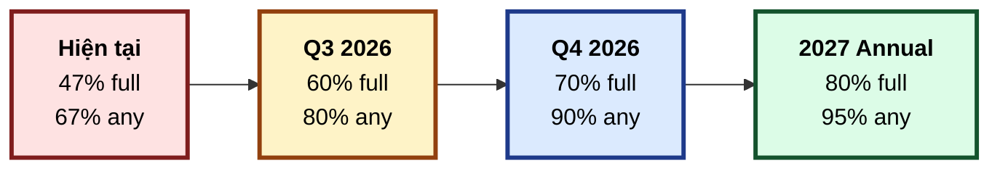

# Control Matrix — SH-GROUP ERP (SHERP)

**Phiên bản:** 1.0 · **Ngày khởi tạo:** 2026-05-02 · **Người duy trì:** IT Audit Agent
**Khung tham chiếu chính:** `CISA Domain 3, 4, 5` · `ISO 27001:2022 Annex A` · `OWASP API Security Top 10`
**Liên quan:** [IT Audit Charter](./it-audit-charter.md) · [Risk Register](./risk-register.md)

---

## 1. Mục đích

Ma trận kiểm soát ánh xạ từng `control objective` (mục tiêu kiểm soát) theo `CISA syllabus` với hiện trạng triển khai trên `SHERP`. Mục đích:

1. Cung cấp cái nhìn tổng quan về `Control Coverage`
2. Xác định gap giữa kỳ vọng và thực tế
3. Tạo kế hoạch khắc phục có ưu tiên
4. Cung cấp evidence cho audit bên ngoài khi cần

---

## 2. Trạng thái triển khai (`Implementation Status`)

| Ký hiệu | Mức | Định nghĩa |
|---------|-----|-----------|
| ✅ | `Implemented` | Triển khai đầy đủ, có evidence |
| 🟡 | `Partial` | Triển khai một phần, có gap đã biết |
| ❌ | `Not Implemented` | Chưa triển khai |
| ⚪ | `N/A` | Không áp dụng cho scale SHERP hiện tại |
| 🔍 | `Under Review` | Đang được kiểm tra, chưa kết luận |

---

## 3. Domain 3 — Phát triển hệ thống (`Information Systems Acquisition, Development and Implementation`)

### 3.1 SDLC Controls

| ID | Control Objective | Status | Evidence | Gap | Action |
|----|-------------------|--------|----------|-----|--------|
| `D3-01` | Có quy trình SDLC chính thức được document | ✅ | `CLAUDE.md` định nghĩa 6-Gate (BA → SA → UI → Dev → QA → Deploy). `.claude/rules/*-rules.md` chi tiết từng gate | Không | — |
| `D3-02` | Mỗi feature có đầy đủ artifact theo SDLC gate | ✅ | `feature/master-plan-project-lookup`: BA_SPEC.md (270 dòng), SA_DESIGN.md (717 dòng) + ADDENDUM, UI_SPEC.md (544 dòng), QA_TEST_MATRIX.md (56 cases), GATE6_DEPLOY_RUNBOOK.md | `project-requests/` thiếu BA/SA (nợ tài liệu cũ) | `DOC-BACKFILL-PROJECT-REQUESTS` (target Q3 2026) |
| `D3-03` | Code review trước khi merge | 🟡 | PR review process trên GitHub | Chỉ 1 reviewer (SH), không có rotation. CC CLI tự audit code mình viết | R-006: triển khai IT Audit Agent (đang thực hiện) |
| `D3-04` | Version control với commit message convention | ✅ | Conventional Commits trong toàn dự án | Không | — |
| `D3-05` | Branch policy (feature → main, không push trực tiếp main) | ✅ | Policy được Tech Advisor enforce trong `feature/master-plan-project-lookup` (28 commit, không push main) | 3 hardening commit cũ trên main (b883ae7/b3bc6fa/c4fa5c9) đã được audit hồi tố. Policy mới áp dụng từ 2026-04-22 | — |
| `D3-06` | Tests cho code mới | 🟡 | BE: 526/526 PASS với +10 tests cho `ProjectLookupService`. FE: chỉ static selector tests (npx tsx), không có runtime test | R-005: thiếu Vitest + RTL | `FE-TEST-INFRA-SETUP` (target 2026-08-01) |
| `D3-07` | Static code analysis (lint) trước commit | ✅ | Pre-commit hook chạy `eslint`, lint-staged. 0 errors trên feature branch | 431 warnings pre-existing trên main | Hardening pass riêng |
| `D3-08` | Type safety (TypeScript strict) | ✅ | `tsc --noEmit` 0 errors trên cả BE và FE | Không | — |
| `D3-09` | Hardcoded secrets check | ✅ | Pre-commit hook bao gồm `secrets` check. Verify trong commit `065b3f38` (gitignore EMD xlsx) | Không phát hiện secrets bị commit | Tiếp tục enforce |
| `D3-10` | Dependency vulnerability scan | ❌ | — | Không có `npm audit` trong CI. Không có `Dependabot` hoặc `Renovate` config | Tạo backlog `DEVOPS-DEPENDENCY-SCAN-CI` |

### 3.2 Change Management Controls

| ID | Control Objective | Status | Evidence | Gap | Action |
|----|-------------------|--------|----------|-----|--------|
| `D3-11` | Mọi thay đổi production có change record | 🟡 | Git commit + 6-Gate gates các thay đổi lớn | Không có biên bản `Change Advisory Board` chính thức | Cân nhắc khi scale (V2) |
| `D3-12` | Migration database có rollback test | 🟡 | `GATE6_DEPLOY_RUNBOOK §5.4` quy định rehearsal | R-008: chưa có cron tự động test rollback | `DEVOPS-MIGRATION-ROLLBACK-CI` (target 2026-09-01) |
| `D3-13` | Deploy có approval workflow | ✅ | PR yêu cầu reviewer approve + QA pass + ultrareview | Không | — |
| `D3-14` | Rollback runbook tồn tại và được test | 🟡 | `GATE6_DEPLOY_RUNBOOK.md §5` có decision tree + commands | Chưa thực hiện rollback rehearsal trên production-like env (mới có protocol) | Lần đầu rehearsal trước Gate 6 deploy thực |
| `D3-15` | Feature flag cho rollout từng phần | ❌ | Không có | Không có infra feature flag (`Unleash`, `LaunchDarkly`, custom) | Cân nhắc khi feature lớn cần phased rollout |

---

## 4. Domain 4 — Vận hành + Khả năng phục hồi (`IS Operations and Business Resilience`)

### 4.1 Operational Controls

| ID | Control Objective | Status | Evidence | Gap | Action |
|----|-------------------|--------|----------|-----|--------|
| `D4-01` | Healthcheck endpoint cho mọi service | ✅ | BE: `/api/health` trả `{ status: 'ok' }` | Không | — |
| `D4-02` | Deploy log + access log retention | 🟡 | Render log retention 7 ngày (default), Vercel log retention 1 ngày | Cần extend hoặc archive sang S3 cho compliance | `DEVOPS-LOG-RETENTION-EXTEND` |
| `D4-03` | Monitoring + alerting | ❌ | Dashboard riêng từng vendor, không có alert | R-015: cần APM (Sentry, Logtail, etc.) | `DEVOPS-MONITORING-SETUP` (target 2026-11-01) |
| `D4-04` | Auto-restart khi service crash | ✅ | Render auto-restart + healthcheck-driven | Không | — |
| `D4-05` | Resource limit + auto-scale | 🟡 | Render plan có CPU/RAM limit cố định | Chưa có auto-scale policy | Đánh giá khi traffic tăng |
| `D4-06` | Cron jobs có timeout + error handling | ✅ | `MasterPlanModule.registerCron` có 5s timeout (commit `c4fa5c9`). `clearTimeout cleanup` (commit `3059488`) | Không | — |
| `D4-07` | Redis (cache + queue) resilience | ✅ | Auto-detect TLS, back-off cap 10s, ready event handling (commit `c4fa5c9`) | Không | — |

### 4.2 Backup + Recovery Controls

| ID | Control Objective | Status | Evidence | Gap | Action |
|----|-------------------|--------|----------|-----|--------|
| `D4-08` | Database backup tự động | ✅ | Neon point-in-time recovery (PITR) tự động | Không | — |
| `D4-09` | Backup được test định kỳ (`restore drill`) | ❌ | Chưa từng test | R-003: chưa có lịch drill | `OPS-BACKUP-RESTORE-DRILL-Q1` (target 2026-06-15) |
| `D4-10` | RTO + RPO định nghĩa | ❌ | Không có document chính thức | R-012: cần BCP/DR plan | `DOCS-BCP-DR-PLAN` (target 2026-08-15) |
| `D4-11` | Disaster recovery plan + runbook | 🟡 | `GATE6_DEPLOY_RUNBOOK §5` có rollback runbook (chỉ deploy event) | Cần plan cho: vendor outage, ransomware, data corruption | Cùng `DOCS-BCP-DR-PLAN` |
| `D4-12` | Cross-region failover | ⚪ | Không áp dụng — SHERP scale hiện tại 1 region đủ | — | Tái xét khi mở rộng địa lý |

### 4.3 Incident Response Controls

| ID | Control Objective | Status | Evidence | Gap | Action |
|----|-------------------|--------|----------|-----|--------|
| `D4-13` | Incident response runbook | ❌ | Không có | Cần `docs/runbooks/incident-response.md` với severity levels, contact list, escalation | `DOCS-INCIDENT-RESPONSE-RUNBOOK` |
| `D4-14` | Post-incident review (PIR) process | ❌ | Không có template | Tạo template `docs/templates/post-incident-review.md` | Khi sự cố đầu tiên xảy ra |
| `D4-15` | Communication plan khi sự cố | ❌ | Không có | Stakeholder list + thông điệp template | Cùng `DOCS-INCIDENT-RESPONSE-RUNBOOK` |

---

## 5. Domain 5 — Bảo vệ tài sản thông tin (`Protection of Information Assets`)

### 5.1 Identity + Access Management

| ID | Control Objective | Status | Evidence | Gap | Action |
|----|-------------------|--------|----------|-----|--------|
| `D5-01` | Authentication có password policy | ✅ | BE có `password-policy.logic.ts` với min length, complexity | Không có rotation forced | Cân nhắc khi audit external |
| `D5-02` | Session management (token expiry, revocation) | ✅ | JWT có expiry + token blocklist (`TokenBlocklistService`) | Không | — |
| `D5-03` | RBAC implementation | ✅ | Privilege system + `PrivilegeGuard` + `@RequirePrivilege` decorator | Không | — |
| `D5-04` | Privilege của user được audit định kỳ | ❌ | Không có | R-013: quarterly access review | `OPS-ACCESS-REVIEW-Q2` (target 2026-06-30) |
| `D5-05` | Multi-factor authentication (MFA) | ❌ | Không có | Cân nhắc cho admin role | Backlog `AUTH-MFA-ADMIN-ROLE` (Q4 2026) |
| `D5-06` | Lockout after failed attempts | ✅ | `lockout.logic.ts` triển khai | Không | — |
| `D5-07` | Audit log cho hành động nhạy cảm | ✅ | `AuditLogService` ghi cross-org MasterPlan creation | Có thể mở rộng sang nhiều action khác (delete, privilege change) | `BACKEND-AUDIT-LOG-EXTEND-CRITICAL-ACTIONS` |

### 5.2 Data Protection Controls

| ID | Control Objective | Status | Evidence | Gap | Action |
|----|-------------------|--------|----------|-----|--------|
| `D5-08` | Data classification policy | ❌ | Không có | R-002 | `DOCS-DATA-CLASSIFICATION-POLICY` (target 2026-07-01) |
| `D5-09` | Encryption at rest | ✅ | Neon mã hóa volume mặc định | Không có encryption riêng cho field nhạy cảm (vd `employees.salary`) | Cân nhắc field-level encryption khi có data classification |
| `D5-10` | Encryption in transit (HTTPS/TLS) | ✅ | Vercel + Render + Neon đều enforce TLS | Không | — |
| `D5-11` | Sensitive data masking trong log | 🟡 | DB URL được masked trong helper script | Không có middleware masking PII trong API response log | `BACKEND-LOG-PII-MASKING` |
| `D5-12` | Data retention policy | ❌ | Không có | R-014 cho audit log | `DOCS-DATA-RETENTION-POLICY` (target 2026-09-01) |
| `D5-13` | Right to deletion (GDPR-like) | ❌ | Không có cho user | Cân nhắc khi expand cho B2C hoặc tích hợp đối tác EU | Backlog low priority |

### 5.3 Application Security Controls

| ID | Control Objective | Status | Evidence | Gap | Action |
|----|-------------------|--------|----------|-----|--------|
| `D5-14` | Input validation server-side | ✅ | Zod schema cho mọi DTO. Regex Unicode whitelist `^[\p{L}\p{N}\s\-._]*$/u` cho query | Không | — |
| `D5-15` | SQL injection prevention | ✅ | TypeORM QueryBuilder parameterized 100% (verified `project-lookup.service.ts:94-106`) | Không | — |
| `D5-16` | XSS prevention | ✅ | React auto-escape, không có `dangerouslySetInnerHTML` | Verify thêm khi có rich text editor | Re-audit khi feature đó xuất hiện |
| `D5-17` | CSRF protection | ✅ | JWT bearer pattern (không dùng cookie session) | Không | — |
| `D5-18` | Rate limiting | ✅ | `@nestjs/throttler` + Redis storage | Cần verify config phù hợp endpoint nhạy cảm (login, password reset) | `BACKEND-RATE-LIMIT-AUDIT` |
| `D5-19` | DoS protection (offset, payload size) | ✅ | `@Max(10000)` cho offset (commit `4639262`). Body parser 50MB (commit `b3bc6fa`) | 50MB hơi rộng — `BACKEND-BODY-PARSER-ROUTE-LEVEL-LIMIT` (đã ở backlog) | — |
| `D5-20` | CORS policy | 🔍 | Cần verify `wms-backend/src/main.ts` config | Nếu chỉ allow Vercel domain → OK | IT Audit verify lần đầu |
| `D5-21` | Security headers (CSP, HSTS, X-Frame-Options) | 🟡 | `helmet` middleware có trong `wms-backend` deps | Cần verify CSP rule + chính sách iframe | IT Audit verify |

### 5.4 Secrets Management

| ID | Control Objective | Status | Evidence | Gap | Action |
|----|-------------------|--------|----------|-----|--------|
| `D5-22` | Secrets không lưu trong code | ✅ | Pre-commit hook + `.env` gitignore + manual review | Không | — |
| `D5-23` | Secrets quản lý tập trung (vault) | ❌ | Mỗi vendor có store riêng | R-011 | `DEVOPS-SECRETS-VAULT-EVAL` (target 2026-10-01) |
| `D5-24` | Secrets rotation policy | ❌ | Không có | R-001 | `DOCS-SECRETS-ROTATION-POLICY` (target 2026-08-01) |
| `D5-25` | Access log cho ai đã đọc secrets | ❌ | Không track | Cùng D5-23 |  |

### 5.5 Network Security

| ID | Control Objective | Status | Evidence | Gap | Action |
|----|-------------------|--------|----------|-----|--------|
| `D5-26` | Database không expose public internet | ✅ | Neon connection string yêu cầu credential + TLS | Không | — |
| `D5-27` | Internal services không cần expose | ✅ | Redis chỉ accept connection từ Render | Không | — |
| `D5-28` | DDoS mitigation | 🟡 | Vercel + Cloudflare-equivalent ở edge | Cần verify cấu hình rate limit ở edge | IT Audit Q3 |

---

## 6. Tổng quan `Control Coverage`

### 6.1 Theo domain

| Domain | Tổng controls | ✅ Implemented | 🟡 Partial | ❌ Not Implemented | ⚪ N/A | 🔍 Under Review | **Coverage** |
|--------|----------------|----------------|------------|---------------------|--------|------------------|--------------|
| Domain 3 (Development) | 15 | 7 | 5 | 3 | 0 | 0 | **47% full / 80% any** |
| Domain 4 (Operations) | 15 | 6 | 3 | 6 | 1 (D4-12) | 0 | **40% full / 60% any** |
| Domain 5 (Info Asset) | 28 | 14 | 3 | 9 | 0 | 2 | **50% full / 61% any** |
| **Tổng** | **58** | **27** | **11** | **18** | **1** | **2** | **47% full / 67% any** |

### 6.2 Mục tiêu coverage



### 6.3 Top 5 gap ưu tiên xử lý 6 tháng đầu

| Hạng | Control ID | Title | Severity gap | Risk liên quan |
|------|-----------|-------|---------------|------------------|
| 1 | D4-09 | Backup restore drill | High | R-003 |
| 2 | D5-08 | Data classification policy | Medium | R-002 |
| 3 | D5-04 | Quarterly access review | Medium | R-013 |
| 4 | D3-06 / D5-23 | FE test runner / Secrets vault | Medium | R-005 / R-011 |
| 5 | D4-10 / D4-13 | RTO-RPO + Incident runbook | Medium | R-012 |

---

## 7. Action plan tổng hợp

### 7.1 Q2 2026 (May - June)

- [x] Khởi tạo `Risk Register` với 15 entries (đã hoàn tất)
- [x] Khởi tạo `Control Matrix` Domain 3, 4, 5 (đã hoàn tất)
- [ ] Triển khai `IT Audit Agent` đầy đủ — chạy thử Pre-Deploy Compliance lần đầu
- [ ] `Backup restore drill` lần đầu (R-003)
- [ ] `Quarterly Access Review` lần đầu (R-013)

### 7.2 Q3 2026 (July - September)

- [ ] `Data Classification Policy` (R-002)
- [ ] `Secrets Rotation Policy` (R-001)
- [ ] `BCP/DR Plan` (R-012)
- [ ] `Incident Response Runbook` (D4-13)
- [ ] `Audit Log Retention Policy` (R-014)

### 7.3 Q4 2026 (October - December)

- [ ] `Secrets Vault` migration (R-011)
- [ ] `Monitoring + APM` setup (R-015)
- [ ] `MFA` cho admin role (D5-05)
- [ ] `Migration rollback CI` (R-008)
- [ ] Annual audit chuẩn bị

---

## 8. Maintenance

### Tần suất review

- **Sau mỗi audit:** IT Audit Agent cập nhật status các control liên quan
- **Hàng quý:** Review tổng thể, cập nhật coverage metrics
- **Hàng năm:** Re-prioritize gaps, retire control N/A, add control mới

### Format cập nhật

Khi cập nhật một control, IT Audit Agent ghi chú vào commit message:
```
docs(governance): update D5-04 status — quarterly access review Q2 completed

- Status: Not Implemented → Implemented
- Evidence: docs/audit/quarterly/2026-Q2-access-review.md
- Date: 2026-06-30
```

---

**Lịch sử phiên bản:**

| Phiên bản | Ngày | Tác giả | Nội dung |
|-----------|------|---------|----------|
| 1.0 | 2026-05-02 | Tech Advisor (Claude Opus) | Phát hành lần đầu — 58 controls khởi tạo |
