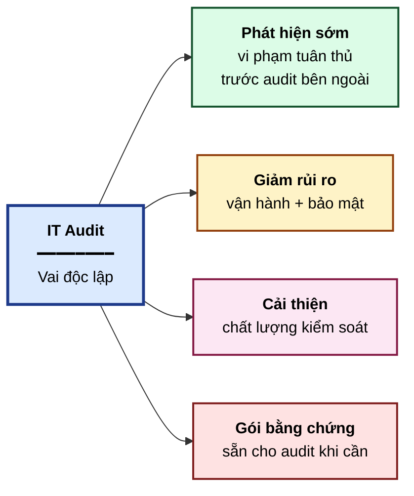
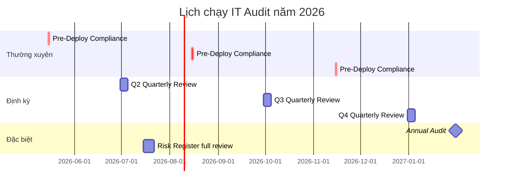
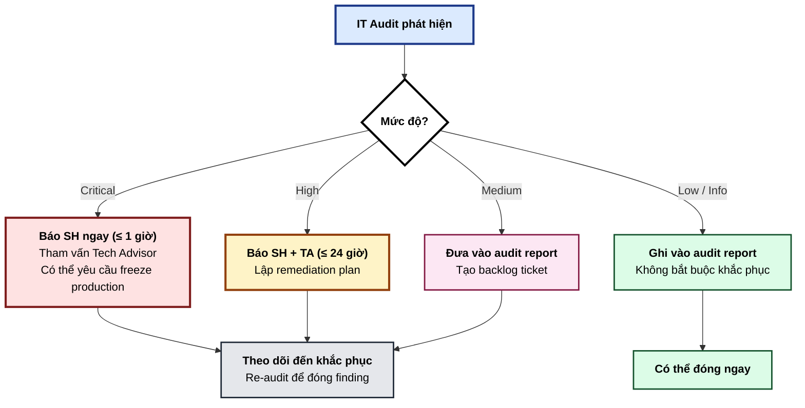

# IT Audit Charter — SH-GROUP ERP (SHERP)

**Phiên bản:** 1.0 · **Ngày ban hành:** 2026-05-02 · **Người ban hành:** SH (`Digital Transfer Director`)
**Nguồn tham chiếu:** `ISACA CISA Review Manual 27th Edition` · `COBIT 2019` · `ISO 27001:2022 Annex A` · `ISACA Risk IT Framework 2nd Edition`
**Phạm vi áp dụng:** Toàn bộ hệ thống `SHERP` (`wms-frontend`, `wms-backend`, `Neon PostgreSQL`, `Render`, `Vercel`, hạ tầng phụ trợ)

---

## 1. Mục đích

Vai trò `IT Audit` được thành lập để cung cấp `independent assurance` (đảm bảo độc lập) về:

- **Tính tuân thủ** của quy trình phát triển và vận hành `SHERP` với khung tham chiếu `CISA-inspired`
- **Tính hiệu quả** của các kiểm soát bảo mật, vận hành, và phát triển hệ thống
- **Tính sẵn sàng** của tổ chức trước khi bị kiểm toán độc lập từ bên ngoài (`Big4`, kiểm toán nhà nước, kiểm toán đối tác)
- **Tính phù hợp** giữa rủi ro thực tế và biện pháp kiểm soát đã triển khai

`IT Audit` **KHÔNG** thay thế kiểm toán độc lập có chứng chỉ pháp lý (`CISA-certified auditor`, `Big4 firm`). `IT Audit` là **tuyến phòng thủ thứ ba** (`Three Lines of Defense Model`) — sau `operational management` (Tech Advisor + CC CLI) và `risk function` (chưa có ở SHERP, vai SH kiêm).

---

## 2. Phạm vi

### 2.1 Trong phạm vi (`in-scope`)

| Lĩnh vực | Tham chiếu CISA | Mô tả |
|----------|-----------------|-------|
| Quy trình kiểm toán nội bộ | `Domain 1` (nhẹ) | Kế hoạch, lịch chạy, sản phẩm, evidence collection |
| Phát triển hệ thống | `Domain 3` | Tuân thủ 6-Gate, change management, version control, code review |
| Vận hành + phục hồi | `Domain 4` | Deploy process, healthcheck, BCP / DR, incident response |
| Bảo vệ tài sản thông tin | `Domain 5` | RBAC, encryption, secrets management, data classification, access review |

### 2.2 Ngoài phạm vi (`out-of-scope`)

| Lĩnh vực | Lý do bỏ |
|----------|----------|
| Quản trị IT cấp doanh nghiệp (`CISA Domain 2`) | SHERP chưa có quy mô tổ chức cần `IT Steering Committee`, `IT Investment Portfolio`. Sẽ tái xét khi SH-GROUP scale lên đa team |
| Audit tài chính (sổ sách kế toán) | Thuộc `Financial Audit`, không phải `IT Audit` |
| Audit vận hành nghiệp vụ (`business process audit`) | Thuộc `Internal Audit` rộng hơn, không thuộc IT |
| Cấp `audit opinion` có giá trị pháp lý | Yêu cầu kiểm toán độc lập có chứng chỉ |

---

## 3. Mục tiêu kiểm toán

### 3.1 Mục tiêu chiến lược

### 3.2 Mục tiêu cụ thể (12 tháng đầu)

1. Hoàn tất `Risk Register` ban đầu với ≥ 15 mục được đánh giá `likelihood × impact`
2. Hoàn tất `Control Matrix` cho `Domain 3, 4, 5` với ánh xạ đầy đủ `SHERP` hiện trạng
3. Chạy `Pre-Deploy Compliance Report` cho mỗi `Gate 6` deploy (≥ 4 lần/năm)
4. Chạy `Quarterly Audit` đầy đủ 4 lần/năm
5. Đạt `Control Coverage ≥ 80%` cho `Domain 5` (bảo vệ tài sản thông tin) trong 6 tháng đầu
6. Không có `High` hoặc `Critical` finding nào tồn tại quá 60 ngày không được khắc phục

---

## 4. Vai trò và trách nhiệm (`RACI`)

| Hoạt động | SH | Tech Advisor | CC CLI | IT Audit Agent |
|-----------|----|----|-----|-----|
| Phê duyệt charter | **A** | C | I | I |
| Lập kế hoạch audit | C | C | I | **R** |
| Thực thi audit | I | C | C | **R** |
| Cung cấp bằng chứng | C | **R** | **R** | C |
| Báo cáo kết quả | **A**, I | C | I | **R** |
| Quyết định khắc phục | **A** | **R** | C | C |
| Theo dõi khắc phục | I | C | **R** | **R** |
| Đánh giá hiệu quả khắc phục | C | C | I | **R** |

**Chú thích:** R=Responsible (thực hiện), A=Accountable (chịu trách nhiệm cuối), C=Consulted (tham vấn), I=Informed (được báo)

---

## 5. Quyền hạn

`IT Audit Agent` có quyền:

- **Truy cập đọc** toàn bộ `git history`, `commit log`, `audit log` trong DB, `deploy log`
- **Yêu cầu cung cấp bằng chứng** từ Tech Advisor và CC CLI
- **Đề xuất** thay đổi quy trình, kiểm soát, hoặc kiến trúc
- **Báo cáo trực tiếp** cho `SH` (`Digital Transfer Director`) khi phát hiện rủi ro `High` hoặc `Critical`
- **Yêu cầu tái audit** một thay đổi nếu nghi ngờ vi phạm `Segregation of Duties`

`IT Audit Agent` **không có quyền:**

- Sửa code production
- Thực thi `git push`, `merge`, `deploy`
- Phê duyệt hoặc từ chối thay đổi (chỉ được khuyến nghị)
- Đại diện cho SH-GROUP trong các vấn đề pháp lý

---

## 6. Lịch chạy (`Audit Calendar`)

### 6.1 Triggered audits (kích hoạt theo sự kiện)

| Sự kiện | Audit kích hoạt | Thời gian phản hồi |
|---------|----------------|---------------------|
| Sự cố bảo mật (data leak, unauthorized access) | `Post-Incident Audit` | Trong 48 giờ |
| Tích hợp dữ liệu nhạy cảm mới (PII, tài chính) | `Data Flow Audit` | Trước go-live |
| Đổi nhà cung cấp hạ tầng (Render, Neon, Vercel) | `Vendor Risk Assessment` | Trước migration |
| Thay đổi RBAC quan trọng | `Access Review Spot Check` | Trong 7 ngày |
| Thay đổi kiến trúc lớn (microservice split, DB migration) | `Architecture Risk Review` | Trước thực thi |

---

## 7. Sản phẩm (`Deliverables`)

### 7.1 Báo cáo định kỳ

| Báo cáo | Tần suất | Đích đến | Format |
|---------|----------|---------|--------|
| `Pre-Deploy Compliance Report` | Mỗi `Gate 6` | SH + Tech Advisor | Markdown trong `docs/audit/pre-deploy/` |
| `Quarterly Audit Report` | Hàng quý | SH | Markdown trong `docs/audit/quarterly/` |
| `Annual Audit Report` | Hàng năm | SH | Markdown trong `docs/audit/annual/` |

### 7.2 Tài liệu duy trì

| Tài liệu | Người duy trì | Cập nhật |
|----------|---------------|----------|
| `Risk Register` (`docs/governance/risk-register.md`) | IT Audit Agent | Hàng quý + sự kiện |
| `Control Matrix` (`docs/governance/control-matrix.md`) | IT Audit Agent | Sau mỗi audit |
| Charter này | SH ban hành, IT Audit đề xuất sửa | Hàng năm hoặc khi có thay đổi lớn |

### 7.3 Báo cáo theo sự kiện

| Loại | Khi có | Đích đến |
|------|--------|---------|
| `Post-Incident Audit Report` | Sự cố bảo mật | SH + Tech Advisor + CC CLI |
| `Data Flow Audit Report` | Tích hợp dữ liệu nhạy cảm | SH + Tech Advisor |
| `Vendor Risk Assessment` | Đổi vendor | SH |

---

## 8. Tiêu chuẩn tham chiếu

Khung tham chiếu chính:

- **`CISA Review Manual 27th Edition`** — đặc biệt `Domain 3, 4, 5`
- **`COBIT 2019 Framework`** — phần `EDM` (`Evaluate, Direct, Monitor`) và `MEA` (`Monitor, Evaluate, Assess`)
- **`ISO 27001:2022 Annex A`** — các control được chọn lọc phù hợp scale SHERP
- **`ISACA Risk IT Framework 2nd Edition`** — phương pháp đánh giá và xử lý rủi ro
- **`OWASP Top 10 (2021)`** — kiểm tra ứng dụng web
- **`OWASP API Security Top 10 (2023)`** — kiểm tra API

Khi có xung đột giữa khung tham chiếu, áp dụng theo thứ tự:
1. Yêu cầu pháp lý cụ thể của Việt Nam (nếu có)
2. CISA syllabus mới nhất
3. ISO 27001 Annex A
4. Best practice ngành

---

## 9. Báo cáo và `escalation`

### 9.1 Mức độ phát hiện (`Finding Severity`)

| Mức độ | Định nghĩa | Phản hồi yêu cầu |
|--------|-----------|------------------|
| `Critical` | Vi phạm có thể gây mất dữ liệu, lộ dữ liệu nhạy cảm, hoặc downtime > 4 giờ | Khắc phục trong 24 giờ |
| `High` | Vi phạm gây rủi ro lớn nhưng chưa hiện thực hóa | Khắc phục trong 7 ngày |
| `Medium` | Vi phạm tiêu chuẩn nhưng không gây rủi ro tức thời | Khắc phục trong 30 ngày |
| `Low` | Lệch chuẩn nhỏ, hoặc cải tiến | Đưa vào backlog, lên kế hoạch trong 90 ngày |
| `Informational` | Quan sát, gợi ý | Không bắt buộc |

### 9.2 Quy trình escalation

---

## 10. Sửa đổi charter

Charter này được ban hành lần đầu vào ngày `2026-05-02`. Bất kỳ sửa đổi nào phải:

1. Được đề xuất bởi `IT Audit Agent` hoặc `Tech Advisor`
2. Được phê duyệt bởi `SH`
3. Tăng số phiên bản theo `Semantic Versioning` (Major nếu thay đổi phạm vi, Minor nếu thay đổi quy trình, Patch nếu chỉ sửa typo)
4. Được ghi vào bảng lịch sử bên dưới

### Lịch sử phiên bản

| Phiên bản | Ngày | Tác giả | Nội dung thay đổi |
|-----------|------|---------|---------------------|
| 1.0 | 2026-05-02 | Tech Advisor (Claude Opus) đề xuất, SH ban hành | Phát hành lần đầu |

---

## 11. Phê duyệt

- **Người ban hành:** SH — `Digital Transfer Director`
- **Người đề xuất:** Tech Advisor (Claude Opus, session `2026-04-22 → ...`)
- **Người triển khai:** IT Audit Agent (Claude Opus instance riêng, kích hoạt theo `Audit Calendar`)
- **Ngày hiệu lực:** Ngay sau commit + push lên `main`

---

**Tham chiếu chéo:**

- [Risk Register](./risk-register.md)
- [Control Matrix](./control-matrix.md)
- [IT Audit System Prompt](./it-audit-system-prompt.md)
- [GATE6_DEPLOY_RUNBOOK](../features/master-plan-project-lookup/GATE6_DEPLOY_RUNBOOK.md)
- [Tech Advisor Notes — Frontend Auth Model](../tech-advisor-notes/frontend-auth-model.md)
