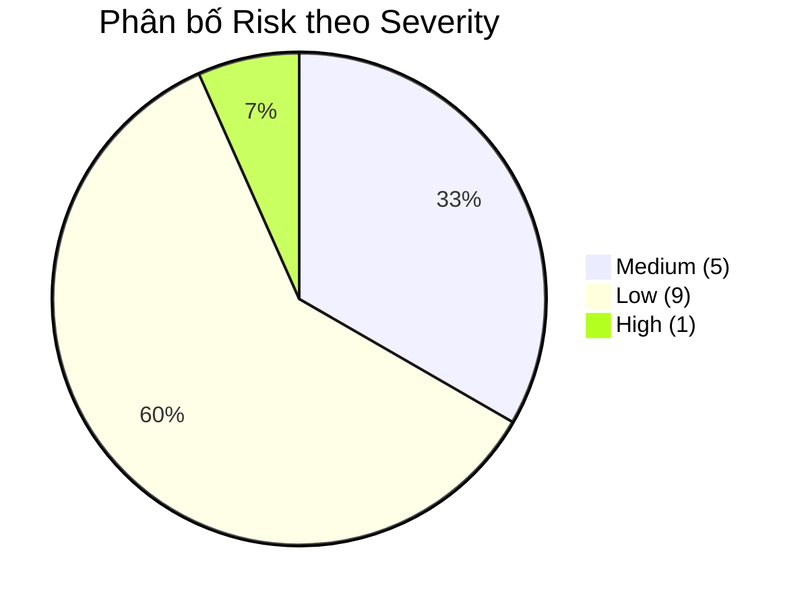

# Risk Register — SH-GROUP ERP (SHERP)

**Phiên bản:** 1.0 · **Ngày khởi tạo:** 2026-05-02 · **Người duy trì:** IT Audit Agent
**Khung tham chiếu:** `ISACA Risk IT Framework 2nd Edition` · `ISO 27005:2022`
**Liên quan:** [IT Audit Charter](./it-audit-charter.md) · [Control Matrix](./control-matrix.md)

---

## 1. Mục đích

Sổ rủi ro này ghi nhận, đánh giá, theo dõi và quản lý các rủi ro công nghệ thông tin của hệ thống `SHERP`. Đây là một **`living document`** — được cập nhật liên tục bởi `IT Audit Agent` qua các pass audit định kỳ và sự kiện.

---

## 2. Phương pháp đánh giá rủi ro

### 2.1 Công thức điểm rủi ro

```
Risk Score = Likelihood × Impact
```

### 2.2 Thang đo `Likelihood` (Khả năng xảy ra)

| Điểm | Mức | Định nghĩa |
|------|-----|-----------|
| 1 | `Rare` | Có thể xảy ra trong các tình huống đặc biệt; không có tiền lệ |
| 2 | `Unlikely` | Có thể xảy ra một lần trong 2-5 năm |
| 3 | `Possible` | Có thể xảy ra một lần trong năm |
| 4 | `Likely` | Có thể xảy ra một lần trong quý |
| 5 | `Almost Certain` | Có thể xảy ra hàng tháng hoặc thường xuyên hơn |

### 2.3 Thang đo `Impact` (Mức độ tác động)

| Điểm | Mức | Định nghĩa (đa chiều) |
|------|-----|-----------------------|
| 1 | `Negligible` | Không ảnh hưởng đáng kể; downtime < 1 giờ; không lộ dữ liệu |
| 2 | `Minor` | Tác động cục bộ; downtime 1-4 giờ; sai sót dữ liệu nhỏ tự khắc phục được |
| 3 | `Moderate` | Tác động lan rộng nội bộ; downtime 4-8 giờ; cần can thiệp; lộ dữ liệu nội bộ phi nhạy cảm |
| 4 | `Major` | Tác động đến vận hành business; downtime > 8 giờ; lộ dữ liệu nhạy cảm; tổn thất tài chính > 50 triệu VND |
| 5 | `Catastrophic` | Mất dữ liệu lớn; downtime > 1 ngày; vi phạm pháp lý; tổn thất tài chính > 500 triệu VND; ảnh hưởng đối tác / khách hàng |

### 2.4 Phân loại rủi ro theo điểm

| Điểm tổng | Mức rủi ro | Phản hồi yêu cầu |
|-----------|-----------|------------------|
| 20-25 | `Critical` | Khắc phục ngay; báo `SH` trong 1 giờ |
| 15-19 | `High` | Lập kế hoạch khắc phục trong 7 ngày |
| 10-14 | `Medium` | Đưa vào backlog; khắc phục trong 30 ngày |
| 5-9 | `Low` | Theo dõi; khắc phục theo kế hoạch trong quý |
| 1-4 | `Informational` | Ghi nhận; có thể chấp nhận |

### 2.5 Chiến lược xử lý

| Chiến lược | Mô tả | Khi áp dụng |
|------------|------|-------------|
| `Mitigate` | Triển khai kiểm soát giảm thiểu | Phổ biến nhất; rủi ro cao có thể giảm |
| `Transfer` | Chuyển rủi ro sang bên thứ ba (bảo hiểm, vendor SLA) | Khi rủi ro vượt khả năng nội bộ |
| `Avoid` | Loại bỏ hoạt động gây rủi ro | Khi rủi ro quá cao và hoạt động không thiết yếu |
| `Accept` | Chấp nhận, ghi nhận, không hành động | Rủi ro thấp + chi phí kiểm soát cao hơn lợi ích |

---

## 3. Cấu trúc bảng `Risk Register`

| Cột | Ý nghĩa |
|-----|---------|
| `Risk ID` | Mã rủi ro `R-xxx` (số thứ tự tăng dần) |
| `Title` | Tên ngắn gọn |
| `Description` | Mô tả chi tiết: nguyên nhân, kịch bản, hậu quả |
| `Domain` | Phân loại theo `CISA Domain 3 / 4 / 5` |
| `Likelihood` | 1-5 |
| `Impact` | 1-5 |
| `Score` | Likelihood × Impact |
| `Severity` | `Critical / High / Medium / Low / Informational` |
| `Owner` | Người chịu trách nhiệm xử lý |
| `Strategy` | `Mitigate / Transfer / Avoid / Accept` |
| `Mitigation` | Mô tả biện pháp giảm thiểu |
| `Status` | `Open / In Progress / Mitigated / Accepted / Closed` |
| `Target Date` | Ngày dự kiến hoàn tất |
| `Date Identified` | Ngày phát hiện |
| `Last Reviewed` | Ngày review gần nhất |

---

## 4. Sổ rủi ro hiện tại

### R-001 · JWT secret không có chính sách xoay vòng

| | |
|--|--|
| **Domain** | 5 — Bảo vệ tài sản thông tin |
| **Description** | `JWT_SECRET` được set một lần qua biến môi trường và không có quy trình xoay vòng định kỳ. Nếu secret bị lộ (qua log, repo cũ, vendor breach), mọi token được phát hành đều bị xâm phạm. Hiện tại không có cơ chế thu hồi hàng loạt. |
| **Likelihood** | 2 (`Unlikely`) |
| **Impact** | 4 (`Major`) — lộ secret cho phép giả mạo bất kỳ user nào |
| **Score** | **8** |
| **Severity** | `Low` |
| **Owner** | Tech Advisor + SH |
| **Strategy** | `Mitigate` |
| **Mitigation** | Lập chính sách xoay vòng `JWT_SECRET` mỗi 6 tháng + cơ chế thu hồi token toàn cục (token blocklist hiện đã có nền tảng, cần extend). |
| **Status** | `Open` |
| **Target Date** | 2026-08-01 |
| **Date Identified** | 2026-05-02 |
| **Last Reviewed** | 2026-05-02 |

---

### R-002 · Không có chính sách phân loại dữ liệu

| | |
|--|--|
| **Domain** | 5 |
| **Description** | SHERP chứa dữ liệu đa cấp nhạy cảm: ngân sách dự án (`projects.budget`, `contract_value`), thông tin nhân viên (`employees`), nhà cung cấp (`suppliers`), audit log. Hiện không có policy phân loại `Public / Internal / Confidential / Restricted`. Hệ quả: thiếu căn cứ áp kiểm soát phù hợp cho từng loại dữ liệu. |
| **Likelihood** | 4 (`Likely`) |
| **Impact** | 3 (`Moderate`) |
| **Score** | **12** |
| **Severity** | `Medium` |
| **Owner** | IT Audit Agent + SH |
| **Strategy** | `Mitigate` |
| **Mitigation** | Viết `Data Classification Policy`, ánh xạ từng entity (table) sang một mức phân loại, định nghĩa kiểm soát tương ứng (encryption, access, retention). |
| **Status** | `Open` |
| **Target Date** | 2026-07-01 |
| **Date Identified** | 2026-05-02 |
| **Last Reviewed** | 2026-05-02 |

---

### R-003 · Backup chưa được kiểm chứng định kỳ (`backup not regularly verified`)

| | |
|--|--|
| **Domain** | 4 — Vận hành + phục hồi |
| **Description** | `Neon PostgreSQL` cung cấp backup tự động. Tuy nhiên SHERP chưa có quy trình `restore drill` định kỳ để xác nhận backup có thể khôi phục thành công. Rủi ro: phát hiện backup không restore được đúng lúc cần (sau sự cố). |
| **Likelihood** | 3 (`Possible`) |
| **Impact** | 5 (`Catastrophic`) — mất dữ liệu vĩnh viễn |
| **Score** | **15** |
| **Severity** | `High` |
| **Owner** | Tech Advisor + SH |
| **Strategy** | `Mitigate` |
| **Mitigation** | Lịch `restore drill` hàng quý: tạo `Neon dev branch` từ backup → chạy migration → seed test data → verify integrity. Document trong `docs/runbooks/backup-restore-drill.md`. |
| **Status** | `Open` |
| **Target Date** | 2026-06-15 |
| **Date Identified** | 2026-05-02 |
| **Last Reviewed** | 2026-05-02 |

---

### R-004 · Cross-org access không có pre-approval

| | |
|--|--|
| **Domain** | 5 |
| **Description** | User có privilege `VIEW_ALL_PROJECTS` có thể tạo `MasterPlan` cho dự án ở org khác. Hiện chỉ có `audit log post-event`, không có cơ chế `pre-approval workflow` (yêu cầu duyệt trước khi tạo cross-org). Rủi ro: lạm quyền không phát hiện kịp. |
| **Likelihood** | 2 (`Unlikely`) |
| **Impact** | 3 (`Moderate`) |
| **Score** | **6** |
| **Severity** | `Low` |
| **Owner** | Tech Advisor |
| **Strategy** | `Accept` (V1) → `Mitigate` (V2 nếu cần) |
| **Mitigation** | V1 chấp nhận với audit log. Tạo backlog `MASTER-PLAN-CROSS-ORG-PRE-APPROVAL` cho V2 nếu phát sinh nhu cầu thực tế. |
| **Status** | `Accepted` |
| **Target Date** | N/A |
| **Date Identified** | 2026-05-02 |
| **Last Reviewed** | 2026-05-02 |

---

### R-005 · Frontend không có runtime test runner

| | |
|--|--|
| **Domain** | 3 — Phát triển hệ thống |
| **Description** | `wms-frontend` chưa có `Vitest`, `Jest`, hoặc `Playwright`. "Tests" hiện tại chỉ là static `npx tsx` grep substring. Coverage hành vi runtime = 0%. Rủi ro: regression UI không được phát hiện sớm; quality assurance phụ thuộc 100% vào manual testing. |
| **Likelihood** | 4 (`Likely`) |
| **Impact** | 3 (`Moderate`) |
| **Score** | **12** |
| **Severity** | `Medium` |
| **Owner** | Tech Advisor + CC CLI |
| **Strategy** | `Mitigate` |
| **Mitigation** | Backlog ticket `FE-TEST-INFRA-SETUP` đã có. Setup `Vitest + RTL + jsdom`, chuyển selector tests sang RTL, thiết lập coverage threshold. |
| **Status** | `In Progress` (backlog) |
| **Target Date** | 2026-08-01 |
| **Date Identified** | 2026-04-24 |
| **Last Reviewed** | 2026-05-02 |

---

### R-006 · Vi phạm tiềm ẩn `Segregation of Duties`

| | |
|--|--|
| **Domain** | 1 — Quy trình kiểm toán |
| **Description** | `CC CLI` đang đóng cả vai `Implementer` (viết code) và `Senior Lead Auditor` (kiểm tra code mình viết). Vi phạm nguyên tắc `Three Lines of Defense`. Rủi ro: tester bias, false negative trong các finding tự audit. |
| **Likelihood** | 5 (`Almost Certain`) |
| **Impact** | 2 (`Minor`) — chất lượng audit giảm, không gây mất dữ liệu trực tiếp |
| **Score** | **10** |
| **Severity** | `Medium` |
| **Owner** | SH |
| **Strategy** | `Mitigate` |
| **Mitigation** | Triển khai vai `IT Audit Agent` riêng biệt (Claude Opus instance khác) — chính là mục đích bộ governance này. Khi `IT Audit Agent` hoạt động, CC CLI ngừng đóng vai `Senior Lead Auditor`. |
| **Status** | `In Progress` |
| **Target Date** | 2026-05-15 (cùng ngày triển khai bộ governance) |
| **Date Identified** | 2026-05-02 |
| **Last Reviewed** | 2026-05-02 |

---

### R-007 · Không có audit trail cho hành động AI agent

| | |
|--|--|
| **Domain** | 1 + 5 |
| **Description** | `Tech Advisor` (em) và `CC CLI` thực hiện thay đổi mã nguồn, file system, git operations. Hiện chỉ có `git history` ghi nhận output cuối, không có log rõ ràng về `prompt → action → result` (audit trail của AI). Khó forensic nếu phát sinh vấn đề "AI làm gì sai". |
| **Likelihood** | 4 (`Likely`) |
| **Impact** | 2 (`Minor`) |
| **Score** | **8** |
| **Severity** | `Low` |
| **Owner** | SH + Tech Advisor |
| **Strategy** | `Mitigate` |
| **Mitigation** | (1) Tech Advisor save `directive` cho CC CLI vào `docs/claude-code-prompts/` (đã làm). (2) CC CLI lưu `session transcript` quan trọng. (3) Định nghĩa policy "thay đổi production data phải có Tech Advisor approve trước". |
| **Status** | `In Progress` (một phần) |
| **Target Date** | 2026-09-01 |
| **Date Identified** | 2026-05-02 |
| **Last Reviewed** | 2026-05-02 |

---

### R-008 · Migration revert chưa được kiểm chứng định kỳ trên production-clone

| | |
|--|--|
| **Domain** | 3 + 4 |
| **Description** | `GATE6_DEPLOY_RUNBOOK §5.4` định nghĩa `rollback rehearsal protocol` nhưng yêu cầu thực hiện trước mỗi deploy. Chưa có cơ chế tự động hoặc lịch định kỳ ngoài deploy event. Rủi ro: migration mới có thể không reversible mà không phát hiện cho đến khi cần rollback thật. |
| **Likelihood** | 2 (`Unlikely`) |
| **Impact** | 4 (`Major`) |
| **Score** | **8** |
| **Severity** | `Low` |
| **Owner** | CC CLI + Tech Advisor |
| **Strategy** | `Mitigate` |
| **Mitigation** | Mỗi `migration:run` đi kèm `migration:revert smoke test` trên `Neon dev branch` trong CI. Lưu kết quả vào audit log. |
| **Status** | `Open` |
| **Target Date** | 2026-09-01 |
| **Date Identified** | 2026-05-02 |
| **Last Reviewed** | 2026-05-02 |

---

### R-009 · Bất nhất nhận dạng thương hiệu (logo vs primary token)

| | |
|--|--|
| **Domain** | 3 |
| **Description** | Logo `SH GROUP` (đỏ-tím) không khớp với primary token UI hiện tại (`Enterprise Blue`). Đã có prototype branch `chore/brand-accent-hybrid-prototype` chờ phê duyệt. Rủi ro: trải nghiệm thương hiệu không nhất quán, ảnh hưởng nhận thức user nội bộ và đối tác. |
| **Likelihood** | 5 (`Almost Certain`) — đã hiện hữu |
| **Impact** | 1 (`Negligible`) — không ảnh hưởng vận hành / bảo mật |
| **Score** | **5** |
| **Severity** | `Low` |
| **Owner** | SH |
| **Strategy** | `Mitigate` (đang xử lý) hoặc `Accept` (nếu SH quyết Enterprise Blue là chuẩn cuối) |
| **Mitigation** | SH review brand prototype + quyết định 1 trong 3 phương án (Approve / Iterate / Reject). |
| **Status** | `In Progress` |
| **Target Date** | 2026-05-09 |
| **Date Identified** | 2026-05-02 |
| **Last Reviewed** | 2026-05-02 |

---

### R-010 · Vendor lock-in (`Vercel`, `Render`, `Neon`)

| | |
|--|--|
| **Domain** | 4 |
| **Description** | Hạ tầng SHERP phụ thuộc 3 nhà cung cấp: `Vercel` (FE hosting), `Render` (BE hosting), `Neon` (PostgreSQL). Mỗi nhà cung cấp có cấu hình riêng (build pipeline, env vars, healthcheck). Nếu vendor có sự cố lớn hoặc thay đổi pricing không thuận lợi, di chuyển sẽ phức tạp. |
| **Likelihood** | 2 (`Unlikely`) |
| **Impact** | 3 (`Moderate`) |
| **Score** | **6** |
| **Severity** | `Low` |
| **Owner** | SH |
| **Strategy** | `Mitigate` |
| **Mitigation** | (1) Document vendor-specific config trong `docs/infrastructure/`. (2) Định kỳ đánh giá alternatives (`AWS App Runner`, `Railway`, `Supabase`). (3) Đảm bảo backup data có thể restore lên bất kỳ PostgreSQL chuẩn nào. |
| **Status** | `Open` |
| **Target Date** | 2026-12-31 (review hàng năm) |
| **Date Identified** | 2026-05-02 |
| **Last Reviewed** | 2026-05-02 |

---

### R-011 · Secrets quản lý không tập trung

| | |
|--|--|
| **Domain** | 5 |
| **Description** | Secrets hiện tại (DB credentials, JWT secret, third-party API keys) được set trực tiếp qua dashboard của vendor (`Vercel`, `Render`, `Neon`). Không có vault tập trung (`HashiCorp Vault`, `AWS Secrets Manager`). Rủi ro: khó audit ai đã access, khó xoay vòng đồng bộ. |
| **Likelihood** | 3 (`Possible`) |
| **Impact** | 4 (`Major`) |
| **Score** | **12** |
| **Severity** | `Medium` |
| **Owner** | SH + Tech Advisor |
| **Strategy** | `Mitigate` |
| **Mitigation** | Đánh giá vault solution (`Doppler`, `Infisical` cho startup scale). Migrate secrets sang vault. Thiết lập access policy. |
| **Status** | `Open` |
| **Target Date** | 2026-10-01 |
| **Date Identified** | 2026-05-02 |
| **Last Reviewed** | 2026-05-02 |

---

### R-012 · Không có `BCP / DR Plan` chính thức

| | |
|--|--|
| **Domain** | 4 |
| **Description** | `Business Continuity Plan` và `Disaster Recovery Plan` chưa được document chính thức. Có một phần trong `GATE6_DEPLOY_RUNBOOK` (rollback runbook) nhưng chỉ áp dụng deploy-time, không phủ kịch bản: vendor outage > 4 giờ, mất dữ liệu, ransomware, đội ngũ không có mặt. |
| **Likelihood** | 2 (`Unlikely`) |
| **Impact** | 5 (`Catastrophic`) |
| **Score** | **10** |
| **Severity** | `Medium` |
| **Owner** | SH |
| **Strategy** | `Mitigate` |
| **Mitigation** | Viết `docs/runbooks/bcp-dr-plan.md` định nghĩa: `RTO` (Recovery Time Objective), `RPO` (Recovery Point Objective), kịch bản disaster, runbook khắc phục, contact list, communication plan. |
| **Status** | `Open` |
| **Target Date** | 2026-08-15 |
| **Date Identified** | 2026-05-02 |
| **Last Reviewed** | 2026-05-02 |

---

### R-013 · Access review chưa được thực hiện định kỳ

| | |
|--|--|
| **Domain** | 5 |
| **Description** | RBAC + privilege seeding hoạt động tốt, nhưng không có quy trình `quarterly access review` để verify: ai vẫn cần privilege gì, account nào nên deactivate, role assignment nào quá rộng. |
| **Likelihood** | 4 (`Likely`) |
| **Impact** | 3 (`Moderate`) |
| **Score** | **12** |
| **Severity** | `Medium` |
| **Owner** | IT Audit Agent + SH |
| **Strategy** | `Mitigate` |
| **Mitigation** | Quy trình `Quarterly Access Review`: IT Audit Agent xuất danh sách (user × privileges), SH review từng dòng, deactivate / adjust theo kết quả. Script support: `scripts/access-review-export.mjs`. |
| **Status** | `Open` |
| **Target Date** | 2026-06-30 (lần đầu) |
| **Date Identified** | 2026-05-02 |
| **Last Reviewed** | 2026-05-02 |

---

### R-014 · Audit log retention không có policy

| | |
|--|--|
| **Domain** | 5 |
| **Description** | Bảng `audit_logs` đã có (cross-org MasterPlan ghi nhận thành công). Nhưng không có chính sách retention: giữ bao lâu, archive ở đâu, xoá khi nào. Rủi ro: bảng phình to dần ảnh hưởng performance, hoặc xoá quá sớm khi cần forensic. |
| **Likelihood** | 4 (`Likely`) |
| **Impact** | 2 (`Minor`) |
| **Score** | **8** |
| **Severity** | `Low` |
| **Owner** | Tech Advisor + IT Audit Agent |
| **Strategy** | `Mitigate` |
| **Mitigation** | Định nghĩa retention: `hot` 90 ngày trong DB, `warm` 1 năm trong S3-compatible storage, `cold` 7 năm tuân thủ luật kế toán Việt Nam. Triển khai cron archive. |
| **Status** | `Open` |
| **Target Date** | 2026-09-01 |
| **Date Identified** | 2026-05-02 |
| **Last Reviewed** | 2026-05-02 |

---

### R-015 · Không có monitoring + alerting tập trung

| | |
|--|--|
| **Domain** | 4 |
| **Description** | Hiện theo dõi qua dashboard riêng của Vercel / Render / Neon. Không có hệ thống alerting tập trung (`Sentry`, `Datadog`, `Grafana`). Rủi ro: phát hiện sự cố muộn, không có metric tập hợp xuyên hệ thống. |
| **Likelihood** | 3 (`Possible`) |
| **Impact** | 3 (`Moderate`) |
| **Score** | **9** |
| **Severity** | `Low` |
| **Owner** | SH |
| **Strategy** | `Mitigate` |
| **Mitigation** | Đánh giá APM solution (`Sentry` cho FE error, `Better Stack` hoặc `Logtail` cho BE log). Thiết lập alert rules cho thresholds đã định trong `GATE6_DEPLOY_RUNBOOK §4.1`. |
| **Status** | `Open` |
| **Target Date** | 2026-11-01 |
| **Date Identified** | 2026-05-02 |
| **Last Reviewed** | 2026-05-02 |

---

## 5. Tổng quan rủi ro

### 5.1 Phân bố theo `severity`



### 5.2 Phân bố theo `domain`

| Domain | Số rủi ro | Severity cao nhất |
|--------|-----------|-------------------|
| Domain 1 (Audit process) | 2 | Medium |
| Domain 3 (Development) | 3 | Medium |
| Domain 4 (Operations) | 4 | High |
| Domain 5 (Info Asset Protection) | 6 | Medium |

### 5.3 Top 3 rủi ro ưu tiên xử lý

| Hạng | Risk ID | Title | Score | Severity |
|------|---------|-------|-------|----------|
| 1 | R-003 | Backup chưa kiểm chứng định kỳ | 15 | High |
| 2 | R-002 | Không có chính sách phân loại dữ liệu | 12 | Medium |
| 3 | R-005 | Frontend không có runtime test runner | 12 | Medium |

---

## 6. Quy trình review

### 6.1 Tần suất

- **Hàng quý:** Toàn bộ register được review, cập nhật `Last Reviewed` cho mọi entry
- **Theo sự kiện:** Khi có sự cố, deploy mới, thay đổi vendor, hoặc audit từ bên ngoài
- **Hàng năm:** Review chiến lược — re-prioritize, retire risk đã đóng, thêm risk mới phát hiện

### 6.2 Workflow

```mermaid
flowchart LR
    Trigger["<b>Trigger</b><br/>Quarterly /<br/>Event-driven"] --> Review["<b>IT Audit review</b><br/>từng entry"]
    Review --> Update["<b>Cập nhật</b><br/>Likelihood + Impact +<br/>Status + Last Reviewed"]
    Update --> NewRisk{"<b>Phát hiện<br/>risk mới?</b>"}
    NewRisk -->|Có| Add["<b>Thêm entry mới</b><br/>R-xxx tiếp theo"]
    NewRisk -->|Không| Report["<b>Tạo Quarterly Report</b><br/>(nếu định kỳ)"]
    Add --> Report
    Report --> Notify["<b>Báo SH + Tech Advisor</b><br/>findings + đề xuất"]

    style Trigger fill:#dbeafe,color:#000,stroke:#1e3a8a,stroke-width:3px
    style Review fill:#dcfce7,color:#000,stroke:#14532d,stroke-width:2px
    style Update fill:#fef3c7,color:#000,stroke:#92400e,stroke-width:2px
    style NewRisk fill:#fff,color:#000,stroke:#000,stroke-width:3px
    style Add fill:#fce7f3,color:#000,stroke:#831843,stroke-width:2px
    style Report fill:#dbeafe,color:#000,stroke:#1e3a8a,stroke-width:2px
    style Notify fill:#fee2e2,color:#000,stroke:#7f1d1d,stroke-width:2px
```



---

**Lịch sử phiên bản:**

| Phiên bản | Ngày | Tác giả | Nội dung |
|-----------|------|---------|----------|
| 1.0 | 2026-05-02 | Tech Advisor (Claude Opus) | Phát hành lần đầu với 15 rủi ro khởi tạo |
