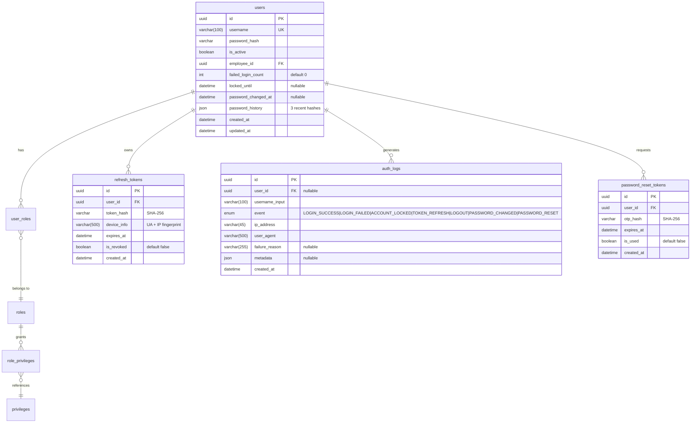
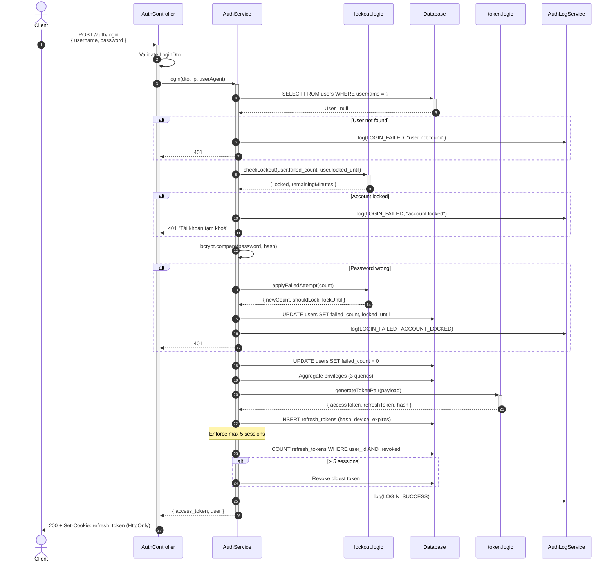
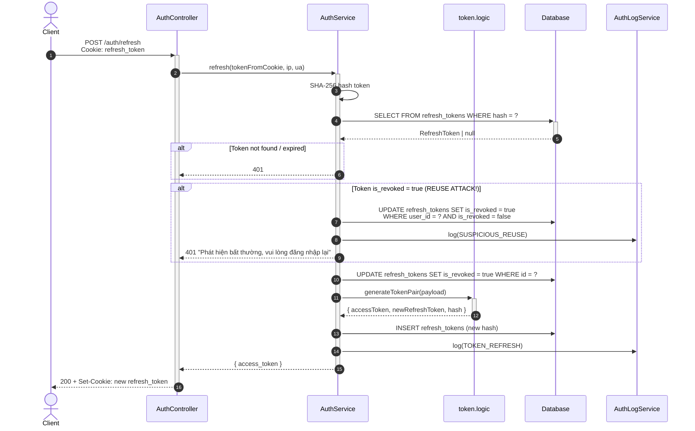

# SA_DESIGN: Module Auth — SH-GROUP ERP

> **Feature:** Authentication, Authorization & Security Audit
> **BA Reference:** `docs/specs/auth-business-spec.md`
> **Ngày tạo:** 2026-03-26
> **Trạng thái:** GATE 2 — SA DESIGN

---

## 1. ERD — Entity Relationship Diagram



---

## 2. Database Schema Changes

### 2.1 ALTER: users (thêm 4 columns)

```sql
ALTER TABLE users ADD COLUMN failed_login_count INT NOT NULL DEFAULT 0;
ALTER TABLE users ADD COLUMN locked_until TIMESTAMP NULL;
ALTER TABLE users ADD COLUMN password_changed_at TIMESTAMP NULL;
ALTER TABLE users ADD COLUMN password_history JSON NULL;
```

### 2.2 CREATE: refresh_tokens

```sql
CREATE TABLE refresh_tokens (
    id UUID PRIMARY KEY DEFAULT gen_random_uuid(),
    user_id UUID NOT NULL REFERENCES users(id) ON DELETE CASCADE,
    token_hash VARCHAR(64) NOT NULL,
    device_info VARCHAR(500),
    expires_at TIMESTAMP NOT NULL,
    is_revoked BOOLEAN NOT NULL DEFAULT false,
    created_at TIMESTAMP NOT NULL DEFAULT NOW()
);

CREATE INDEX idx_refresh_tokens_user ON refresh_tokens(user_id);
CREATE INDEX idx_refresh_tokens_hash ON refresh_tokens(token_hash);
CREATE INDEX idx_refresh_tokens_expires ON refresh_tokens(expires_at) WHERE is_revoked = false;
```

### 2.3 CREATE: auth_logs

```sql
CREATE TABLE auth_logs (
    id UUID PRIMARY KEY DEFAULT gen_random_uuid(),
    user_id UUID REFERENCES users(id) ON DELETE SET NULL,
    username_input VARCHAR(100) NOT NULL,
    event VARCHAR(30) NOT NULL,
    ip_address VARCHAR(45),
    user_agent VARCHAR(500),
    failure_reason VARCHAR(255),
    metadata JSON,
    created_at TIMESTAMP NOT NULL DEFAULT NOW()
);

CREATE INDEX idx_auth_logs_user ON auth_logs(user_id);
CREATE INDEX idx_auth_logs_event ON auth_logs(event);
CREATE INDEX idx_auth_logs_created ON auth_logs(created_at DESC);
CREATE INDEX idx_auth_logs_ip ON auth_logs(ip_address);
```

### 2.4 CREATE: password_reset_tokens

```sql
CREATE TABLE password_reset_tokens (
    id UUID PRIMARY KEY DEFAULT gen_random_uuid(),
    user_id UUID NOT NULL REFERENCES users(id) ON DELETE CASCADE,
    otp_hash VARCHAR(64) NOT NULL,
    expires_at TIMESTAMP NOT NULL,
    is_used BOOLEAN NOT NULL DEFAULT false,
    created_at TIMESTAMP NOT NULL DEFAULT NOW()
);

CREATE INDEX idx_prt_user ON password_reset_tokens(user_id);
```

---

## 3. Clean Architecture — Folder Structure

```
src/auth/
├── domain/
│   ├── logic/
│   │   ├── password-policy.logic.ts    # Validate password strength + history
│   │   ├── lockout.logic.ts            # Check/apply account lockout
│   │   └── token.logic.ts              # Token generation/rotation logic
│   ├── types/
│   │   └── auth.types.ts               # Pure interfaces (no framework deps)
│   └── ports/
│       └── auth-log.port.ts            # Interface for audit logging
│
├── entities/
│   ├── refresh-token.entity.ts
│   ├── auth-log.entity.ts
│   └── password-reset-token.entity.ts
│
├── dto/
│   ├── login.dto.ts                    # username, password (class-validator)
│   ├── refresh-token.dto.ts            # Cookie-based, no body needed
│   ├── change-password.dto.ts          # old_password, new_password
│   └── forgot-password.dto.ts          # email/username + OTP
│
├── guards/
│   ├── jwt-auth.guard.ts               # (existing)
│   └── privilege.guard.ts              # (existing, moved from common)
│
├── decorators/
│   └── require-privilege.decorator.ts  # (existing, moved from common)
│
├── auth.controller.ts                  # Route handlers
├── auth.service.ts                     # Orchestrator (thin)
├── auth-log.service.ts                 # Audit log writer
├── token.service.ts                    # JWT + Refresh token management
├── auth.module.ts
└── jwt.strategy.ts                     # (existing)
```

**Clean Architecture enforcement:**
- `domain/logic/` = Pure functions, zero framework deps, 100% testable
- `auth.service.ts` = Thin orchestrator, calls domain logic + repositories
- NO business logic in controller

---

## 4. API Endpoints

### 4.1 Authentication

| Method | Route | Auth | Mô tả | Request | Response |
|--------|-------|------|--------|---------|----------|
| POST | `/auth/login` | No | Đăng nhập | `LoginDto { username, password }` | `{ access_token, user }` + Set-Cookie: refresh_token |
| POST | `/auth/refresh` | Cookie | Refresh token | Cookie: refresh_token | `{ access_token }` + Set-Cookie: new refresh_token |
| POST | `/auth/logout` | JWT | Đăng xuất | — | Revoke refresh_token + Clear cookie |
| GET | `/auth/me` | JWT | Profile hiện tại | — | `{ id, username, role, privileges }` |

### 4.2 Password Management

| Method | Route | Auth | Mô tả | Request | Response |
|--------|-------|------|--------|---------|----------|
| POST | `/auth/change-password` | JWT | Đổi mật khẩu | `{ old_password, new_password }` | `{ message }` |
| POST | `/auth/forgot-password` | No | Yêu cầu OTP | `{ username }` | `{ message }` (luôn success, không leak user) |
| POST | `/auth/reset-password` | No | Đặt lại bằng OTP | `{ username, otp, new_password }` | `{ message }` |

### 4.3 Admin — Session Management

| Method | Route | Auth | Privilege | Mô tả |
|--------|-------|------|-----------|--------|
| GET | `/auth/sessions` | JWT | — | Xem danh sách sessions của mình |
| DELETE | `/auth/sessions/:id` | JWT | — | Thu hồi 1 session |
| GET | `/auth/logs` | JWT | `VIEW_AUTH_LOGS` | Xem audit logs (admin) |
| POST | `/auth/force-logout/:userId` | JWT | `MANAGE_USER` | Buộc user logout |

---

## 5. Domain Logic Interfaces

### 5.1 password-policy.logic.ts
```typescript
interface PasswordPolicyResult {
  valid: boolean;
  errors: string[];   // ["Thiếu chữ hoa", "Thiếu ký tự đặc biệt"]
}

function validatePasswordPolicy(password: string): PasswordPolicyResult;
function isPasswordReused(password: string, history: string[]): Promise<boolean>;
```

### 5.2 lockout.logic.ts
```typescript
interface LockoutCheckResult {
  locked: boolean;
  remainingMinutes: number;      // 0 nếu không bị khoá
  failedCount: number;
}

function checkLockout(failedCount: number, lockedUntil: Date | null): LockoutCheckResult;
function applyFailedAttempt(currentCount: number): { newCount: number; shouldLock: boolean; lockUntil: Date | null };
```

### 5.3 token.logic.ts
```typescript
interface TokenPair {
  accessToken: string;
  refreshToken: string;
  refreshTokenHash: string;
}

// Pure function: detect token reuse attack
function isTokenReuseAttack(storedToken: { is_revoked: boolean }): boolean;
```

---

## 6. DTOs (class-validator)

### LoginDto
```typescript
class LoginDto {
  @IsString()
  @IsNotEmpty({ message: 'Tên đăng nhập không được để trống' })
  @MaxLength(100)
  username: string;

  @IsString()
  @IsNotEmpty({ message: 'Mật khẩu không được để trống' })
  password: string;
}
```

### ChangePasswordDto
```typescript
class ChangePasswordDto {
  @IsString()
  @IsNotEmpty()
  old_password: string;

  @IsString()
  @MinLength(8)
  @Matches(/^(?=.*[a-z])(?=.*[A-Z])(?=.*\d)(?=.*[!@#$%^&*])/, {
    message: 'Mật khẩu phải có ít nhất 8 ký tự, gồm chữ hoa, chữ thường, số và ký tự đặc biệt',
  })
  new_password: string;
}
```

---

## 7. Sequence Diagram — Login (Full)



---

## 8. Sequence Diagram — Token Refresh



---

## 9. Infrastructure — Auto Port Check

### Vấn đề
Backend NestJS crash/không tắt sạch → port 3000 bị chiếm → `EADDRINUSE` khi restart.

### Giải pháp: Script kill-port trước khi start

**File: `scripts/kill-port.sh`**
```bash
#!/bin/bash
PORT=${1:-3000}
PID=$(lsof -ti:$PORT 2>/dev/null || netstat -ano | grep ":$PORT " | grep LISTENING | awk '{print $NF}')
if [ -n "$PID" ]; then
  echo "Killing process $PID on port $PORT"
  kill -9 $PID 2>/dev/null || taskkill //F //PID $PID 2>/dev/null
fi
```

**File: `scripts/kill-port.bat` (Windows)**
```batch
@echo off
FOR /F "tokens=5" %%P IN ('netstat -ano ^| findstr ":3000" ^| findstr "LISTENING"') DO (
    echo Killing PID %%P on port 3000
    taskkill /F /PID %%P 2>NUL
)
```

**package.json update:**
```json
{
  "scripts": {
    "prestart:dev": "bash scripts/kill-port.sh 3000 || scripts/kill-port.bat",
    "start:dev": "nest start --watch"
  }
}
```

---

## 10. Environment Variables

### Mới cần thêm:
| Variable | Default | Mô tả |
|----------|---------|--------|
| `JWT_ACCESS_EXPIRES_IN` | `15m` | Thời hạn access token |
| `JWT_REFRESH_EXPIRES_IN` | `7d` | Thời hạn refresh token |
| `JWT_REFRESH_SECRET` | (required) | Secret riêng cho refresh token |
| `LOCKOUT_MAX_ATTEMPTS` | `5` | Số lần login sai tối đa |
| `LOCKOUT_DURATION_MINUTES` | `15` | Thời gian khoá (phút) |
| `MAX_SESSIONS_PER_USER` | `5` | Số session tối đa |

### Giữ nguyên:
| Variable | Giá trị hiện tại | Ghi chú |
|----------|------------------|---------|
| `JWT_SECRET` | `SH_WMS_SUPER_SECRET_KEY_PRODUCTION_2026` | Dùng cho access token |
| `PORT` | `3000` | Giữ nguyên |
| `VITE_API_URL` | `/api` | Frontend — đã khớp |

---

## 11. Migration Plan

```
Migration 1: AddUserSecurityFields
  → ALTER users: + failed_login_count, locked_until, password_changed_at, password_history

Migration 2: CreateRefreshTokensTable
  → CREATE refresh_tokens + indexes

Migration 3: CreateAuthLogsTable
  → CREATE auth_logs + indexes

Migration 4: CreatePasswordResetTokensTable
  → CREATE password_reset_tokens + indexes
```

**Data Integrity:** Không DROP/DELETE column nào → an toàn cho dữ liệu hiện tại.

---

## 12. SA Checklist

- [x] ERD đầy đủ (4 entities: User mở rộng + 3 bảng mới)
- [x] Clean Architecture folder structure
- [x] API Endpoints (10 endpoints, 3 nhóm)
- [x] Domain Logic interfaces (password-policy, lockout, token)
- [x] DTOs với class-validator
- [x] Sequence Diagrams (Login + Refresh)
- [x] Index strategy cho truy vấn (auth_logs, refresh_tokens)
- [x] Environment variables mới
- [x] Migration plan (4 migrations, không mất dữ liệu)
- [x] Auto-Port-Check infrastructure

---

> **SA Sign-off:** Thiết kế sẵn sàng cho **GATE 3 — Development**.
> Chờ Duy duyệt trước khi bắt đầu code.
