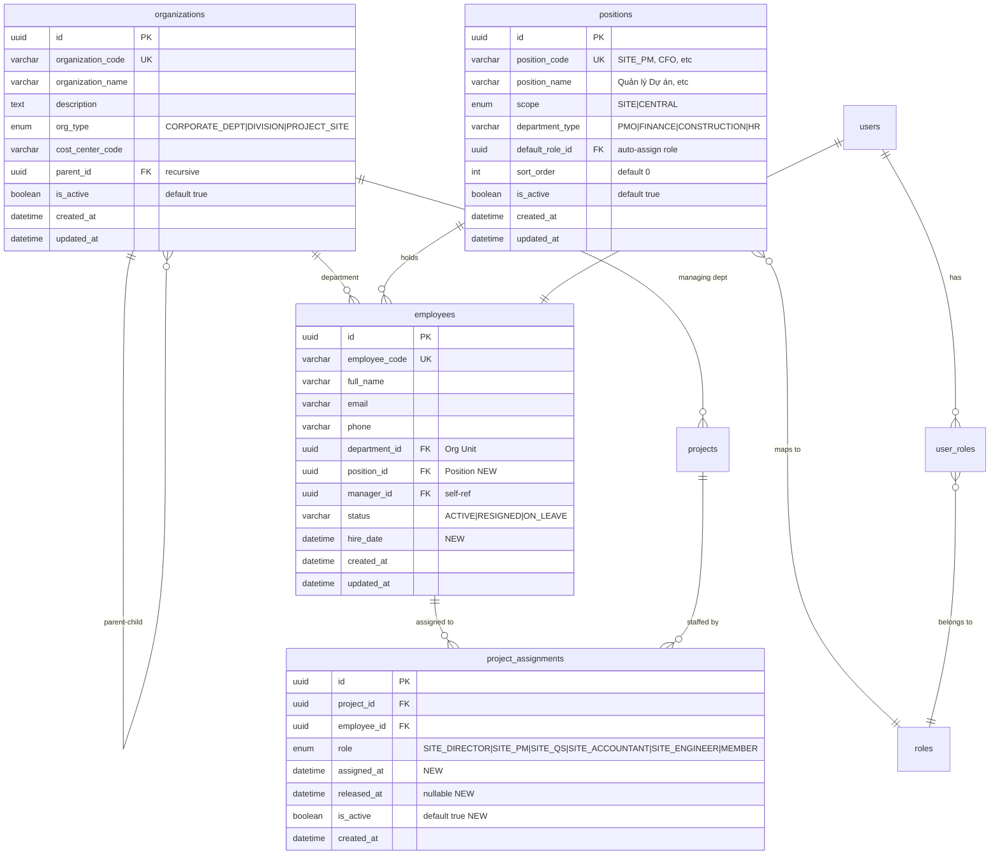

# SA_DESIGN: Org Chart & HR Foundation

> **BA Reference:** `docs/specs/org-chart-hr-foundation-ba-spec.md`
> **Ngày tạo:** 2026-03-26
> **Trạng thái:** GATE 2 — SA DESIGN

---

## 1. ERD — Mô hình dữ liệu mới



---

## 2. Schema Changes

### 2.1 ALTER: organizations (thêm giá trị enum, thêm is_active)

```sql
-- Mở rộng OrgType enum
ALTER TYPE org_type_enum ADD VALUE IF NOT EXISTS 'DIVISION';
ALTER TYPE org_type_enum ADD VALUE IF NOT EXISTS 'PROJECT_SITE';

-- Thêm is_active cho soft-disable
ALTER TABLE organizations ADD COLUMN IF NOT EXISTS is_active BOOLEAN NOT NULL DEFAULT true;
```

### 2.2 CREATE: positions (BẢNG MỚI)

```sql
CREATE TABLE positions (
    id UUID PRIMARY KEY DEFAULT gen_random_uuid(),
    position_code VARCHAR(50) NOT NULL UNIQUE,
    position_name VARCHAR(100) NOT NULL,
    scope VARCHAR(10) NOT NULL DEFAULT 'SITE',  -- SITE | CENTRAL
    department_type VARCHAR(50),                  -- PMO, FINANCE, CONSTRUCTION, HR
    default_role_id UUID REFERENCES roles(id) ON DELETE SET NULL,
    sort_order INT NOT NULL DEFAULT 0,
    is_active BOOLEAN NOT NULL DEFAULT true,
    created_at TIMESTAMP NOT NULL DEFAULT NOW(),
    updated_at TIMESTAMP NOT NULL DEFAULT NOW()
);

CREATE INDEX idx_positions_scope ON positions(scope);
CREATE INDEX idx_positions_active ON positions(is_active) WHERE is_active = true;
```

### 2.3 ALTER: employees (thêm position_id, hire_date)

```sql
ALTER TABLE employees ADD COLUMN position_id UUID REFERENCES positions(id) ON DELETE SET NULL;
ALTER TABLE employees ADD COLUMN hire_date DATE;

CREATE INDEX idx_employees_position ON employees(position_id);
```

### 2.4 ALTER: project_assignments (mở rộng roles + tracking)

```sql
-- Mở rộng AssignmentRole enum
ALTER TYPE assignment_role_enum ADD VALUE IF NOT EXISTS 'SITE_DIRECTOR';
ALTER TYPE assignment_role_enum ADD VALUE IF NOT EXISTS 'SITE_QS';
ALTER TYPE assignment_role_enum ADD VALUE IF NOT EXISTS 'SITE_ACCOUNTANT';
ALTER TYPE assignment_role_enum ADD VALUE IF NOT EXISTS 'SITE_ENGINEER';
ALTER TYPE assignment_role_enum ADD VALUE IF NOT EXISTS 'SITE_PM';

-- Thêm tracking fields
ALTER TABLE project_assignments ADD COLUMN assigned_at TIMESTAMP DEFAULT NOW();
ALTER TABLE project_assignments ADD COLUMN released_at TIMESTAMP;
ALTER TABLE project_assignments ADD COLUMN is_active BOOLEAN NOT NULL DEFAULT true;
```

---

## 3. Entity Designs

### 3.1 Position Entity (MỚI)

```typescript
@Entity('positions')
export class Position {
  @PrimaryGeneratedColumn('uuid')
  id: string;

  @Column({ unique: true, length: 50 })
  position_code: string;   // SITE_PM, CFO, CC_SPECIALIST

  @Column({ length: 100 })
  position_name: string;   // "Quản lý Dự án", "Giám đốc Tài chính"

  @Column({ type: 'varchar', length: 10, default: 'SITE' })
  scope: 'SITE' | 'CENTRAL';

  @Column({ type: 'varchar', length: 50, nullable: true })
  department_type: string;  // PMO, FINANCE, CONSTRUCTION, HR

  @ManyToOne(() => Role, { nullable: true, onDelete: 'SET NULL' })
  @JoinColumn({ name: 'default_role_id' })
  default_role: Role;       // Auto-assign RBAC role

  @Column({ type: 'int', default: 0 })
  sort_order: number;

  @Column({ default: true })
  is_active: boolean;

  @CreateDateColumn()
  created_at: Date;

  @UpdateDateColumn()
  updated_at: Date;
}
```

### 3.2 Employee Entity (MỞ RỘNG)

```typescript
// Thêm vào Employee entity hiện tại:
@ManyToOne(() => Position, { nullable: true, onDelete: 'SET NULL' })
@JoinColumn({ name: 'position_id' })
position: Position;

@Column({ type: 'date', nullable: true })
hire_date: Date;
```

### 3.3 AssignmentRole Enum (MỞ RỘNG)

```typescript
export enum AssignmentRole {
  // Existing
  PROJECT_MANAGER = 'PROJECT_MANAGER',
  MEMBER = 'MEMBER',
  // New — Site roles (luồng NTP)
  SITE_SUPERVISOR = 'SITE_SUPERVISOR', // GSHT — Giám sát hiện trường
  SITE_DIRECTOR = 'SITE_DIRECTOR',     // CHT — Chỉ huy trưởng
  SITE_QS = 'SITE_QS',                 // QS Công trình
  SITE_ACCOUNTANT = 'SITE_ACCOUNTANT', // Kế toán công trình
  SITE_ENGINEER = 'SITE_ENGINEER',     // Kỹ sư giám sát
}
```

### 3.4 OrgType Enum (MỞ RỘNG)

```typescript
export enum OrgType {
  CORPORATE_DEPT = 'CORPORATE_DEPT',   // Phòng ban trung tâm
  RETAIL_STORE = 'RETAIL_STORE',       // Cửa hàng (giữ tương thích)
  DIVISION = 'DIVISION',               // Khối/Chi nhánh
  PROJECT_SITE = 'PROJECT_SITE',       // Công trình
}
```

---

## 4. Seed Data — Positions

```typescript
const POSITIONS = [
  // Site Positions — Tham gia luồng NTP
  { code: 'SITE_SUPERVISOR',    name: 'Giám sát Hiện trường (GSHT)', scope: 'SITE',    dept: 'CONSTRUCTION', swimlane: 1 },
  { code: 'SITE_QS',            name: 'QS Công trình',              scope: 'SITE',    dept: 'CONSTRUCTION', swimlane: 2 },
  { code: 'SITE_DIRECTOR',      name: 'Chỉ huy trưởng (CHT)',      scope: 'SITE',    dept: 'CONSTRUCTION', swimlane: 3 },
  { code: 'SITE_ACCOUNTANT',    name: 'Kế toán Công trình',        scope: 'SITE',    dept: 'FINANCE' },
  { code: 'SITE_ENGINEER',      name: 'Kỹ sư Công trình',          scope: 'SITE',    dept: 'CONSTRUCTION' },
  { code: 'SITE_SAFETY',        name: 'An toàn Lao động',          scope: 'SITE',    dept: 'CONSTRUCTION' },

  // Central Positions — Tham gia luồng NTP
  { code: 'PROJECT_DIRECTOR',   name: 'Giám đốc Dự án (GĐDA)',     scope: 'CENTRAL', dept: 'PMO', swimlane: 4 },
  { code: 'CC_SPECIALIST',      name: 'Chuyên viên C&C',           scope: 'CENTRAL', dept: 'PMO', swimlane: 5 },
  { code: 'CC_MANAGER',         name: 'Trưởng phòng C&C',          scope: 'CENTRAL', dept: 'PMO', swimlane: 5 },

  // Central Positions — Hỗ trợ
  { code: 'PMO_MANAGER',        name: 'Trưởng phòng PMO',          scope: 'CENTRAL', dept: 'PMO' },
  { code: 'CHIEF_ACCOUNTANT',   name: 'Kế toán trưởng (KTT)',      scope: 'CENTRAL', dept: 'FINANCE' },
  { code: 'HR_MANAGER',         name: 'Trưởng phòng Nhân sự',      scope: 'CENTRAL', dept: 'HR' },
  { code: 'PROCUREMENT_MGR',    name: 'Trưởng phòng Mua hàng',     scope: 'CENTRAL', dept: 'PROCUREMENT' },
];
```

### Position → Role Default Mapping

| Position | Default RBAC Role | Lý do |
|----------|------------------|-------|
| `SITE_PM` | `PROJECT_MANAGER` | Quản lý dự án |
| `SITE_DIRECTOR` | `PROJECT_MANAGER` | CHT cũng vận hành |
| `PROJECT_DIRECTOR` | `PROJECT_DIRECTOR` | PD phê duyệt |
| `PMO_MANAGER` | `PROJECT_DIRECTOR` | PMO Lead duyệt |
| `SITE_ACCOUNTANT` | `PROJECT_ACCOUNTANT` | Kế toán site |
| `CENTRAL_ACCOUNTANT` | `PROJECT_ACCOUNTANT` | Kế toán trung tâm |
| `CFO` | `PROJECT_DIRECTOR` | CFO duyệt tài chính |
| Khác | Không auto-assign | Gán manual |

---

## 5. Seed Data — Org Chart IMPC mẫu

```typescript
const IMPC_ORG = {
  code: 'IMPC', name: 'IMPC - Xây dựng & Phát triển', type: 'DIVISION',
  children: [
    // Central Departments
    { code: 'IMPC-PMO',  name: 'Phòng PMO',            type: 'CORPORATE_DEPT' },
    { code: 'IMPC-FIN',  name: 'Phòng Tài chính',      type: 'CORPORATE_DEPT' },
    { code: 'IMPC-HR',   name: 'Phòng Nhân sự',        type: 'CORPORATE_DEPT' },
    { code: 'IMPC-PROC', name: 'Phòng Mua hàng',       type: 'CORPORATE_DEPT' },
    { code: 'IMPC-CC',   name: 'Bộ phận C&C',          type: 'CORPORATE_DEPT' },

    // Project Sites (đang chạy)
    { code: 'SITE-VCQ7', name: 'CT Vincom Quận 7',     type: 'PROJECT_SITE' },
    { code: 'SITE-TDC',  name: 'CT Thủ Đức Central',   type: 'PROJECT_SITE' },
    { code: 'SITE-SGA',  name: 'CT SaiGon Airport',     type: 'PROJECT_SITE' },
  ]
};
```

---

## 6. Login → Scope Resolution (Quan trọng)

### Flow sau Login:

```
Login thành công
    │
    ▼
Query: User → Employee → Position → scope
    │
    ├── scope = 'CENTRAL'
    │     → projectScope = 'ALL' (toàn portfolio)
    │     → Trả về: { scope: 'CENTRAL', projects: null }
    │
    └── scope = 'SITE'
          │
          ▼
    Query: project_assignments WHERE employee_id = ? AND is_active = true
          │
          → projectScope = [project_id_1, project_id_2, ...]
          → Trả về: { scope: 'SITE', projects: ['uuid-1', 'uuid-2'] }
```

### API Response mở rộng cho GET /auth/me:

```typescript
{
  id: 'user-uuid',
  username: 'nguyenvana',
  role: 'PROJECT_MANAGER',
  position: {
    code: 'SITE_PM',
    name: 'PM Công trình',
    scope: 'SITE',
  },
  org_unit: {
    code: 'SITE-VCQ7',
    name: 'CT Vincom Quận 7',
    type: 'PROJECT_SITE',
  },
  project_scope: {
    type: 'SITE',                              // SITE hoặc CENTRAL
    project_ids: ['proj-uuid-1', 'proj-uuid-2'] // null nếu CENTRAL
  }
}
```

Frontend dùng `project_scope` để filter dữ liệu hiển thị.

---

## 7. Chuỗi quan hệ đầy đủ

```
User ──(1:1)──→ Employee ──(N:1)──→ Position ──(N:1)──→ Role (default)
                   │                    │
                   │ (N:1)              │ scope: SITE|CENTRAL
                   ▼                    │
              Organization              │
              (Dept/Site)               │
                   │                    │
                   │ (1:N)              │
                   ▼                    │
         Project Assignments            │
         (per-project roles)  ◄─────────┘ (determines data filter)
```

---

## 8. Migration Plan

```
Migration 1: ExtendOrgType
  → ALTER TYPE org_type ADD 'DIVISION', 'PROJECT_SITE'
  → ALTER TABLE organizations ADD is_active

Migration 2: CreatePositionsTable
  → CREATE TABLE positions (13 seeded)

Migration 3: ExtendEmployeePosition
  → ALTER TABLE employees ADD position_id, hire_date

Migration 4: ExtendAssignmentRoles
  → ALTER TYPE assignment_role ADD 5 new values
  → ALTER TABLE project_assignments ADD assigned_at, released_at, is_active
```

**Backward-compatible:** Tất cả thêm mới, không DROP/DELETE.

---

## 9. SA Checklist

- [x] ERD đầy đủ (4 entities: org mở rộng, position mới, employee mở rộng, assignment mở rộng)
- [x] Schema changes SQL cụ thể (4 migrations)
- [x] Entity designs TypeScript
- [x] Seed data: 13 positions + IMPC org chart
- [x] Position → Role default mapping
- [x] Login → Scope Resolution flow
- [x] API /auth/me response mở rộng
- [x] Backward-compatible migration plan

> **SA Sign-off:** Sẵn sàng chuyển GATE 3 — Development.
> Chờ Duy duyệt trước khi tạo migration.
