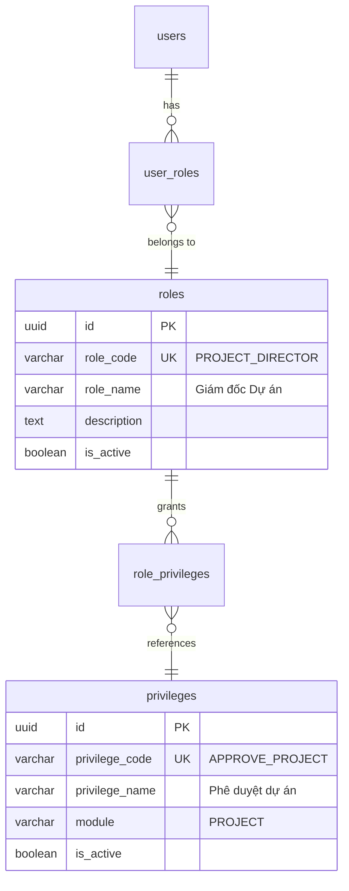

# SA_DESIGN: RBAC — Phân quyền 3 Vai trò Dự án

> **Feature:** Project Role-Based Access Control (PD / PM / Project Accountant)
> **Chuẩn tham chiếu:** Oracle Fusion Cloud — Project Portfolio Management (PPM) Security
> **Ngày tạo:** 2026-03-26
> **Trạng thái:** GATE 2 — SA DESIGN

---

## 1. Tầm nhìn & Nguyên tắc

### Nguyên tắc Oracle PPM Security
- **Separation of Duties (SoD):** Người duyệt ≠ Người tạo ≠ Người hạch toán
- **Least Privilege:** Mỗi vai trò chỉ có quyền tối thiểu cần thiết
- **Vertical Hierarchy:** PD > PM > Accountant (quyền cao bao hàm quyền thấp ở mức view)

### 3 Vai trò cốt lõi

```
┌──────────────────────────────────────────────────────────┐
│                PROJECT DIRECTOR (PD)                      │
│  "Người ra quyết định chiến lược"                        │
│  ✦ Phê duyệt / Từ chối dự án, kế hoạch, VO             │
│  ✦ Giám sát KPI (CPI/SPI), ngân sách tổng thể          │
│  ✦ KHÔNG trực tiếp tạo/sửa dữ liệu vận hành            │
├──────────────────────────────────────────────────────────┤
│                PROJECT MANAGER (PM)                       │
│  "Người vận hành hàng ngày"                              │
│  ✦ Tạo/sửa WBS, BOQ, CBS, tiến độ, giao dịch           │
│  ✦ Submit kế hoạch, báo cáo, yêu cầu thay đổi          │
│  ✦ KHÔNG phê duyệt — chỉ submit lên PD duyệt           │
├──────────────────────────────────────────────────────────┤
│              PROJECT ACCOUNTANT                           │
│  "Người kiểm soát tài chính"                            │
│  ✦ Xem ngân sách, giao dịch, quyết toán                │
│  ✦ Tạo/quản lý quyết toán (Settlement)                  │
│  ✦ KHÔNG sửa WBS/BOQ/Tiến độ                            │
│  ✦ Xem báo cáo tài chính: Budget Variance, CPI          │
└──────────────────────────────────────────────────────────┘
```

---

## 2. Privilege Matrix — Chi tiết

### 2.1 Privileges MỚI cần tạo (mở rộng từ 2 → 18)

Thay thế `MANAGE_PROJECTS` (quá rộng) bằng privileges chi tiết:

| # | Privilege Code | Privilege Name | Module | Mô tả |
|---|---------------|----------------|--------|--------|
| 1 | `VIEW_PROJECTS` | Xem danh sách dự án | PROJECT | **Giữ nguyên** — tất cả roles đều có |
| 2 | `CREATE_PROJECT` | Tạo dự án mới | PROJECT | Tạo project + import Excel |
| 3 | `UPDATE_PROJECT` | Cập nhật thông tin dự án | PROJECT | Sửa tên, ngày, trạng thái |
| 4 | `DELETE_PROJECT` | Xoá dự án | PROJECT | Soft delete |
| 5 | `MANAGE_WBS` | Quản lý WBS | PROJECT | Tạo/sửa/xoá Work Breakdown Structure |
| 6 | `MANAGE_BOQ` | Quản lý BOQ | PROJECT | Tạo/sửa/xoá Bill of Quantities + Import |
| 7 | `MANAGE_CBS` | Quản lý CBS | PROJECT | Tạo Cost Breakdown Structure |
| 8 | `MANAGE_BUDGET` | Quản lý ngân sách | PROJECT | Tạo/sửa budget lines cho project |
| 9 | `MANAGE_TRANSACTION` | Quản lý giao dịch | PROJECT | Tạo/xoá project transactions |
| 10 | `MANAGE_SCHEDULE` | Quản lý tiến độ | PROJECT | Tasks, links, CPM, baselines |
| 11 | `SUBMIT_PLAN` | Gửi kế hoạch duyệt | PROJECT | Submit plan lên PD |
| 12 | `SUBMIT_REPORT` | Gửi báo cáo tiến độ | PROJECT | Submit progress report |
| 13 | `SUBMIT_REQUEST` | Gửi yêu cầu dự án | PROJECT | Submit project request |
| 14 | `SUBMIT_VO` | Gửi lệnh thay đổi | PROJECT | Submit Variation Order |
| 15 | `APPROVE_PROJECT` | Phê duyệt dự án | PROJECT | Approve/Reject project requests |
| 16 | `APPROVE_PLAN` | Phê duyệt kế hoạch | PROJECT | Review/Approve/Reject plans |
| 17 | `APPROVE_REPORT` | Phê duyệt báo cáo | PROJECT | Approve/Reject progress reports |
| 18 | `APPROVE_VO` | Phê duyệt Variation Order | PROJECT | Approve/Reject VOs (ảnh hưởng budget) |
| 19 | `MANAGE_SETTLEMENT` | Quản lý quyết toán | PROJECT | Tạo/finalize settlements |
| 20 | `VIEW_PROJECT_FINANCE` | Xem tài chính dự án | PROJECT | Budget variance, CPI, SPI, cost reports |
| 21 | `ASSIGN_PROJECT_MEMBER` | Phân công nhân sự | PROJECT | Assign/remove team members |

### 2.2 Privilege giữ nguyên (backward-compatible)
`MANAGE_PROJECTS` được giữ lại như "super privilege" cho SUPER_ADMIN — hoạt động như wildcard.

---

## 3. Role → Privilege Mapping

### 3.1 PROJECT DIRECTOR (PD)

> Chiến lược + Phê duyệt. Không vận hành.

| Privilege | Có | Lý do |
|-----------|:--:|-------|
| `VIEW_PROJECTS` | ✅ | Xem tất cả dự án |
| `VIEW_PROJECT_FINANCE` | ✅ | Giám sát CPI/SPI/Budget |
| `APPROVE_PROJECT` | ✅ | Duyệt/từ chối yêu cầu dự án |
| `APPROVE_PLAN` | ✅ | Duyệt/từ chối kế hoạch |
| `APPROVE_REPORT` | ✅ | Duyệt/từ chối báo cáo tiến độ |
| `APPROVE_VO` | ✅ | Duyệt VO (thay đổi ngân sách) |
| `ASSIGN_PROJECT_MEMBER` | ✅ | Chỉ định PM/nhân sự |
| `DELETE_PROJECT` | ✅ | Quyết định đóng/xoá dự án |
| `CREATE_PROJECT` | ❌ | PD không tạo trực tiếp |
| `MANAGE_WBS` | ❌ | Việc của PM |
| `MANAGE_BOQ` | ❌ | Việc của PM |
| `MANAGE_BUDGET` | ❌ | Việc của PM/Accountant |
| `MANAGE_TRANSACTION` | ❌ | Việc của PM |
| `MANAGE_SCHEDULE` | ❌ | Việc của PM |
| `MANAGE_SETTLEMENT` | ❌ | Việc của Accountant |

**Tổng: 8 privileges**

### 3.2 PROJECT MANAGER (PM)

> Vận hành + Submit. Không duyệt.

| Privilege | Có | Lý do |
|-----------|:--:|-------|
| `VIEW_PROJECTS` | ✅ | Xem dự án được assign |
| `VIEW_PROJECT_FINANCE` | ✅ | Theo dõi ngân sách dự án mình quản lý |
| `CREATE_PROJECT` | ✅ | Tạo dự án mới, import Excel |
| `UPDATE_PROJECT` | ✅ | Cập nhật thông tin dự án |
| `MANAGE_WBS` | ✅ | Tạo/sửa/xoá WBS |
| `MANAGE_BOQ` | ✅ | Tạo/sửa/xoá BOQ + Import |
| `MANAGE_CBS` | ✅ | Tạo CBS |
| `MANAGE_BUDGET` | ✅ | Thiết lập ngân sách theo WBS |
| `MANAGE_TRANSACTION` | ✅ | Ghi nhận chi phí thực tế |
| `MANAGE_SCHEDULE` | ✅ | Quản lý tiến độ, CPM |
| `SUBMIT_PLAN` | ✅ | Gửi kế hoạch lên PD duyệt |
| `SUBMIT_REPORT` | ✅ | Gửi báo cáo tiến độ |
| `SUBMIT_REQUEST` | ✅ | Gửi yêu cầu dự án |
| `SUBMIT_VO` | ✅ | Gửi Variation Order |
| `ASSIGN_PROJECT_MEMBER` | ✅ | Phân công thành viên |
| `APPROVE_PROJECT` | ❌ | PD duyệt |
| `APPROVE_PLAN` | ❌ | PD duyệt |
| `APPROVE_REPORT` | ❌ | PD duyệt |
| `APPROVE_VO` | ❌ | PD duyệt |
| `DELETE_PROJECT` | ❌ | PD quyết định |
| `MANAGE_SETTLEMENT` | ❌ | Accountant |

**Tổng: 15 privileges**

### 3.3 PROJECT ACCOUNTANT (Kế toán Dự án)

> Tài chính + Quyết toán. Không sửa WBS/tiến độ.

| Privilege | Có | Lý do |
|-----------|:--:|-------|
| `VIEW_PROJECTS` | ✅ | Xem dự án để đối chiếu |
| `VIEW_PROJECT_FINANCE` | ✅ | Xem CPI, SPI, Budget Variance |
| `MANAGE_BUDGET` | ✅ | Kiểm soát/điều chỉnh ngân sách |
| `MANAGE_TRANSACTION` | ✅ | Ghi nhận/xác minh giao dịch tài chính |
| `MANAGE_SETTLEMENT` | ✅ | Tạo/finalize quyết toán |
| `MANAGE_CBS` | ✅ | Quản lý Cost Breakdown |
| `CREATE_PROJECT` | ❌ | Không tạo dự án |
| `UPDATE_PROJECT` | ❌ | Không sửa info dự án |
| `MANAGE_WBS` | ❌ | Không sửa cấu trúc công việc |
| `MANAGE_BOQ` | ❌ | Không sửa BOQ |
| `MANAGE_SCHEDULE` | ❌ | Không sửa tiến độ |
| `APPROVE_*` | ❌ | Không phê duyệt |
| `SUBMIT_*` | ❌ | Không submit kế hoạch/báo cáo |

**Tổng: 6 privileges**

---

## 4. Ma trận so sánh (Comparison Matrix)

```
Privilege                  │ PD │ PM │ ACC │ Ghi chú
───────────────────────────┼────┼────┼─────┼──────────────────
VIEW_PROJECTS              │ ✅ │ ✅ │ ✅  │ Tất cả đều xem được
VIEW_PROJECT_FINANCE       │ ✅ │ ✅ │ ✅  │ CPI/SPI/Budget
CREATE_PROJECT             │    │ ✅ │     │ PM tạo, PD duyệt
UPDATE_PROJECT             │    │ ✅ │     │ PM sửa
DELETE_PROJECT             │ ✅ │    │     │ Chỉ PD
MANAGE_WBS                 │    │ ✅ │     │ Cấu trúc công việc
MANAGE_BOQ                 │    │ ✅ │     │ Bill of Quantities
MANAGE_CBS                 │    │ ✅ │ ✅  │ PM + Accountant
MANAGE_BUDGET              │    │ ✅ │ ✅  │ PM lập, ACC kiểm soát
MANAGE_TRANSACTION         │    │ ✅ │ ✅  │ PM ghi, ACC xác minh
MANAGE_SCHEDULE            │    │ ✅ │     │ Tiến độ = việc PM
MANAGE_SETTLEMENT          │    │    │ ✅  │ Chỉ Accountant
SUBMIT_PLAN                │    │ ✅ │     │ PM submit
SUBMIT_REPORT              │    │ ✅ │     │ PM submit
SUBMIT_REQUEST             │    │ ✅ │     │ PM submit
SUBMIT_VO                  │    │ ✅ │     │ PM submit
APPROVE_PROJECT            │ ✅ │    │     │ Chỉ PD
APPROVE_PLAN               │ ✅ │    │     │ Chỉ PD
APPROVE_REPORT             │ ✅ │    │     │ Chỉ PD
APPROVE_VO                 │ ✅ │    │     │ Chỉ PD
ASSIGN_PROJECT_MEMBER      │ ✅ │ ✅ │     │ PD + PM
───────────────────────────┼────┼────┼─────┼──────────────────
TỔNG                       │  8 │ 15 │  6  │
```

---

## 5. SoD (Separation of Duties) — Kiểm tra xung đột

| Xung đột cần tránh | PD | PM | ACC | Status |
|---------------------|:--:|:--:|:---:|--------|
| Người tạo ≠ Người duyệt | ❌ create | ✅ create | ❌ | ✅ Tách biệt |
| Người submit ≠ Người approve | ❌ submit | ✅ submit | ❌ | ✅ Tách biệt |
| Người ghi giao dịch ≠ Người quyết toán | ❌ | ✅ ghi | ✅ quyết toán | ✅ Tách biệt |
| Người sửa WBS ≠ Người duyệt kế hoạch | ❌ | ✅ sửa WBS | ❌ | ✅ Tách biệt |

**Kết luận: Không có xung đột SoD.**

---

## 6. ERD — Mở rộng Privilege Seed



### Seed Data — 3 Roles + 21 Privileges

**Roles:**
```typescript
{ role_code: 'PROJECT_DIRECTOR', role_name: 'Giám đốc Dự án', description: 'Phê duyệt, giám sát KPI, ra quyết định chiến lược' }
{ role_code: 'PROJECT_MANAGER',  role_name: 'Quản lý Dự án',   description: 'Vận hành hàng ngày, tạo/sửa WBS/BOQ, submit kế hoạch' }
{ role_code: 'PROJECT_ACCOUNTANT', role_name: 'Kế toán Dự án', description: 'Kiểm soát tài chính, quyết toán, giám sát ngân sách' }
```

**Privileges mới (19 thêm vào 2 cái có sẵn):**
```typescript
// Nhóm VIEW
{ code: 'VIEW_PROJECT_FINANCE',    name: 'Xem tài chính dự án',       module: 'PROJECT' }

// Nhóm CRUD
{ code: 'CREATE_PROJECT',          name: 'Tạo dự án mới',             module: 'PROJECT' }
{ code: 'UPDATE_PROJECT',          name: 'Cập nhật thông tin dự án',   module: 'PROJECT' }
{ code: 'DELETE_PROJECT',          name: 'Xoá dự án',                 module: 'PROJECT' }

// Nhóm MANAGE (vận hành)
{ code: 'MANAGE_WBS',              name: 'Quản lý WBS',               module: 'PROJECT' }
{ code: 'MANAGE_BOQ',              name: 'Quản lý BOQ',               module: 'PROJECT' }
{ code: 'MANAGE_CBS',              name: 'Quản lý CBS',               module: 'PROJECT' }
{ code: 'MANAGE_BUDGET',           name: 'Quản lý ngân sách dự án',   module: 'PROJECT' }
{ code: 'MANAGE_TRANSACTION',      name: 'Quản lý giao dịch dự án',   module: 'PROJECT' }
{ code: 'MANAGE_SCHEDULE',         name: 'Quản lý tiến độ',           module: 'PROJECT' }
{ code: 'MANAGE_SETTLEMENT',       name: 'Quản lý quyết toán',        module: 'PROJECT' }
{ code: 'ASSIGN_PROJECT_MEMBER',   name: 'Phân công nhân sự dự án',   module: 'PROJECT' }

// Nhóm SUBMIT (gửi duyệt)
{ code: 'SUBMIT_PLAN',             name: 'Gửi kế hoạch phê duyệt',   module: 'PROJECT' }
{ code: 'SUBMIT_REPORT',           name: 'Gửi báo cáo tiến độ',       module: 'PROJECT' }
{ code: 'SUBMIT_REQUEST',          name: 'Gửi yêu cầu dự án',        module: 'PROJECT' }
{ code: 'SUBMIT_VO',               name: 'Gửi lệnh thay đổi (VO)',   module: 'PROJECT' }

// Nhóm APPROVE (phê duyệt) — CHỈ PD
{ code: 'APPROVE_PROJECT',         name: 'Phê duyệt dự án',           module: 'PROJECT' }
{ code: 'APPROVE_PLAN',            name: 'Phê duyệt kế hoạch',        module: 'PROJECT' }
{ code: 'APPROVE_REPORT',          name: 'Phê duyệt báo cáo tiến độ', module: 'PROJECT' }
{ code: 'APPROVE_VO',              name: 'Phê duyệt Variation Order',  module: 'PROJECT' }
```

---

## 7. Controller Refactor — Thay thế MANAGE_PROJECTS

### 7.1 projects.controller.ts

| Route | Hiện tại | Sau refactor |
|-------|---------|-------------|
| `GET /projects` | Open | `VIEW_PROJECTS` |
| `POST /projects` | `MANAGE_PROJECTS` | `CREATE_PROJECT` |
| `PATCH /projects/:id` | `MANAGE_PROJECTS` | `UPDATE_PROJECT` |
| `DELETE /projects/:id` | `MANAGE_PROJECTS` | `DELETE_PROJECT` |
| `POST /:id/assignments` | `MANAGE_PROJECTS` | `ASSIGN_PROJECT_MEMBER` |
| `DELETE /assignments/:id` | `MANAGE_PROJECTS` | `ASSIGN_PROJECT_MEMBER` |
| `POST /:id/budgets` | `MANAGE_PROJECTS` | `MANAGE_BUDGET` |
| `DELETE /budgets/:id` | `MANAGE_PROJECTS` | `MANAGE_BUDGET` |
| `POST /:id/transactions` | `MANAGE_PROJECTS` | `MANAGE_TRANSACTION` |
| `DELETE /transactions/:id` | `MANAGE_PROJECTS` | `MANAGE_TRANSACTION` |
| `POST /:id/wbs` | `MANAGE_PROJECTS` | `MANAGE_WBS` |
| `PATCH /wbs/:id` | `MANAGE_PROJECTS` | `MANAGE_WBS` |
| `DELETE /wbs/:id` | `MANAGE_PROJECTS` | `MANAGE_WBS` |
| `POST /:id/cbs` | `MANAGE_PROJECTS` | `MANAGE_CBS` |
| `POST /:id/boq` | `MANAGE_PROJECTS` | `MANAGE_BOQ` |
| `DELETE /boq/:id` | `MANAGE_PROJECTS` | `MANAGE_BOQ` |
| `POST /:id/boq/import` | `MANAGE_PROJECTS` | `MANAGE_BOQ` |
| `POST /:id/settlements` | `MANAGE_PROJECTS` | `MANAGE_SETTLEMENT` |
| `PATCH /settlements/:id/finalize` | `MANAGE_PROJECTS` | `MANAGE_SETTLEMENT` |
| `POST /excel/import` | `MANAGE_PROJECTS` | `CREATE_PROJECT` |

### 7.2 project-monitoring.controller.ts

| Route | Hiện tại | Sau refactor |
|-------|---------|-------------|
| `POST /reports` | `MANAGE_PROJECTS` | `SUBMIT_REPORT` |
| `PATCH /reports/:id/approve` | `MANAGE_PROJECTS` | `APPROVE_REPORT` |
| `PATCH /reports/:id/reject` | `MANAGE_PROJECTS` | `APPROVE_REPORT` |
| `POST /vo` | `MANAGE_PROJECTS` | `SUBMIT_VO` |
| `PATCH /vo/:id/approve` | `MANAGE_PROJECTS` | `APPROVE_VO` |
| `PATCH /vo/:id/reject` | `MANAGE_PROJECTS` | `APPROVE_VO` |

### 7.3 project-plans.controller.ts

| Route | Hiện tại | Sau refactor |
|-------|---------|-------------|
| `POST /` | `MANAGE_PROJECTS` | `SUBMIT_PLAN` |
| `PATCH /:id` | `MANAGE_PROJECTS` | `SUBMIT_PLAN` |
| `PATCH /:id/review` | `MANAGE_PROJECTS` | `APPROVE_PLAN` |
| `PATCH /:id/approve` | `MANAGE_PROJECTS` | `APPROVE_PLAN` |
| `PATCH /:id/reject` | `MANAGE_PROJECTS` | `APPROVE_PLAN` |

### 7.4 project-requests.controller.ts

| Route | Hiện tại | Sau refactor |
|-------|---------|-------------|
| `POST /` | `MANAGE_PROJECTS` | `SUBMIT_REQUEST` |
| `PATCH /:id/approve-dept` | `MANAGE_PROJECTS` | `APPROVE_PROJECT` |
| `PATCH /:id/approve-exec` | `MANAGE_PROJECTS` | `APPROVE_PROJECT` |
| `PATCH /:id/reject` | `MANAGE_PROJECTS` | `APPROVE_PROJECT` |

### 7.5 project-schedule.controller.ts

| Route | Hiện tại | Sau refactor |
|-------|---------|-------------|
| `POST /tasks` | `MANAGE_PROJECTS` | `MANAGE_SCHEDULE` |
| `PATCH /tasks/:id` | `MANAGE_PROJECTS` | `MANAGE_SCHEDULE` |
| `DELETE /tasks/:id` | `MANAGE_PROJECTS` | `MANAGE_SCHEDULE` |
| `POST /links` | `MANAGE_PROJECTS` | `MANAGE_SCHEDULE` |
| `DELETE /links/:id` | `MANAGE_PROJECTS` | `MANAGE_SCHEDULE` |
| `POST /recalculate/:id` | `MANAGE_PROJECTS` | `MANAGE_SCHEDULE` |
| `POST /baselines` | `MANAGE_PROJECTS` | `MANAGE_SCHEDULE` |
| `PATCH /baselines/:id/approve` | `MANAGE_PROJECTS` | `APPROVE_PLAN` |

---

## 8. Frontend Impact — Privilege Check

Các component FE cần cập nhật để check privilege mới:

| Component | Hiện tại check | Sau refactor |
|-----------|---------------|-------------|
| Nút "Tạo dự án" | `MANAGE_PROJECTS` | `CREATE_PROJECT` |
| Nút "Duyệt" (request/plan/report/VO) | `MANAGE_PROJECTS` | `APPROVE_*` |
| Tab "Tài chính" | Open | `VIEW_PROJECT_FINANCE` |
| Nút "Quyết toán" | `MANAGE_PROJECTS` | `MANAGE_SETTLEMENT` |
| Menu Sidebar "Dự án" | `VIEW_PROJECTS` | Giữ nguyên |

---

## 9. Migration Plan

```
Step 1: Seed 19 privileges mới vào bảng privileges
Step 2: Seed 3 roles mới (PD, PM, ACC)
Step 3: Map privileges → roles (bảng role_privileges)
Step 4: Cập nhật SUPER_ADMIN để có đủ 21 privileges mới
Step 5: Refactor controllers: thay MANAGE_PROJECTS → privileges chi tiết
Step 6: Cập nhật privilege.enum.ts
Step 7: Sync frontend privilege checks
```

**Backward-compatible:** `MANAGE_PROJECTS` vẫn giữ cho SUPER_ADMIN. Controllers cũ vẫn chạy đến khi refactor xong.

---

## 10. SA Checklist

- [x] 3 Roles định nghĩa rõ ràng (PD/PM/ACC)
- [x] 21 Privileges chi tiết (thay cho 2 cũ)
- [x] Privilege Matrix đầy đủ với lý do
- [x] SoD (Separation of Duties) verified — không xung đột
- [x] Controller refactor mapping (5 controllers, 35+ routes)
- [x] Frontend impact assessment
- [x] Migration plan (7 bước, backward-compatible)
- [x] Tuân thủ Oracle PPM Security model

---

> **SA Sign-off:** Thiết kế sẵn sàng cho **GATE 3 — Development**.
> Chờ Duy duyệt trước khi refactor controllers.
