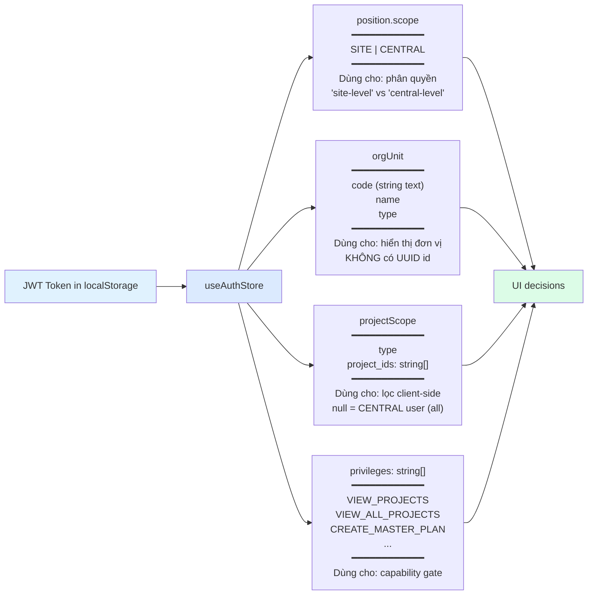
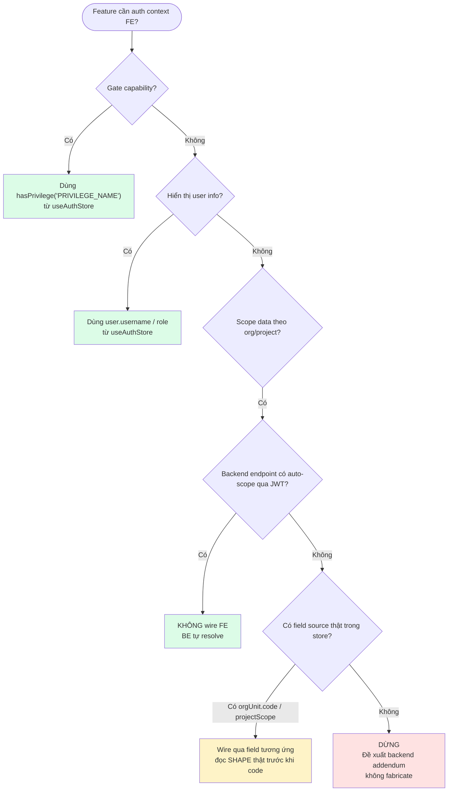

# Frontend Auth Model — 3-Field Scope Paradigm

> **Tech Advisor note — 2026-04-24.** Ghi nhận sau sự cố F3 Gate 4B: Tech Advisor (và dev) thường giả định FE auth shape giống BE (`AuthenticatedRequest.contexts`), thực tế FE dùng paradigm **khác hoàn toàn**. Tài liệu này chốt nguồn truth về FE auth store để **không lặp lỗi fabricate `currentOrgId`**.

---

## 1. Source of truth

**File:** `wms-frontend/src/features/auth/model/auth.store.ts`

**Shape chuẩn** (copy đúng nguyên văn, đừng đoán):

```typescript
interface User {
  id: string
  username: string
  role: string
  privileges: string[]     // ← gate mọi capability; KHÔNG có `contexts`
}

interface AuthState {
  user: User | null
  accessToken: string | null
  isAuthenticated: boolean
  isValidating: boolean
  position: PositionInfo | null        // { code, name, scope: 'SITE' | 'CENTRAL' }
  orgUnit: OrgUnitInfo | null          // { code, name, type } — KHÔNG có `id`
  projectScope: ProjectScope | null    // { type, project_ids: string[] } | null
  setAuth / logout / validateToken / hasPrivilege
}
```

---

## 2. 3-field scope paradigm (khác BE)

FE scope resolution đi qua **3 field song song**, không phải 1 array `contexts` như BE:



---

## 3. Backend vs Frontend — đừng lẫn

| Aspect | Backend (`AuthenticatedRequest.user`) | Frontend (`useAuthStore`) |
|--------|---------------------------------------|---------------------------|
| Org identifier | `contexts: string[]` (array UUIDs) | `orgUnit.code` (1 string text) |
| Multi-org | Array UUID, filter `IN (:...contexts)` | Implicit qua projectScope + privileges |
| Privilege | `privileges: string[]` | `privileges: string[]` (giống) |
| Scope type | N/A | `position.scope: 'SITE' \| 'CENTRAL'` |
| Current "org" | Không có (multi) | Không có (xem §4) |

**Conclusion:** FE **KHÔNG có khái niệm "current org UUID"**. Mọi lúc cần `organization_id` ở query/body — hỏi bản thân trước:
1. Backend có tự resolve qua JWT không? (thường CÓ)
2. Nếu có, FE không gửi — để BE scope
3. Nếu không, expose field mới ở `/auth/me` → cần backend change

---

## 4. "Current org" không tồn tại — do not fabricate

```mermaid
graph TD
    Q{Feature cần 'current org'?}
    Q -->|Regular user| A[BE tự scope qua JWT<br/>→ response chỉ chứa own-org]
    Q -->|VIEW_ALL_PROJECTS user| B[Không có 'current org'<br/>→ user thấy all orgs]

    A --> A1["FE hiển thị items<br/>organization_name chỉ là metadata"]
    B --> B1["FE luôn render organization_name<br/>để disambiguate"]

    A1 --> Combine[Pattern: always render organization_name<br/>khi response có field này]
    B1 --> Combine

    style Q fill:#fef3c7
    style Combine fill:#dcfce7
```



**Anti-pattern đã gặp:**
```tsx
// SAI: fabricate currentOrgId từ orgUnit.code (string text ≠ UUID)
const currentOrgId = useAuthStore((s) => s.orgUnit?.code)
<ProjectPicker currentOrgId={currentOrgId} />  // ← so sánh với item.organization_id → luôn mismatch
```

**Đúng pattern:**
```tsx
// ĐÚNG: trust backend scoping, always-render organization metadata
<ProjectPicker />  // không prop currentOrgId

// Trong ProjectPicker renderItem:
{item.organization_name && (
  <span className="text-xs text-muted-foreground">
    Đơn vị: {item.organization_name}
  </span>
)}
```

---

## 5. Decision tree cho Tech Advisor khi spec auth wiring



---

## 6. Checklist trước khi spec FE auth wiring

- [ ] Đã `cat wms-frontend/src/features/auth/model/auth.store.ts` để **verify shape**?
- [ ] Field cần reference (`contexts` / `currentOrgId` / etc.) **thật sự tồn tại** trong store?
- [ ] Backend endpoint đã auto-scope qua JWT chưa? (Grep `@RequirePrivilege` + `user.contexts` ở controller)
- [ ] Nếu wire FE, có tạo **double-scoping** không? (FE gửi + BE tự resolve lại)
- [ ] String vs UUID — orgUnit.code là **string text** (PO-001), không so sánh được với UUID field từ BE

---

## 7. Reference commits & files

- Store definition: `wms-frontend/src/features/auth/model/auth.store.ts` (108 dòng, full file)
- Backend auth type: `wms-backend/src/auth/types/authenticated-request.ts`
- Backend JWT strategy: `wms-backend/src/auth/jwt.strategy.ts`
- BE user.contexts usage: `grep -rn "user.contexts" wms-backend/src/`

---

**Maintained by:** Tech Advisor (Claude, `sahuynhpt@gmail.com` session)
**Last updated:** 2026-04-24 (post Gate 4B F3 incident)
