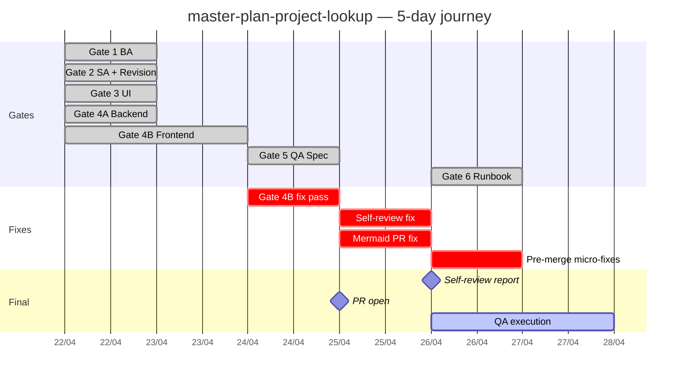

# Retro — Master Plan Project Lookup feature

> Feature `master-plan-project-lookup` · 5-day journey · 28 commits · 6 Gates đầy đủ

## 1. Overview

| Field | Value |
|---|---|
| Feature | `master-plan-project-lookup` |
| Goal | Thay text input "Project UUID" trong MasterPlanFormDialog bằng LOV picker với cross-org RBAC |
| Branch | `feature/master-plan-project-lookup` |
| Start | 2026-04-22 (commit 559c3cf — BA_SPEC) |
| End (pre-merge) | 2026-04-26 (commit 980cf6e — Gate 6 runbook) |
| Duration | 5 ngày |
| Commits | 28 |
| Files changed | 53 (≈20.4K insertions, 13.6K deletions) |
| Backend tests | 526/526 PASS |
| Team | Tech Advisor (SH) + CC CLI (Claude Opus 4.7) |
| Outcome | APPROVE — sẵn sàng merge sau QA + reviewer approve |

---

## 2. Timeline

### Major commit milestones

| Date | Commit | Description |
|---|---|---|
| 2026-04-22 | `559c3cf` | Gate 1 BA_SPEC |
| 2026-04-22 | `9e05223` → `21dac87` | Gate 2 SA_DESIGN + revision |
| 2026-04-22 | `4822ef1` | Gate 3 UI_SPEC |
| 2026-04-22 | `7eb8c30` | Gate 4A backend `/projects/lookup` + cross-org audit |
| 2026-04-22 | `dbb7db3` | VIEW_ALL_PROJECTS privilege |
| 2026-04-22 | `fe70a6f` → `514c63d` | Gate 4B EntityPicker + ProjectPicker |
| 2026-04-24 | `14540ae` | Gate 4B fix — drop dead currentOrgId |
| 2026-04-24 | `f833434` | Static selector test suites |
| 2026-04-24 | `bcfe27e` | Gate 5 QA matrix 56 cases |
| 2026-04-25 | `03fd570` | Self-review fix — kill useProjectLookup hook + surface picker error |
| 2026-04-25 | `5b9c82c` | PR description |
| 2026-04-25 | `1590414` | Mermaid GitHub render fix |
| 2026-04-26 | `4639262` | DoS guard `@Max(10000)` |
| 2026-04-26 | `c6fec58` | Self-review audit report |
| 2026-04-26 | `3059488` | Pre-merge micro-fixes (EntityPicker warn + clearTimeout) |
| 2026-04-26 | `980cf6e` | Gate 6 deploy runbook |

---

## 3. 6 issues phát hiện trong process

### 3.1 F3 — `currentOrgId` fabricated từ shape không tồn tại

**Phase:** Gate 4B implementation
**Commit fix:** `14540ae` (2026-04-24)
**Symptom:** Frontend code khởi tạo gọi `useAuthStore` lấy `currentOrgId` — nhưng FE auth store không có field này. Property bị fabricate dựa trên BE-style `contexts: string[]` shape.
**Root cause:** Cross-stack misalignment. BE inject `contexts` vào JWT payload (cho RBAC org filter). FE auth store dùng paradigm khác: `position / orgUnit / projectScope / privileges`. CC CLI khi viết FE picker nhớ BE pattern, suy luận FE phải có `currentOrgId` tương ứng.
**Fix:** Drop dead field, rename `ORG_PREFIX` (Vietnamese string catalog).
**Lesson:** Khi cross-stack feature, đọc auth store FE TRƯỚC, không assume từ BE shape. **PR #1 (`docs/tech-advisor-notes/frontend-auth-model.md`) ra đời để document FE auth paradigm chính thức.**

### 3.2 `useProjectLookup` hook dead code

**Phase:** Self-review (2026-04-25)
**Commit fix:** `03fd570`
**Symptom:** `useProjectLookup` TanStack Query hook được tạo trong commit `e40302f` (Gate 4B) nhưng cuối cùng không được consume — `ProjectPicker` dùng raw axios call qua `searchProjects` function, không dùng hook.
**Root cause:** Iterative design — ban đầu định dùng TanStack Query cache, sau đó realize EntityPicker đã có internal state management cho query, hook trở nên redundant. Không ai delete khi refactor.
**Fix:** Delete hook + `useProjectLookup` test selectors. Surface picker error state qua `errorText` prop.
**Lesson:** Self-review phải có check "imports without consumers" — grep sym name trong toàn codebase, nếu chỉ 1 reference là chính file định nghĩa → dead code.

### 3.3 `searchProjects` swallow errors

**Phase:** Self-review (2026-04-25) + audit pass (2026-04-26)
**Commit fix:** `03fd570` (surface error) + `3059488` (console.warn cho EntityPicker hydration)
**Symptom:** Picker silent fail khi BE 404/500 — UI hiển thị "không kết quả" thay vì error state với retry button. Hydration edit-mode `.catch(() => {})` swallow hoàn toàn → dev không biết tại sao picker giữ raw UUID.
**Root cause:** Defensive coding pattern (`return null on error`) áp dụng quá rộng. Picker UX cần phân biệt "thực sự không có kết quả" vs "lookup endpoint fail".
**Fix:** EntityPicker render alert state khi onSearch reject; hydration catch log console.warn với value + err context.
**Lesson:** Silent fail pattern OK ở data fetch level (graceful degrade), nhưng phải có observability — log/warn ít nhất để dev debug được.

### 3.4 QA_TEST_MATRIX enum typos

**Phase:** Gate 5 implementation
**Commit fix:** `bcfe27e` (Gate 5 — caught by CC CLI khi cross-reference với `enums/project.enum.ts`)
**Symptom:** Initial QA matrix dùng status `CLOSED` và `CANCELLED` (tiếng Anh chuẩn) — không khớp với enum thật là `SETTLED` và `CANCELED` (1 chữ L).
**Root cause:** CC CLI viết QA matrix dựa trên domain knowledge, không grep enum. `CANCELLED` vs `CANCELED` là spelling variation — codebase chọn 1 chữ L (US English) trong khi tiếng Anh BE chuẩn dùng 2 chữ L (UK).
**Fix:** Sync với `enums/project.enum.ts` enum values đúng tên: `SETTLED, CANCELED, RETENTION_RELEASED`.
**Lesson:** Khi viết test/spec mention enum value, **phải grep enum source trước khi gõ tay**. Spelling pitfalls cao.

### 3.5 Mermaid `[/text/]` GitHub render fail vs VS Code permissive

**Phase:** PR opening (2026-04-25)
**Commit fix:** `1590414`
**Symptom:** Mermaid flowchart trong PR_DESCRIPTION render fine ở VS Code preview, nhưng GitHub PR body parse `[/projects/lookup/]` thành parallelogram shape thay vì text trong rectangle node.
**Root cause:** GitHub Mermaid parser strict hơn VS Code extension — `[/...../]` là syntax cho parallelogram (node shape), trong khi VS Code permissive cho phép treat as text.
**Fix:** Quote node labels chứa slashes: `["/projects/lookup"]` thay vì `[/projects/lookup/]`.
**Lesson:** **Mermaid-first convention** ra đời từ pass này — mọi architecture/flow doc dùng Mermaid, render preview qua GitHub PR comment trước khi merge để catch render bugs.

### 3.6 CSS tokens staged DELETE phantom

**Phase:** Daily review (giữa Gate 4B → Gate 5)
**Commit fix:** N/A (caught + reverted manually)
**Symptom:** Một pass CSS edit accidentally staged DELETE cho `--warning` + `--success` tokens trong `index.css`. Không có lý do rõ — git diff chỉ thấy DELETE lines, không có replacement.
**Root cause:** Có thể auto-format tool hoặc IDE undo conflict. Khó reproduce.
**Fix:** Daily review kết hợp `git diff --staged` trước commit, manual review từng hunk → catch + revert.
**Lesson:** Pre-commit hook phải bao gồm `git diff --check` + visual review staged hunks. **Add to checklist: "review every staged hunk, never blanket git add ."**

---

## 4. Process improvements

### 4.1 Cross-stack documentation upgrade

**Trigger:** Issue 3.1 (currentOrgId fabricated)
**Action:** Tạo `docs/tech-advisor-notes/` folder với:
- `README.md` — index + Mermaid-first convention
- `frontend-auth-model.md` — 4 Mermaid diagrams cho FE auth paradigm

**Future:** Mở rộng cross-stack reference cho các module khác:
- `backend-rbac-paradigm.md` (privileges + contexts từ JWT)
- `frontend-error-boundary-strategy.md`
- `tanstack-query-caching-conventions.md`

### 4.2 Self-review checklist

Add vào `.claude/rules/dev-rules.md`:

- [ ] Grep all symbols added — confirm có consumer (no dead exports)
- [ ] Search `.catch(() => {})` patterns — replace với log/warn nếu intentional swallow
- [ ] Cross-reference enum values với source file trước khi viết spec/test
- [ ] Render Mermaid trong GitHub PR preview ít nhất 1 lần
- [ ] `git diff --staged` review từng hunk — never blanket `git add .`

### 4.3 Pre-merge audit pass

Add như Gate 5.5 (giữa QA matrix + Gate 6 runbook):

1. Run `/review` slash command → audit report
2. Apply micro-fixes phát hiện trong audit
3. Re-run backend test + frontend type-check
4. Commit "pre-merge cleanup" tách biệt từ feature commits

Pattern này đã chạy trong commit `c6fec58` (review report) + `3059488` (micro-fixes).

### 4.4 Mermaid-first convention

**Rule:** Mọi architecture/flow doc dùng Mermaid (sequence, flowchart, gantt, class). Render preview qua:
- VS Code Mermaid extension (dev iteration)
- GitHub PR body comment (final review — catch render diff với VS Code)

**Reasoning:** Mermaid render diff giữa VS Code (permissive) và GitHub (strict) là silent foot-gun. Catch bằng cross-render verification.

### 4.5 Daily review cadence

- Đầu mỗi ngày làm: chạy `git log --oneline ^main` xem branch state
- Review từng commit qua `git show --stat` quick scan
- Nếu thấy unexpected file (CSS DELETE phantom kiểu §3.6) → investigate trước khi tiếp

---

## 5. What worked well

### 5.1 6-Gate discipline

Quy trình 6 cổng (BA → SA → UI → DEV → TEST → DEPLOY) **bắt buộc artifact docs trước code**. Khi gate trước có artifact (BA_SPEC, SA_DESIGN, UI_SPEC), gate sau code rất rõ ràng — không cần "diễn giải lại business intent" giữa session.

Bằng chứng: 28 commit, 0 commit "tôi nghĩ business muốn cái này" — tất cả implementations trace được về BR-MPL-XX trong BA_SPEC.

### 5.2 Tech Advisor (SH) + CC CLI dual-agent pattern

- **CC CLI**: tactical execution — viết code, test, doc theo prompt
- **Tech Advisor (SH)**: strategic review — catch design flaws, prioritize fixes, decide trade-offs

Pattern này tránh CC CLI "drift" — mỗi pass có verification từ human + design review trước khi commit.

Đặc biệt hiệu quả khi Tech Advisor catch:
- F3 currentOrgId fabricated (3.1) — qua Q&A "field này lấy từ đâu?"
- offset DoS gap (Audit pass) — qua "có pagination DoS guard chưa?"

### 5.3 Mermaid-first docs

Mermaid trực quan hơn ASCII art, version-controllable, render được trong PR body. Convention này ra đời từ `frontend-auth-model.md` (PR #1) và mở rộng sang Gate 6 runbook (3 diagrams: deploy strategy / sequence / rollback decision tree).

### 5.4 Daily review cadence

Mỗi ngày bắt đầu bằng `git log` + `git diff` review → catch silent issues sớm:
- §3.6 CSS tokens DELETE phantom — caught daily review
- Branch state visualization — luôn biết "đang ở đâu" trong feature lifecycle

### 5.5 Backend test coverage discipline

526/526 PASS trên 50 test suites trước mỗi push. Pre-commit hook enforce:
- `npm run check` (env, DB, lint, type, port)
- `npm run lint:fix`
- `npm run type-check`
- `npm run build` (BE + FE)

→ Không có commit "build broken" suốt 28 commits.

### 5.6 Document-driven branching

PR description, QA matrix, runbook viết SONG SONG với code, không sau cùng. Khi merge, doc + code consistent — không cần "viết doc retro" cho những gì đã làm rồi quên.

---

## 6. Open questions

### 6.1 Frontend test infrastructure

**Status:** 0% runtime test coverage trên FE. Selector tests hiện tại là static text grep (`readFileSync + string.includes`) — không test React render/hooks/async behavior.

**Backlog:** `FE-TEST-INFRA-SETUP` (medium priority).

**Question:** Vitest + React Testing Library setup nên scope vào sprint nào? Effort 2-4 giờ initial + ongoing test maintenance.

### 6.2 Brand identity alignment

**Status:** Logo SH đỏ-tím vs UI Enterprise Blue mismatch. Prototype `chore/brand-accent-hybrid-prototype` đã push (login + sidebar accent), đợi visual review của Tech Advisor.

**Question:** Sau prototype review, scope `brand-identity-alignment` feature (BA_SPEC + UI_SPEC §1 revision + apply broader) — sprint nào và ai owner?

### 6.3 Backlog hardening tickets

5 ticket follow-up đã file ở `docs/backlog/hardening-backlog.md`:
- `BACKEND-BODY-PARSER-ROUTE-LEVEL-LIMIT` (low)
- `FE-ENTITY-PICKER-CONSUME-QUERYSTATEROW` (low)
- `FE-TEST-INFRA-SETUP` (medium)
- `MASTER-PLAN-CREATE-UNIT-TESTS` (low)
- `MASTER-PLAN-CRON-TIMEOUT-CLEANUP` (low — closed bởi commit `3059488`)

**Question:** Bundle các low-priority ticket thành 1 PR `chore/post-master-plan-hardening` sau Gate 6 deploy success?

### 6.4 Render Pro plan cho Pull Request Previews

**Status:** Render free plan không support PR preview environments. Branch deploy phải manual trigger qua dashboard (8-12 phút Docker build).

**Question:** Có cần upgrade Render Pro để enable auto PR preview cho future feature branches? Cost vs benefit phụ thuộc volume PR/tháng.

### 6.5 QA execution strategy

**Status:** QA_TEST_MATRIX 56 cases pending execution. 3 phương án:
- (a) Tech Advisor self-execute 56 cases (~3-4h, tester bias risk)
- (b) Assign QA team (chuẩn SDLC, phụ thuộc availability)
- (c) Critical path 19 cases trước (Section A/D/F) — fast track, defer regression

**Recommendation:** (c) trước → deploy → (b) full 56 cases như post-deploy regression trong tuần đầu.

---

## 7. Reference

- **Feature branch:** `feature/master-plan-project-lookup` @ `980cf6e`
- **Self-review report:** `docs/features/master-plan-project-lookup/REVIEW_master-plan-project-lookup_2026-04-26.md`
- **PR description:** `docs/features/master-plan-project-lookup/PR_DESCRIPTION.md`
- **QA matrix:** `docs/features/master-plan-project-lookup/QA_TEST_MATRIX.md`
- **Gate 6 runbook:** `docs/features/master-plan-project-lookup/GATE6_DEPLOY_RUNBOOK.md`
- **Hardening backlog:** `docs/backlog/hardening-backlog.md`
- **Frontend auth model (sister PR):** `docs/tech-advisor-notes/frontend-auth-model.md`

---

**Document owner:** Tech Advisor (SH)
**Co-author:** CC CLI (Claude Opus 4.7, 1M context)
**Last updated:** 2026-04-26
**Next retro target:** Sau khi feature deploy production successfully — capture deploy lessons + post-deploy metrics
